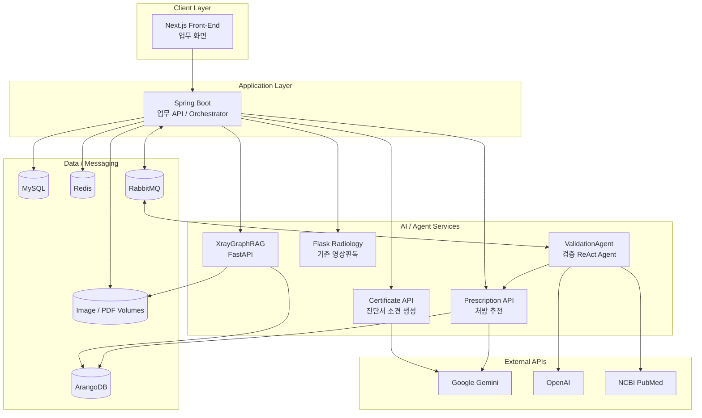
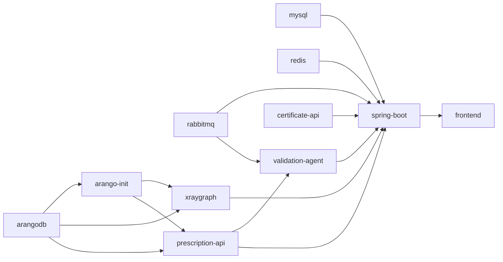
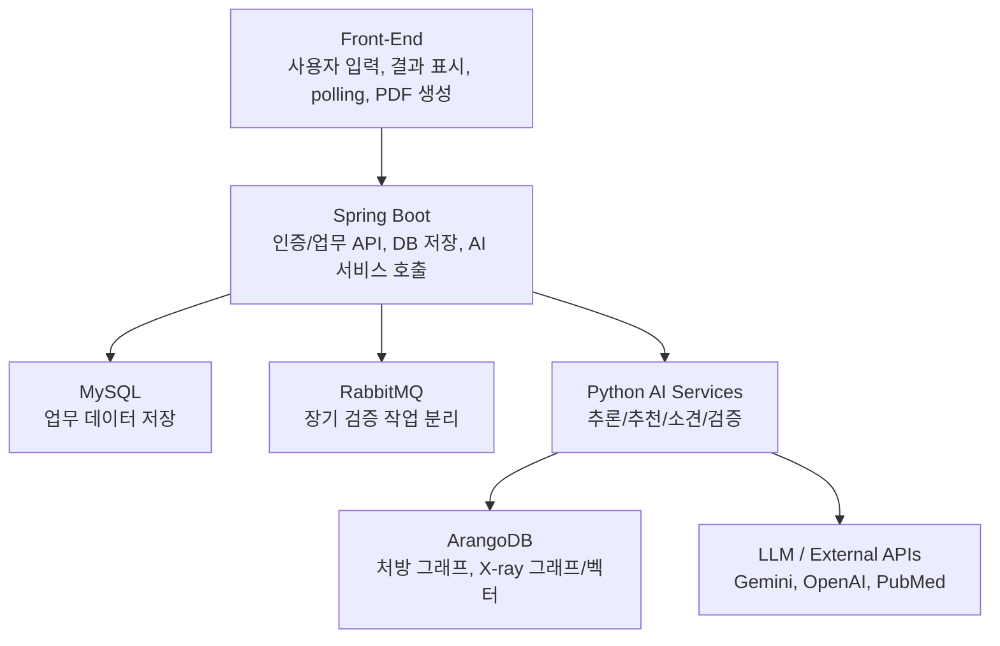

# 전체 시스템 구조

BitComputer는 병원 진료 업무 UI, Spring Boot 업무 API, 여러 Python AI 서비스, MySQL/ArangoDB/RabbitMQ/Redis 인프라로 구성된다. 전체 실행은 루트의 `docker-compose.yml`이 기준이다.

## 1. 서비스 구성

| 서비스 | 컨테이너 | 포트 | 역할 |
|---|---|---:|---|
| Front-End | `bit-frontend` | 3000 | Next.js 기반 병원 업무 UI |
| Spring Boot | `bit-spring-boot` | 8080 | 업무 API, DB 저장, AI 서비스 오케스트레이션 |
| MySQL | `bit-mysql` | 3307 -> 3306 | 환자, 진료, 상병, 처방, 검증 결과, 진단서 저장 |
| Redis | `bit-redis` | 6379 | 캐시 |
| RabbitMQ | `bit-rabbitmq` | 5672 / 15672 | 처방 추천/검증 비동기 메시징 |
| ArangoDB | `bit-arangodb` | 8529 | 처방 그래프, XrayGraphRAG 그래프/벡터 저장소 |
| XrayGraphRAG | `bit-xraygraph` | 8000 | X-ray 유사 사례 검색, 질병 후보 추론, 히트맵 |
| Flask Radiology | `bit-flask-radiology` | 5000 | 기존 X-ray 이상 탐지 엔진 |
| Certificate API | `bit-certificate-api` | 5001 | Gemini 기반 진단서 소견 문장 생성 |
| Prescription API | `bit-prescription-api` | 8001 | ArangoDB + Gemini 기반 처방 추천 |
| ValidationAgent | `bit-validation-agent` | 8002 | OpenAI + ReAct 기반 상병/처방/X-ray/PubMed 검증 |

## 2. 컨텍스트 다이어그램

## 3. Docker Compose 의존성

`spring-boot`는 거의 모든 외부 서비스를 호출하는 중심 역할을 한다. 프론트엔드는 직접 AI 서비스에 접근하지 않고, Spring API를 통해서만 업무 데이터를 생성하거나 AI 결과를 조회한다.

## 4. 저장소 디렉터리 역할

| 경로 | 역할 |
|---|---|
| `Front-End` | Next.js UI, 대시보드, 진료실, 진단서 화면, API 클라이언트 |
| `Back-End` | Spring Boot 업무 API, JPA 엔티티/리포지토리/서비스/컨트롤러 |
| `GraphDB/langchain_graph_qa` | 처방 추천 API, 진단서 소견 생성 API, ArangoDB 질의 코드 |
| `ValidationAgent` | RabbitMQ consumer + ReAct 검증 에이전트 |
| `XrayGraphRAG` | X-ray 그래프 RAG, ArangoDB 벡터/그래프 기반 추론 |
| `AI_BackEnd` | 기존 Flask 기반 X-ray 이상 탐지 |
| `Docs` | 프로젝트 구조 및 설계 문서 |

## 5. 계층별 책임

- Front-End는 화면 상태와 사용자 이벤트를 관리한다.
- Spring Boot는 업무 데이터의 소유권을 가진다.
- Python AI 서비스는 계산/생성/검증을 담당하되, 업무 DB를 직접 수정하지 않는 방향이 기본 설계다.
- ValidationAgent는 RabbitMQ를 통해 비동기로 실행되고, 결과 저장은 Spring consumer가 담당한다.

## 6. 주요 설계 판단

- **AI 서비스 분리**: X-ray, 처방 추천, 진단서 생성, 검증 에이전트를 독립 서비스로 분리해 장애와 의존성을 격리한다.
- **Spring 중심 데이터 소유**: 환자/진료/상병/처방/진단서/검증 결과는 MySQL에 저장하고 Spring이 소유한다.
- **장기 작업 비동기화**: 처방 추천과 검증은 PubMed/LLM/그래프 조회가 포함되므로 RabbitMQ job으로 분리한다.
- **그래프 DB 역할 분리**: ArangoDB는 처방 그래프와 XrayGraphRAG 그래프/벡터 저장에 사용한다.
- **의료 안전성**: AI 결과는 자동 확정이 아니라 의료진 검토용 보조 결과로 취급한다.
