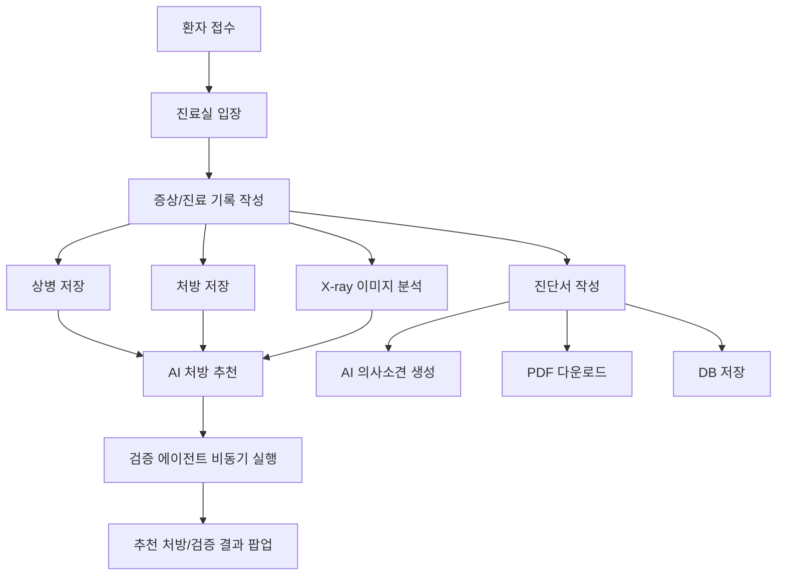
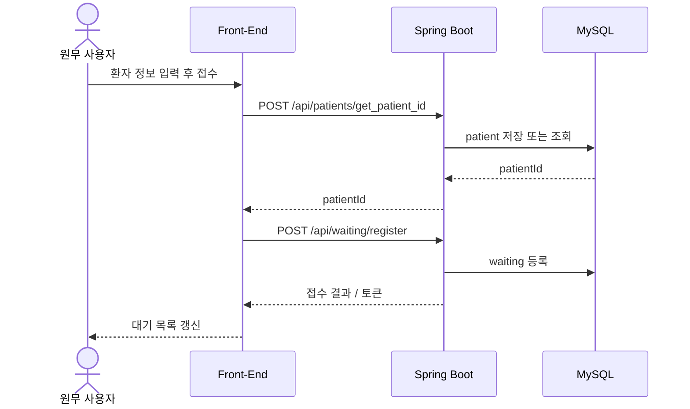
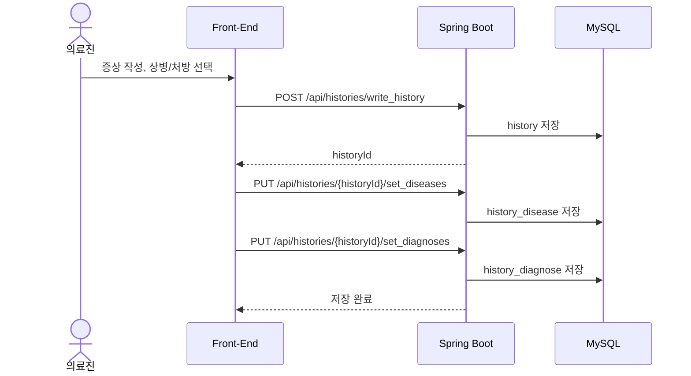
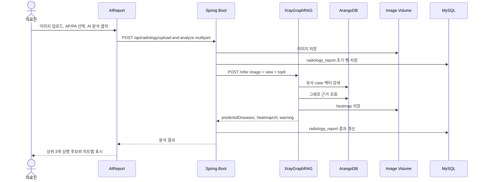
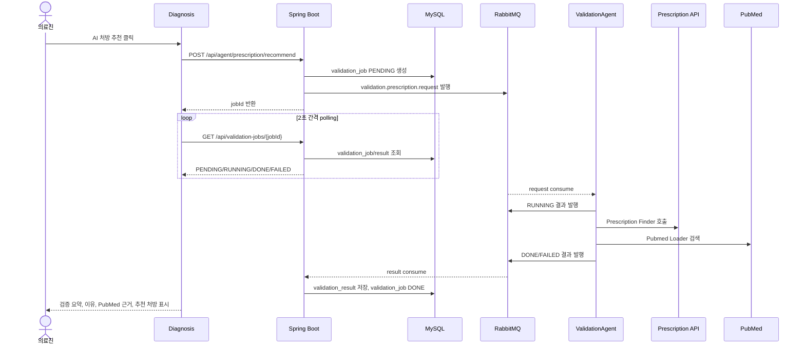
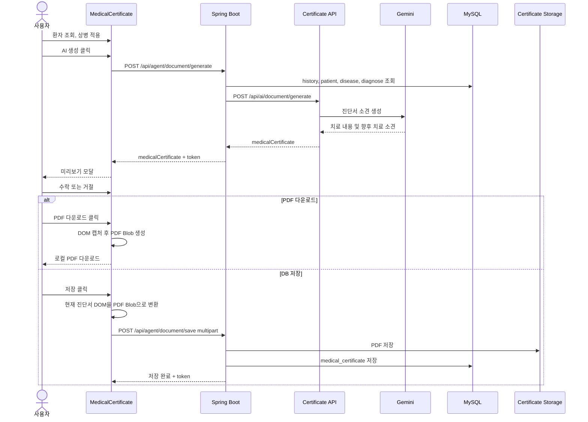
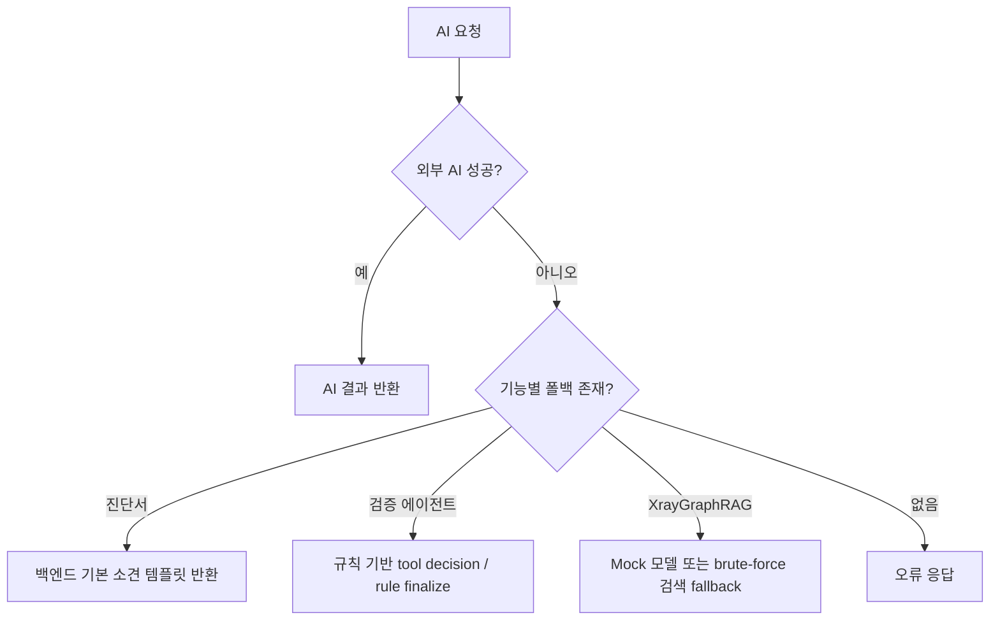

# 주요 사용자 흐름

이 문서는 사용자가 화면에서 수행하는 이벤트가 어떤 API, 서비스, 저장소를 거쳐 결과로 돌아오는지 설명한다.

## 1. 전체 업무 흐름

## 2. 환자 접수 흐름

주요 데이터:

- `patient`: 환자 기본 정보
- `waiting`: 대기 상태
- `employee`, `dept`: 담당자/부서 정보

## 3. 진료실 상병/처방 저장 흐름

상병과 처방은 마스터 테이블의 원본을 그대로 참조하기보다, 진료 시점의 스냅샷을 `history_disease`, `history_diagnose`에 저장하는 구조다.

## 4. X-ray 이미지 분석 흐름

프론트 표시는 `predictedDiseases`를 점수 기준 정렬한 뒤 `no_finding`, `support_devices` 등 상병이 아닌 태그를 제외하고 최대 3개만 보여준다.

## 5. AI 처방 추천 및 검증 흐름

처방 추천 버튼은 단순 추천 API 호출이 아니라 검증 job을 시작한다. 추천 후보, 저장 상병/처방, X-ray 추론, PubMed 근거를 함께 검토한다.

상태:

- `PENDING`: Spring이 job을 만들고 큐에 넣은 상태
- `RUNNING`: ValidationAgent가 메시지를 소비하고 처리 중
- `DONE`: 검증 결과 저장 완료
- `FAILED`: 처리 실패

## 6. 진단서 생성, PDF, DB 저장 흐름

진단서 화면은 PDF 위에 입력을 얹는 방식이 아니라, PNG 템플릿 배경 위에 HTML 입력 필드를 배치한다. 다운로드는 브라우저에서 `html2canvas`와 `pdf-lib`를 이용해 PDF로 변환한다.

진단서 저장 시 저장되는 내용:

- `historyId`
- PDF 파일 경로
- AI 사용 여부
- AI 원문 소견
- 최종 저장 소견
- 피드백 타입: `APPROVE`, `MODIFY`, `REJECT`, `NONE`

## 7. 실패와 폴백 흐름

중요한 점은 폴백 결과도 최종 의료 판단이 아니라 의료진 검토용 보조 정보라는 점이다.
