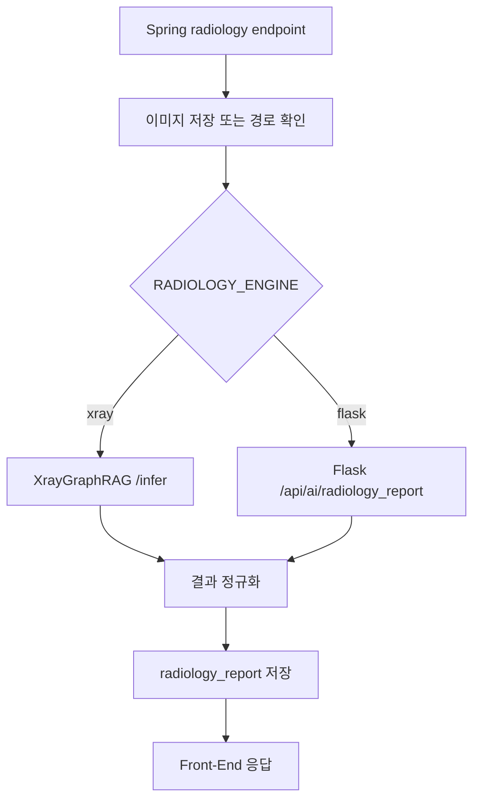
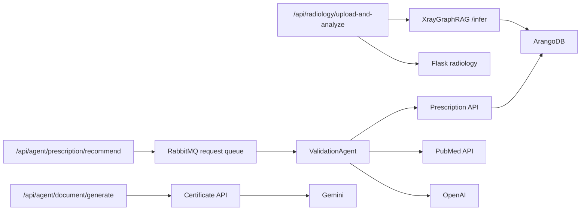

# 엔드포인트와 프로세스

이 문서는 Spring Boot와 Python AI 서비스의 주요 엔드포인트를 기능별로 정리한다. 개발 중 확인된 구조 기준이며, 세부 DTO 필드는 실제 코드의 `model` 패키지와 프론트 `services`를 기준으로 확인한다.

## 1. Spring Boot API 개요

```mermaid
flowchart LR
  FE[Front-End] --> User[/api/user]
  FE --> Patients[/api/patients]
  FE --> Waiting[/api/waiting]
  FE --> Histories[/api/histories]
  FE --> Disease[/api/diseases]
  FE --> Diagnose[/api/diagnoses]
  FE --> Radiology[/api/radiology]
  FE --> AgentRx[/api/agent/prescription]
  FE --> AgentDoc[/api/agent/document]
  FE --> Validation[/api/validation-jobs]

  User --> MySQL[(MySQL)]
  Patients --> MySQL
  Waiting --> MySQL
  Histories --> MySQL
  Disease --> MySQL
  Diagnose --> MySQL
  Radiology --> Xray[XrayGraphRAG or Flask]
  AgentRx --> Rabbit[(RabbitMQ)]
  AgentDoc --> Cert[Certificate API]
  Validation --> MySQL
```

## 2. 인증 / 사용자

| Method | Path | 역할 | 주요 처리 |
|---|---|---|---|
| `POST` | `/api/user/register` | 사용자 등록 | `employee` 저장 |
| `POST` | `/api/user/login` | 로그인 | JWT access/refresh token 발급 |
| `POST` | `/api/user/logout` | 로그아웃 | refresh token 처리 |
| `GET` | `/api/patients/get_role` | 현재 사용자 역할 조회 | Bearer token에서 직원 조회 |
| `GET` | `/api/patients/get_me` | 현재 사용자 프로필 조회 | id, name, deptId, role, username 반환 |

현재 Spring Security 전역 설정은 개발 편의를 위해 `permitAll` 성격이 강하지만, 일부 컨트롤러는 개별적으로 `Authorization: Bearer` 헤더를 검사한다.

## 3. 환자 / 대기 / 진료

| Method | Path | 역할 | 저장소 |
|---|---|---|---|
| `POST` | `/api/patients/get_patient_id` | 환자 등록 또는 ID 조회 | `patient` |
| `POST` | `/api/patients/search_patient/{patientId}` | 환자 상세 조회 | `patient` |
| `GET` | `/api/patients/get_all` | 전체 환자 조회 | `patient` |
| `POST` | `/api/waiting/register` | 대기 등록 | `waiting` |
| `GET` | `/api/waiting/get_list` | 대기 목록 조회 | `waiting` |
| `PUT` | `/api/waiting/{patientId}/complete` | 환자 단위 진료 완료 | `waiting` |
| `PUT` | `/api/waiting/entry/{waitingId}/complete` | 대기 row 단위 진료 완료 | `waiting` |
| `PUT` | `/api/waiting/{patientId}/hold` | 보류 | `waiting` |
| `DELETE` | `/api/waiting/entry/{waitingId}` | 대기 삭제 | `waiting` |
| `POST` | `/api/histories/write_history` | 진료 기록 작성 | `history` |
| `PUT` | `/api/histories/modify_history/{id}` | 진료 기록 수정 | `history` |
| `GET` | `/api/histories/search_history/{employeeId}` | 진료 기록 검색 | `history` |

## 4. 상병 / 처방 마스터와 진료별 스냅샷

### 4.1 마스터 조회

| Method | Path | 역할 | 저장소 |
|---|---|---|---|
| `GET` | `/api/diseases` | 상병 검색/페이지 조회 | `disease` |
| `GET` | `/api/diseases/{id}` | 상병 단건 조회 | `disease` |
| `GET` | `/api/diagnoses` | 처방 검색/페이지 조회 | `diagnose` |
| `GET` | `/api/diagnoses/{id}` | 처방 단건 조회 | `diagnose` |

### 4.2 진료별 저장

| Method | Path | 역할 | 저장소 |
|---|---|---|---|
| `PUT` | `/api/histories/{historyId}/set_diseases?employeeId=...` | 해당 진료의 상병 목록 교체 저장 | `history_disease` |
| `GET` | `/api/histories/{historyId}/get_diseases?employeeId=...` | 해당 진료의 상병 조회 | `history_disease` |
| `POST` | `/api/histories/{historyId}/add_disease/{diseaseId}` | 마스터 상병을 진료에 추가 | `history_disease` |
| `PUT` | `/api/histories/{historyId}/set_diagnoses?employeeId=...` | 해당 진료의 처방 목록 교체 저장 | `history_diagnose` |
| `GET` | `/api/histories/{historyId}/get_diagnoses?employeeId=...` | 해당 진료의 처방 조회 | `history_diagnose` |
| `POST` | `/api/histories/{historyId}/add_diagnose/{diagnoseId}` | 마스터 처방을 진료에 추가 | `history_diagnose` |

## 5. X-ray / 영상판독

| Method | Path | 역할 | 외부 호출 | 저장소 |
|---|---|---|---|---|
| `POST` | `/api/radiology/upload-and-analyze` | 이미지 업로드 후 분석 | XrayGraphRAG `/infer` 또는 Flask `/api/ai/radiology_report` | `radiology_report`, image volume |
| `POST` | `/api/radiology/report` | 기존 이미지 경로 기반 분석 | 설정된 radiology engine | `radiology_report` |

처리 흐름:



## 6. 처방 추천 / 검증 Job

| Method | Path | 역할 | 처리 |
|---|---|---|---|
| `POST` | `/api/agent/prescription/recommend` | AI 처방 추천 및 검증 job 시작 | `validation_job` 생성 후 RabbitMQ request queue 발행 |
| `POST` | `/api/agent/prescription/feedback` | 추천 처방 피드백 저장 | MySQL 저장 후 prescription-api feedback 연동 |
| `GET` | `/api/validation-jobs/{jobId}` | 검증 job 상태 조회 | `validation_job`, `validation_result` 조회 |
| `GET` | `/api/histories/{historyId}/validation_results` | 진료별 검증 결과 조회 | `validation_result` 조회 |

비동기 메시지:

| Queue | 방향 | 역할 |
|---|---|---|
| `validation.prescription.request` | Spring -> ValidationAgent | 검증/추천 job 요청 |
| `validation.prescription.result` | ValidationAgent -> Spring | `RUNNING`, `DONE`, `FAILED` 상태 및 결과 |

## 7. 진단서

| Method | Path | 역할 | 외부 호출 / 저장소 |
|---|---|---|---|
| `GET` | `/api/agent/document/{historyId}` | 진단서 폼용 환자/진료 상세 조회 | MySQL |
| `GET` | `/api/agent/document/{historyId}/past-prescriptions` | 과거 처방 조회 | MySQL |
| `GET` | `/api/agent/document/search` | 진단서 목록/이력 검색 | MySQL, `medical_certificate` |
| `POST` | `/api/agent/document/generate` | 실제 진료 이력 기반 소견 생성 | Certificate API -> Gemini |
| `POST` | `/api/agent/document/generate-test` | 테스트 입력 기반 소견 생성 | Certificate API -> Gemini |
| `POST` | `/api/agent/document/save` | 진단서 PDF와 소견 저장 | `medical_certificate`, certificate storage |
| `POST` | `/api/agent/document/evaluate` | 진단서 문장 평가 | Gemini evaluation |

`/save`는 `multipart/form-data`를 사용한다.

필드:

- `historyId`
- `pdfFile`
- `agentUsed`
- `originalMedicalCertificate`
- `savedMedicalCertificate`
- `feedbackType`

## 8. Python AI 서비스 엔드포인트

### 8.1 XrayGraphRAG

| Method | Path | 역할 |
|---|---|---|
| `GET` | `/health` | 헬스 체크 |
| `POST` | `/admin/init-db` | Arango 컬렉션/그래프/인덱스 초기화 |
| `POST` | `/cases` | X-ray case 등록 |
| `GET` | `/cases/{case_id}` | case 조회 |
| `POST` | `/cases/search-similar` | 임베딩 기반 유사 case 검색 |
| `POST` | `/cases/{case_id}/feedback` | case 피드백 저장 |
| `POST` | `/infer` | 업로드 이미지 추론 |

### 8.2 Flask Radiology

| Method | Path | 역할 |
|---|---|---|
| `GET` | `/api/ai/is_running` | 헬스 체크 |
| `POST` | `/api/ai/radiology_report` | 기존 SQUID 기반 이상 탐지 |

### 8.3 Certificate API

| Method | Path | 역할 |
|---|---|---|
| `GET` | `/health` | 헬스 체크 |
| `POST` | `/api/ai/document/generate` | 진단서 의사소견 생성 |

### 8.4 Prescription API

| Method | Path | 역할 |
|---|---|---|
| `GET` | `/health` | 헬스 체크 |
| `POST` | `/api/agent/prescription/recommend` | 처방 후보 추천 |
| `POST` | `/api/agent/prescription/feedback` | 처방 추천 피드백 그래프 저장 |

### 8.5 ValidationAgent

| Method | Path | 역할 |
|---|---|---|
| `GET` | `/health` | 헬스 체크, OpenAI 설정 확인 |
| `POST` | `/api/agent/validation/run` | 동기 검증 실행 |

RabbitMQ consumer는 애플리케이션 시작 시 백그라운드에서 실행된다.

## 9. 엔드포인트별 외부 도구 매핑


