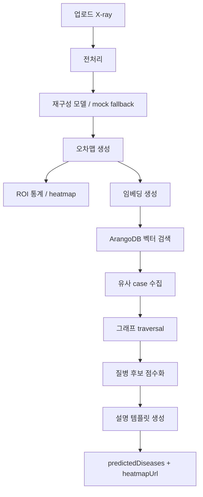
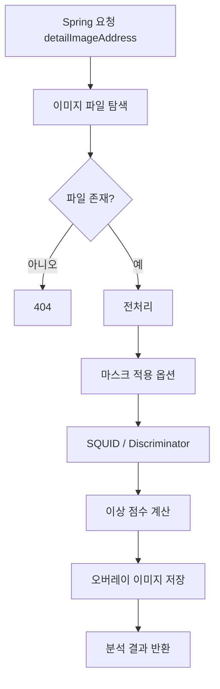
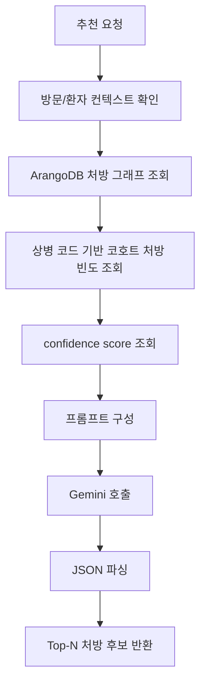
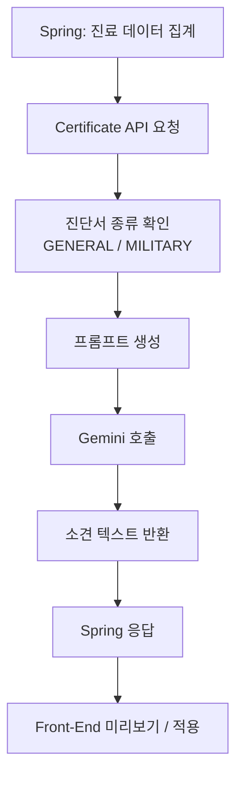
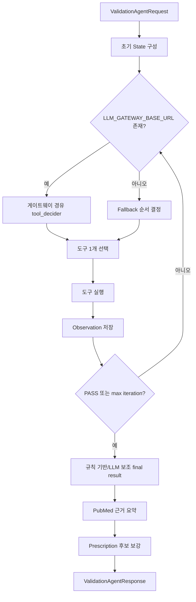
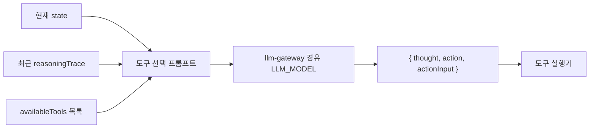
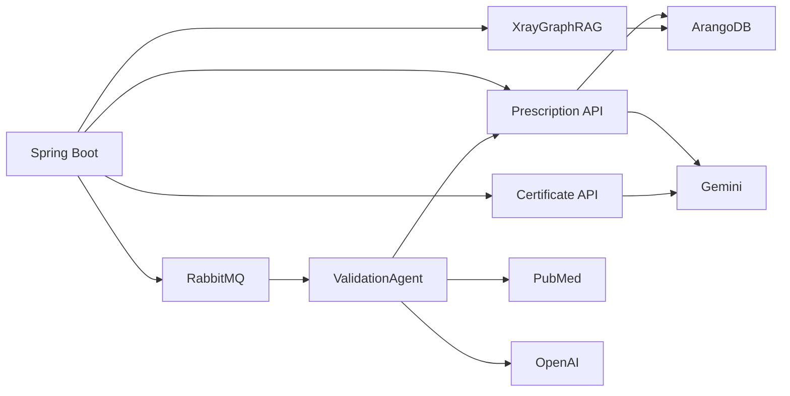

# AI 서비스와 에이전트 설계

BitComputer의 AI 기능은 하나의 모델에 몰려 있지 않고, 기능별 Python 서비스로 분리되어 있다. Spring Boot는 이 서비스들을 호출하거나 RabbitMQ로 작업을 위임한다.

## 1. AI 서비스 요약

| 서비스 | 기술 | 주요 역할 | LLM |
|---|---|---|---|
| `XrayGraphRAG` | FastAPI, ArangoDB, vector search | X-ray 유사 사례 검색, 상병 후보 추론, 히트맵 생성 | 없음 |
| `AI_BackEnd` | Flask, PyTorch | 기존 X-ray 이상 탐지 | 없음 |
| `certificate-api` | FastAPI, LangChain | 진단서 의사소견 생성 | Gemini |
| `prescription-api` | FastAPI, ArangoDB, LangChain | 그래프 기반 처방 추천 | Gemini |
| `validation-agent` | FastAPI, RabbitMQ, ReAct loop | 상병/처방/X-ray/PubMed 검증 및 추천 후보 조합 | OpenAI |

## 2. XrayGraphRAG

### 2.1 역할

XrayGraphRAG는 X-ray 이미지를 직접 질병 분류 모델로 판정하는 것이 아니라, 재구성 오차 패턴과 임베딩을 이용해 유사한 X-ray case를 찾고 그래프 근거로 상병 후보를 추론한다.

### 2.2 주요 출력

- `predictedDiseases`: 질병 후보 배열
- `score`: 유사 사례 기반 점수
- `reason`: 후보 추론 근거
- `heatmapUrl`: 재구성 오차 또는 ROI 기반 시각 자료
- `warning`: 의료 진단이 아니라 후보 추론이라는 경고

### 2.3 설계 특성

- LLM 없이 동작한다.
- ArangoDB의 벡터 인덱스와 그래프 traversal을 사용한다.
- `view=PA` 또는 `view=AP`가 적재 데이터와 맞아야 유사 case가 잘 나온다.
- `support_devices`, `no_finding` 같은 태그는 프론트 표시 단계에서 상병 후보에서 제외한다.

## 3. Flask Radiology

Flask Radiology는 기존 영상판독 엔진이다. 파일 경로 기반으로 이미지를 읽고 SQUID/Discriminator 계열 이상 탐지를 수행한다.

현재 기본 Docker 설정은 `RADIOLOGY_ENGINE=xray`이므로 Spring은 XrayGraphRAG를 우선 사용한다. Flask 엔진은 비교/백업 성격으로 유지된다.

## 4. Prescription API

Prescription API는 ArangoDB 그래프 질의 결과와 Gemini를 결합해 처방 후보를 만든다.

### 4.1 입력 컨텍스트

- 환자/방문 ID
- 상병 코드 목록
- 증상 또는 검증 사유
- 기존 처방 또는 후보 처방

### 4.2 피드백

추천 결과에 대해 프론트에서 `accepted`, `rejected`, `missed` 피드백을 보낼 수 있다. Spring은 MySQL에 저장하고, Prescription API는 ArangoDB 피드백 그래프에 반영한다.

## 5. Certificate API

Certificate API는 Spring이 MySQL에서 모은 환자/진료/상병/처방 데이터를 받아 진단서 소견 문장을 생성한다.

### 5.1 프롬프트 핵심

- 일반진단서: `치료 내용 및 향후 치료에 대한 소견`
- 병무용 진단서: 증상/질병 소견을 포함하되 치료 내용과 향후 치료/경과 관찰 필요성을 함께 작성
- 환자명, 날짜, 제목, 상병 목록, 처방 목록 같은 행정 항목은 출력하지 않는다.
- 진단 구분이 `임상적 추정`이면 확정 표현을 피한다.
- 진단 구분이 `최종 진단`이면 확정 진단에 근거한 치료 경과와 향후 계획을 중심으로 작성한다.

## 6. ValidationAgent

ValidationAgent는 처방 추천 버튼을 계기로 실행되는 검증 에이전트다. Spring이 만든 job 메시지를 RabbitMQ에서 소비하고, 여러 도구를 선택적으로 호출한 뒤 검증 결과를 JSON으로 반환한다.

### 6.1 전체 루프

### 6.2 도구 목록

| 도구 | 역할 | 입력 | 출력 |
|---|---|---|---|
| `X-ray Result Loader` | Spring이 전달한 X-ray 결과를 검증 컨텍스트로 로드 | `xrayInference` | X-ray 상태 |
| `Disease Validator` | 저장 상병과 X-ray 추론/증상 일관성 확인 | 저장 상병, 증상, X-ray 결과 | `MATCH`, `MISMATCH`, `PARTIAL_MATCH` 등 |
| `Prescription Validator` | 저장 처방 또는 후보 처방이 상병/증상과 검토 가능한지 확인 | 상병, 증상, 처방 | `APPROPRIATE`, `QUESTIONABLE`, `INSUFFICIENT_DATA` 등 |
| `Prescription Finder` | 기존 처방 RAG에서 후보 처방 조회 | 환자 ID, 상병, 증상/검증 사유 | 후보 처방 배열 |
| `Pubmed Loader` | PubMed 논문 검색과 초록 조회 | 검색어, max_results | 논문 제목, PMID, 초록 |

### 6.3 tool_decider 설계

`LLM_MODEL` 기본값은 `openai.gpt-5.6-luna`다. 비용과 속도를 우선하면서도 도구 선택, PubMed query 생성, 초록 요약 같은 경량 reasoning에 적합하도록 설정했다. 자격증명은 `services/llm-gateway` 가 갖고 있으며, ValidationAgent 는 게이트웨이 base URL(`LLM_GATEWAY_BASE_URL`)만 안다.

### 6.4 결과 구조

대표 필드:

- `overallStatus`: `PASS`, `WARNING`, `CRITICAL`, `NEEDS_REVIEW`
- `summary`: 검증 요약
- `reason`: 전체 상태의 핵심 이유
- `recommendedPrescriptions`, `candidatePrescriptions`
- `checks`: 검증 항목별 결과
- `suspectedIssues`: 의심 문제 목록
- `reasoningTrace`: Thought/Action/Observation 기록
- `validation.pubmedEvidence`: PubMed 논문 근거
- `validation.pubmedEvidenceSummary`: 초록 요약

## 7. AI 서비스 간 관계

## 8. 의료 안전성 원칙

- AI 결과는 최종 진단이 아니다.
- 처방 추천은 자동 저장/자동 확정되지 않는다.
- 검증 에이전트는 DB를 직접 수정하지 않는다.
- X-ray 추론 결과와 실제 판독은 의료진이 함께 확인해야 한다.
- PubMed 근거는 참고 문헌 후보이며, 환자 개별 처방의 정당성을 자동 보장하지 않는다.
