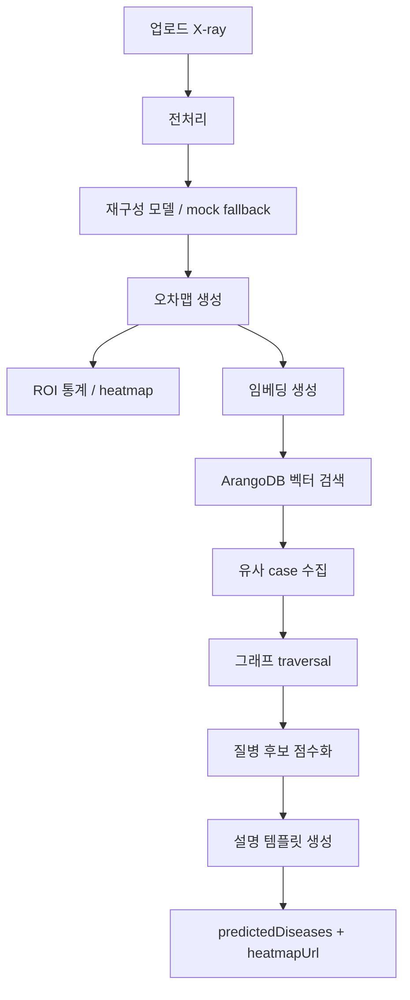
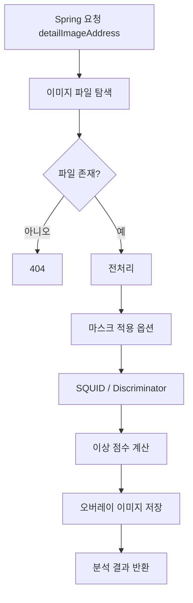
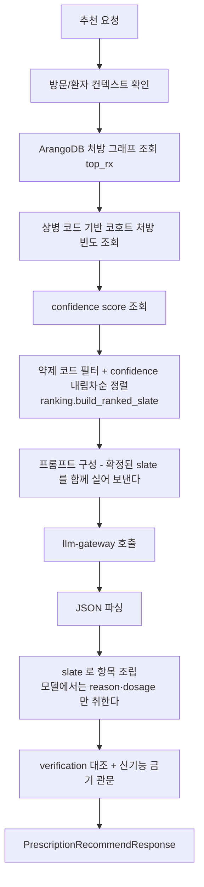
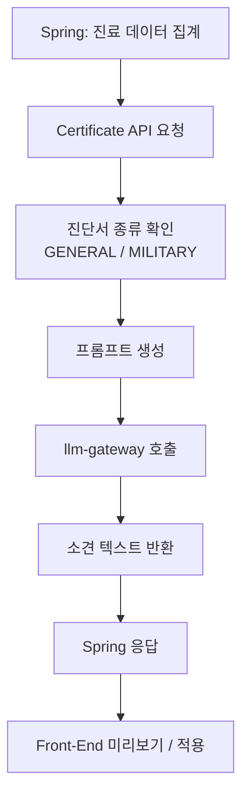
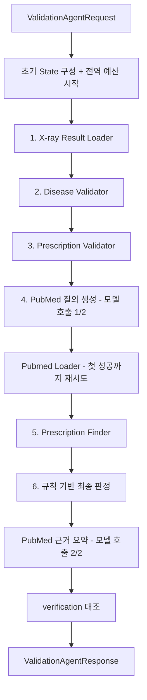
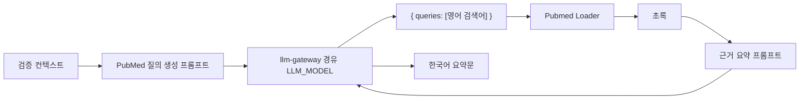
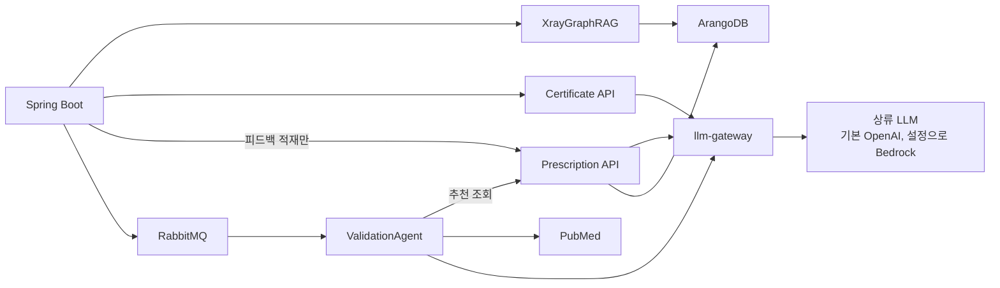

# AI 서비스와 에이전트 설계

BitComputer의 AI 기능은 하나의 모델에 몰려 있지 않고, 기능별 Python 서비스로 분리되어 있다. Spring Boot는 이 서비스들을 호출하거나 RabbitMQ로 작업을 위임한다.

## 1. AI 서비스 요약

| 서비스(소스 경로) | 기술 | 주요 역할 | LLM |
|---|---|---|---|
| `xray-rag`(`services/xray-rag`) | FastAPI, ArangoDB, vector search | X-ray 유사 사례 검색, 상병 후보 추론, 히트맵 생성 | 없음 |
| `radiology-legacy`(`services/radiology-legacy`) | Flask, PyTorch | 기존 X-ray 이상 탐지 | 없음 |
| `llm-gateway`(`services/llm-gateway`) | FastAPI, httpx | 단일 LLM 진입점. 상류 제공자 선택·재시도·비용 계측 | 상류 자체 (기본 OpenAI) |
| `certificate-api`(`services/prescription`) | FastAPI, LangChain | 진단서 의사소견 생성 | llm-gateway 경유 |
| `prescription-api`(`services/prescription`) | FastAPI, ArangoDB, LangChain | 그래프 조회가 순위를 정하고 모델이 사유·용법을 쓴다 | llm-gateway 경유 |
| `validation-agent`(`services/validation-agent`) | FastAPI, RabbitMQ, 고정 파이프라인 + 모델 호출 2회 | 상병/처방/X-ray/PubMed 검증 및 추천 후보 조합 | llm-gateway 경유 |

## 2. XrayGraphRAG

### 2.1 역할

XrayGraphRAG는 X-ray 이미지를 직접 질병 분류 모델로 판정하는 것이 아니라, 재구성 오차 패턴과 임베딩을 이용해 유사한 X-ray case를 찾고 그래프 근거로 상병 후보를 추론한다.



### 2.2 주요 출력

- `predictedDiseases`: 질병 후보 배열
- `score`: 유사 사례 기반 점수
- `reason`: 후보 추론 근거
- `heatmapUrl`: 재구성 오차 또는 ROI 기반 시각 자료
- `warning`: 의료 진단이 아니라 후보 추론이라는 경고

### 2.3 설계 특성

- LLM 없이 동작한다.
- ArangoDB의 벡터 인덱스와 그래프 traversal을 사용한다.
- `view=PA` 또는 `view=AP`가 적재 데이터와 맞아야 유사 case가 잘 나온다.
- `support_devices`, `no_finding` 같은 태그는 프론트 표시 단계에서 상병 후보에서 제외한다.

## 3. Flask Radiology

Flask Radiology는 기존 영상판독 엔진이다. 파일 경로 기반으로 이미지를 읽고 SQUID/Discriminator 계열 이상 탐지를 수행한다.



현재 기본 Docker 설정은 `RADIOLOGY_ENGINE=xray`이므로 Spring은 XrayGraphRAG를 우선 사용한다. Flask 엔진은 비교/백업 성격으로 유지된다.

## 4. Prescription API

Prescription API는 ArangoDB 그래프 질의 결과와 게이트웨이 경유 모델을 결합해 처방 후보를
만든다. **순위는 조회가 정하고 모델은 설명만 쓴다**(PR #13, 설계 §3.1). 응답 항목의
`name` 과 `prescription_code` 는 조회가 확정한 slate 에서 그대로 오고, 모델 출력에서
가져오는 것은 순위별 `reason` 과 `dosage` 뿐이다. **조회가 뒷받침하지 않는 순위를 모델
문장으로 채우지 않는다** — 그 자리를 무엇으로 처리하는지(자리표시자 행이냐, 애초에
그 순위를 내지 않느냐)는 `services/prescription/ranking.py` 를 본다.



관련 순수 모듈: `ranking.py`(순위), `medication_codes.py`(약제 코드 판별),
`feedback_adjustment.py`(피드백 보정 산술), `renal_gate.py`(신기능 금기 관문),
`verification.py`(응답이 조회 근거를 벗어나지 않았는지 대조).

### 4.1 입력 컨텍스트

- 환자/방문 ID
- 상병 코드 목록
- 증상 또는 검증 사유
- 기존 처방 또는 후보 처방

### 4.2 피드백

추천 결과에 대해 프론트에서 `accepted`, `rejected`, `missed` 피드백을 보낼 수 있다. Spring은 MySQL에 저장하고, Prescription API는 ArangoDB 피드백 그래프에 반영한다.

### 4.3 호출 주체 (2026-08-30 결정)

`POST /api/agent/prescription/recommend` 를 호출하는 주체는 **validation-agent 하나뿐이다**
(`services/validation-agent/app/tools.py` 의 `prescription_finder`).

Spring 에도 같은 엔드포인트를 부르는 동기 경로(`AgentServiceImpl.callAgentAndMap` →
`PrescriptionAgentClient.recommend`)가 있었으나, 웹이 실제로 쓰는 경로가
`recommendPrescription` → RabbitMQ validation job → `ValidationAgentResponse` 로 옮겨 간 뒤로
호출자가 하나도 남지 않은 죽은 코드였다. 되살리는 대신 **삭제**했다.

- 근거: 동기 경로를 되살리면 검증 루프를 거치지 않는 두 번째 추천 경로가 생겨
  "AI 추천은 검증 루프를 반드시 거친다"는 현재 설계와 충돌한다. Python → Python 직통
  호출이 한 홉 더 짧기도 하다.
- 같이 삭제된 것: `PrescriptionAgentRequest`, `PrescriptionAgentResponse`,
  `PrescriptionRecommendResponseDTO`, `RecommendedPrescriptionItemDTO`,
  `AgentServiceImpl` 의 프롬프트 조립 헬퍼(`buildAgentRequest`, `buildTopRx`,
  `buildHistoryText`, `applyExampleContextIfRequested`, `findDiagnoseMaster` 등),
  `ai.prescription-agent.path` / `.fetch-top-rx-from-arango` / `.arango-top-rx-limit` /
  `.fetch-cohort-rx-from-arango` / `.arango-cohort-rx-limit` / `.example-context-path` 설정.
- 같이 삭제된 테스트: `PrescriptionAgentResponseTest`(대상 DTO 가 사라졌다),
  `PythonProvenanceFieldsSurviveJavaDtoTest` 의 `prescription_api.py` 경계 한 쌍.
  그 경계의 출처·검증 신호는 이제 `ValidationAgentResponse` 의
  `prescriptionLlmStatus` / `prescriptionVerification` 로 건너오므로 같은 목록의 첫 경계가 덮는다.
- 남긴 것: `PrescriptionAgentClient.saveFeedbackToGraph` 와 `ai.prescription-agent.base-url` /
  `.feedback-path` — 피드백 적재는 여전히 Spring 이 담당한다.
- 부수 효과: `PrescriptionRecommendRequestDTO` 의 `use_example_context` / `arango_patient_id` 는
  이제 읽는 코드가 없다. 필드는 요청 호환성을 위해 남겼지만 **무시된다**.

### 4.4 그래프 조회 결과 노출 (F-M6)

`used_arango_top_rx` / `arango_top_rx_count` / `used_cohort_rx` / `cohort_rx_count` 는
예전에는 Spring 로그 한 줄로만 남고 사라졌다. 그래프가 빈손이면 추천은 모델의 일반지식에만
기대게 되는데, 화면에서는 그 차이가 보이지 않았다. E78(고지혈증)은 PR #9 의 약제 코드 필터
이후 실제로 약제 후보가 0건이라 가정이 아니라 실재하는 상태다.

```
prescription_api /recommend   used_arango_top_rx, arango_top_rx_count, ...
  → prescription_finder       graphLookup {status, usedArangoTopRx, arangoTopRxCount,
                                           usedCohortRx, cohortRxCount, foundNothing, evidence[]}
  → run_validation_agent      validation.graphLookup + checks[] 의 GRAPH_LOOKUP 한 줄
  → RabbitMQ result           ValidationJob.result (Map 그대로 통과, Java DTO 변경 없음)
  → Diagnosis.tsx             검증 모달의 그래프 배지 + 근거 문장
```

**세 상태를 구분한다** (설계 문서 §3.2, GC-3 fail-closed). "확인함·0건", "확인 못 함",
"근거 있음"은 셋 다 다르다.

| 상태 | `graphLookup` | `checks` | 화면 |
|---|---|---|---|
| 근거 있음 | `status=LOADED`, `foundNothing=false` | 없음 | 표시 없음 |
| 확인함·0건 | `status=LOADED`, `foundNothing=true` | `GRAPH_LOOKUP` / `NO_DATA` | "그래프 근거 0건" |
| 조회 실패 | `status=FAILED`, `foundNothing=false` | `GRAPH_LOOKUP` / `UNKNOWN` | "그래프 근거 미확인" |
| 단계 미실행 | `null` | 없음 | "그래프 근거 미확인" |

`foundNothing` 은 **조회에 성공한 경우에만** 의미가 있다. 조회 실패나 예산 초과로 5단계를
건너뛴 경우를 0건으로 접으면 모르는 것을 아는 것처럼 말하게 된다.

- 회귀 테스트: `services/validation-agent/tests/test_graph_lookup_visibility.py`,
  `apps/web/src/utils/__tests__/graphLookupNotice.test.ts`

### 4.5 신기능 금기 관문 배선

`services/prescription/renal_gate.py` 가 내는 판정을 화면까지 잇는다. 관문 자체는 PR #14 가
만들었고, 여기서는 그 결과가 Java·웹까지 살아서 가는 경로와 표시 규칙만 정한다.

```
prescription_api /recommend   renalGate {status, renalStatus, renalEvidence,
                                         items[], undeterminedReason}
  → prescription_finder       recommendationRenalGate (원본 그대로, 요약하지 않음)
  → run_validation_agent      최상위 prescriptionRenalGate
  → ValidationAgentResponse   prescriptionRenalGate (Java DTO)
  → Diagnosis.tsx             추천 목록 위 배너 + 행별 배지
```

`prescriptionVerification` / `prescriptionLlmStatus` 와 정확히 같은 자리, 같은 원칙이다 —
prescription_api 자신의 판정이므로 validation-agent 자신의 판정(`verification`, `llmStatus`)과
병합하지 않는다.

**축이 둘이고, 합치면 이 관문이 무의미해진다.**

| 축 | 값 | 뜻 |
|---|---|---|
| `renalStatus` | `impaired` / `suspected` / `undetermined` | 환자 상태. 자유텍스트 노트 파싱 결과 |
| `status`, `items[].outcome` | `warn` / `clear` / `unknown` | 판정. 그 약이 신배설 금기 표 안에 있는가 |

노트 파싱 실패는 item outcome 이 아니라 **`renalStatus="undetermined"`** 로 나타난다. 그래서
`renalStatus=undetermined` 인데 항목이 전부 `clear` 인 조합이 실재하고, 그때의 `clear` 는
"금기 없음"을 뜻하지 않는다. 화면이 `renalStatus` 를 빼고 outcome 만 렌더하면 정확히 그
오독이 생긴다.

- `clear` 를 환자 근거로 내는 경로는 파이썬에 없다. 자유텍스트가 "신장 정상"이라고 말해
  주지 않기 때문이다. **완전히 깨끗한 상태가 없으므로** 관문 결과가 있으면 배너를 항상
  띄운다 — `llmStatus`/`verification` 처럼 "정상이면 무표시" 하지 않고 tone 으로만 가른다.
- `items[].evidence` 는 표의 좁은 범위를 문장으로 들고 다닌다(예: "신배설 금기 표(11개
  성분)에 없는 성분입니다 — 이 표의 범위 안에서 해당 없음"). 버리고 outcome 만 렌더하면
  그 한정이 사라져 "안전함"으로 읽힌다. 배너가 evidence 원문을 그대로 보여준다.
- 관문 결과가 없으면(`null`) "관문 미확인"이다. `clear` 로 접지 않는다(GC-3).
- **스왑된 rank 는 관문 판정도 무효다.** 그 판정은 지금 화면의 약이 아니라 스왑되기 전
  약을 대조한 결과다 — 검증 축이 이미 지키는 규칙과 같고, 빠뜨리면 금기 약으로 바꿔 넣어도
  옛 `clear` 가 그대로 남는다.
- 회귀 테스트: `services/validation-agent/tests/test_renal_gate_relay.py`,
  `apps/api/.../ValidationAgentResponseTest`,
  `apps/web/src/utils/__tests__/renalGateNotice.test.ts`,
  `apps/web/src/components/__tests__/Diagnosis.test.tsx`

## 5. Certificate API

Certificate API는 Spring이 MySQL에서 모은 환자/진료/상병/처방 데이터를 받아 진단서 소견 문장을 생성한다.



### 5.1 프롬프트 핵심

- 일반진단서: `치료 내용 및 향후 치료에 대한 소견`
- 병무용 진단서: 증상/질병 소견을 포함하되 치료 내용과 향후 치료/경과 관찰 필요성을 함께 작성
- 환자명, 날짜, 제목, 상병 목록, 처방 목록 같은 행정 항목은 출력하지 않는다.
- 진단 구분이 `임상적 추정`이면 확정 표현을 피한다.
- 진단 구분이 `최종 진단`이면 확정 진단에 근거한 치료 경과와 향후 계획을 중심으로 작성한다.

## 6. ValidationAgent

ValidationAgent는 처방 추천 버튼을 계기로 실행되는 검증 에이전트다. Spring이 만든 job 메시지를 RabbitMQ에서 소비하고, 정해진 순서로 도구를 호출한 뒤 검증 결과를 JSON으로 반환한다.

### 6.1 전체 파이프라인

도구 선택은 모델이 하지 않는다. 실행 순서는 도메인이 정한 고정 순서이며, 모델은
**두 자리에서만** 쓴다: PubMed 질의 생성과 근거 요약. 이전에는 매 단계 게이트웨이에
"다음에 어떤 도구를 부를까" 를 물었으나, 측정 결과 그 결정은 하드코딩 순서를
재생산했을 뿐이고 관측값이 다음 행동을 바꾼 사례가 없었다(`.superpowers/sdd/agent-architecture-review.md` §5,
`.superpowers/sdd/react-loop-removal-report.md`). 결정 호출 4회가 0회가 됐다.



각 단계 앞에서 전역 예산(`VALIDATION_JOB_BUDGET_SECONDS`, 기본 110초)을 확인한다.
소진되면 남은 단계를 건너뛰고 지금까지 모은 관측값으로 규칙 기반 판정을 내되,
건너뛴 단계를 `reasoningTrace` 에 `BUDGET_EXCEEDED` 로 남긴다.

### 6.2 도구 목록

| 도구 | 역할 | 입력 | 출력 |
|---|---|---|---|
| `X-ray Result Loader` | Spring이 전달한 X-ray 결과를 검증 컨텍스트로 로드 | `xrayInference` | X-ray 상태 |
| `Disease Validator` | 저장 상병과 X-ray 추론/증상 일관성 확인 | 저장 상병, 증상, X-ray 결과 | `MATCH`, `MISMATCH`, `PARTIAL_MATCH` 등 |
| `Prescription Validator` | 저장 처방 또는 후보 처방이 상병/증상과 검토 가능한지 확인 | 상병, 증상, 처방 | `APPROPRIATE`, `QUESTIONABLE`, `INSUFFICIENT_DATA` 등 |
| `Prescription Finder` | 기존 처방 RAG에서 후보 처방 조회 | 환자 ID, 상병, 증상/검증 사유 | 후보 처방 배열 |
| `Pubmed Loader` | PubMed 논문 검색과 초록 조회 | 검색어, max_results | 논문 제목, PMID, 초록 |

### 6.3 모델 호출 두 자리



이 둘만 모델을 필요로 한다. 질의 생성은 한국어 임상 맥락을 영어 검색어로 번역하는
일이고, 15항목짜리 하드코딩 사전(`app/pubmed.py` 의 `KOREAN_PUBMED_TERMS`)으로는
할 수 없다. 두 호출 모두 실패하면 결정론적 대체물로 강등되고 그 사실이
`llmStatus` 와 트레이스 `source` 에 남는다.

`LLM_MODEL` 기본값은 `openai.gpt-5.6-luna`다. 비용과 속도를 우선하면서도 PubMed
query 생성과 초록 요약 같은 경량 생성에 적합하도록 설정했다. 자격증명은
`services/llm-gateway` 가 갖고 있으며, ValidationAgent 는 게이트웨이 base
URL(`LLM_GATEWAY_BASE_URL`)만 안다.

### 6.4 결과 구조

대표 필드:

- `overallStatus`: `PASS`, `WARNING`, `CRITICAL`, `NEEDS_REVIEW`
- `summary`: 검증 요약
- `reason`: 전체 상태의 핵심 이유
- `recommendedPrescriptions`, `candidatePrescriptions`
- `checks`: 검증 항목별 결과
- `suspectedIssues`: 의심 문제 목록
- `reasoningTrace`: 파이프라인 단계별 기록. 각 항목은 `thought`/`action`/`actionInput`/`observation`/`source` 를 갖는다. `source` 는 그 단계가 실제로 쓴 내용의 출처다 — `rule`(결정론적), `llm`(모델이 생성), `stub`, `fallback`
- `llmStatus`: 이 실행에서 실제로 성사된 모델 호출에서만 도출한다. 게이트웨이가 설정돼 있다는 사실은 근거가 되지 않는다
- `validation.pubmedEvidence`: PubMed 논문 근거
- `validation.pubmedEvidenceSummary`: 초록 요약
- `validation.graphLookup`: ArangoDB 처방 그래프 조회 결과. 후보 조회 단계를 돌지 않았으면 `null` 이고, 그 "확인 못 함"은 "0건"과 다른 상태다 (§4.4)
- `prescriptionRenalGate`: prescription_api 의 신기능 금기 관문. 최상위 별도 필드다 — `verification`(이 에이전트 자신의 판정)과 병합하지 않는다 (§4.5)

## 7. AI 서비스 간 관계



자격증명은 `llm-gateway` 컨테이너에만 있다. 세 호출 서비스는 상류가 누구인지 모르고
`LLM_GATEWAY_BASE_URL` 만 안다.

## 8. 의료 안전성 원칙

- AI 결과는 최종 진단이 아니다.
- 처방 추천은 자동 저장/자동 확정되지 않는다.
- 검증 에이전트는 DB를 직접 수정하지 않는다.
- X-ray 추론 결과와 실제 판독은 의료진이 함께 확인해야 한다.
- PubMed 근거는 참고 문헌 후보이며, 환자 개별 처방의 정당성을 자동 보장하지 않는다.
