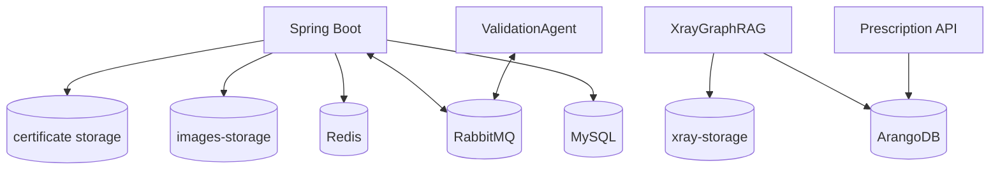
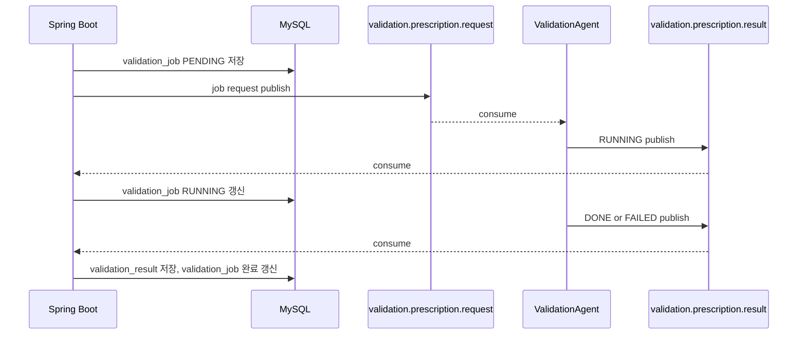
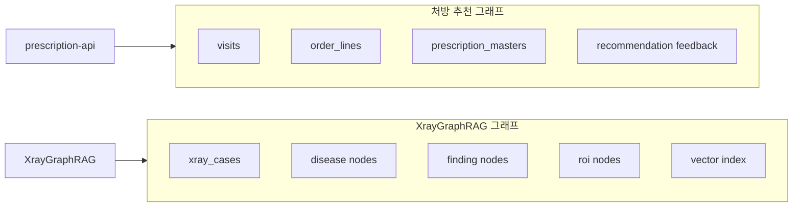
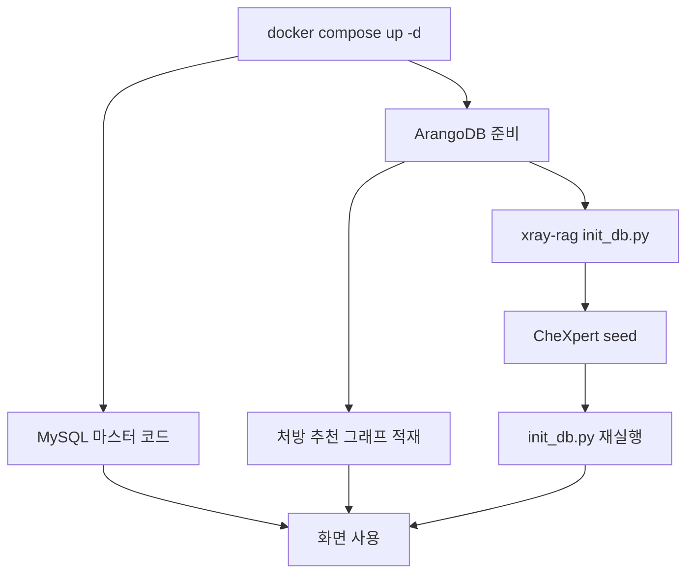

# 데이터, 메시징, 배포 구조

이 문서는 BitComputer의 저장소, 메시지 큐, Docker 실행 구조와 운영 시 자주 확인하는 명령을 정리한다.

## 1. 데이터 저장소 역할



| 저장소 | 역할 |
|---|---|
| MySQL | 환자, 직원, 진료 기록, 상병/처방 마스터, 진료별 상병/처방, 방사선 리포트, 검증 job/result, 진단서 저장 |
| Redis | 캐시 |
| RabbitMQ | 검증 에이전트 비동기 request/result queue |
| ArangoDB | 처방 그래프, 처방 피드백 그래프, XrayGraphRAG case/그래프/벡터 |
| `images-storage` | Spring/Flask 영상 파일 공유 |
| `xray-storage` | XrayGraphRAG heatmap, reconstruction, case 이미지 저장 |
| `rabbitmq-data` | RabbitMQ 내부 상태 유지 |
| `mysql-data` | MySQL 데이터 유지 |
| `arango-data`, `arango-apps` | ArangoDB 데이터 유지 |

## 2. 주요 MySQL 테이블

| 테이블 | 역할 |
|---|---|
| `patient` | 환자 기본 정보 |
| `employee` | 직원/사용자 정보 |
| `dept` | 진료과 |
| `waiting` | 대기/접수 상태 |
| `history` | 진료 기록 |
| `disease` | 상병 마스터 |
| `diagnose` | 처방 마스터 |
| `history_disease` | 진료별 저장 상병 스냅샷 |
| `history_diagnose` | 진료별 저장 처방 스냅샷 |
| `radiology_report` | X-ray 분석 요청과 결과 |
| `validation_job` | 비동기 검증 job 상태 |
| `validation_result` | 검증 에이전트 최종 JSON 결과 |
| `validation_event` | 이전 outbox 방식 검증 이벤트. 현재 RabbitMQ 흐름에서는 기본 비활성화 |
| `medical_certificate` | 진단서 PDF 경로, AI 원문, 저장 소견, 피드백 타입 |
| `prescription_feedback` | 추천 처방 피드백 |
| `phrase` | 직원별 상용구 |

## 3. RabbitMQ 설계



| Queue | Producer | Consumer | 메시지 |
|---|---|---|---|
| `validation.prescription.request` | Spring Boot | ValidationAgent | 검증 job 요청 |
| `validation.prescription.result` | ValidationAgent | Spring Boot | `RUNNING`, `DONE`, `FAILED` 결과 |

## 4. ArangoDB 데이터

ArangoDB는 두 종류의 그래프성 데이터를 담당한다.



주의:

- Docker build는 ArangoDB 데이터를 만들지 않는다.
- 처방 그래프 적재와 XrayGraphRAG seed는 실행 중인 ArangoDB volume에 대해 별도로 수행해야 한다.
- XrayGraphRAG는 seed 후 `init_db.py`를 다시 실행해 벡터 인덱스 상태를 갱신하는 것이 좋다.

## 5. 환경 변수

| 변수 | 사용 서비스 | 설명 |
|---|---|---|
| `MYSQL_ROOT_PASSWORD` | MySQL, Spring | MySQL root 비밀번호 |
| `MYSQL_DATABASE` | MySQL, Spring | 업무 DB 이름 |
| `ARANGO_PASSWORD` | ArangoDB, Spring, Python AI | ArangoDB root 비밀번호 |
| `ARANGO_DATABASE` | Spring, Prescription API | 처방 그래프 DB |
| `XRAY_ARANGO_DATABASE` | XrayGraphRAG | X-ray 그래프 DB |
| `LLM_GATEWAY_BASE_URL` | Certificate API, Prescription API, ValidationAgent | 게이트웨이 경유 LLM base URL, 기본 `http://llm-gateway:8003/v1` |
| `LLM_MODEL` | Certificate API, Prescription API, ValidationAgent, LLM Gateway | 게이트웨이에 실릴 모델. `infra/.env.example` 이 주는 값은 `gpt-5.6-luna` 이고, 환경변수가 아예 없을 때 파이썬 쪽 폴백은 `openai.gpt-5.6-luna` 다 |
| `LLM_PROVIDER` | Certificate API, Prescription API, ValidationAgent | `real` \| `stub`. 호출 서비스가 게이트웨이를 쓸지 결정론적 내부 stub 을 쓸지. 상류 제공자와는 다른 축이다 |
| `LLM_API_KEY` | LLM Gateway | 상류 API 키. 이 서비스에만 존재한다 |
| `LLM_UPSTREAM_BASE_URL` | LLM Gateway | 상류 base URL, 기본 `https://api.openai.com/v1` |
| `LLM_UPSTREAM_PROVIDER` | LLM Gateway | `openai`(기본) \| `bedrock`. 게이트웨이가 어느 회사 API 를 치는가. `bedrock` 을 고르면 `LLM_BEDROCK_*` 가 함께 필요하다. PR #27 에서 이 변수와 `LLM_BEDROCK_*` 가 컨테이너에 실리도록 배선됐다 — 그 전에는 `.env` 에만 넣으면 컨테이너에서 여전히 openai 로 떴다 |
| `LLM_TIMEOUT_SECONDS` | LLM Gateway | 상류 호출 1회 시도당 타임아웃(초), 기본 45 |
| `LLM_GATEWAY_TIMEOUT_SECONDS` | Certificate API, Prescription API | 게이트웨이 응답을 기다리는 총 시간(초), 기본 180. `LLM_TIMEOUT_SECONDS`(게이트웨이 1회 시도당)와 이름이 다르다 |
| `VALIDATION_LLM_TIMEOUT_SECONDS` | ValidationAgent | 게이트웨이 호출 타임아웃(초), 기본 180. RabbitMQ 컨슈머 스레드가 무기한 멈추지 않도록 명시한다 |
| `VALIDATION_JOB_BUDGET_SECONDS` | ValidationAgent | 검증 작업 하나의 전역 예산(초), 기본 110. RabbitMQ 하트비트 주기의 두 배(=브로커가 연결을 닫는 120초)보다 작아야 한다. 초과하면 남은 단계를 건너뛰고 규칙 기반 판정으로 마감하며, 건너뛴 단계를 `reasoningTrace` 에 남긴다 |
| `PRESCRIPTION_AGENT_TIMEOUT_SECONDS` | ValidationAgent | Prescription API 호출(처방 RAG 조회) 타임아웃(초), 기본 180 |
| `GEMINI_API_KEY` | Spring | 진단서 NLI 평가(`CertificateEvaluationServiceImpl`, `/api/agent/document/evaluate`)에 쓰던 자격증명. **이 경로는 현재 죽어 있다** — 키가 폐기됐고, 이 엔드포인트를 쓰는 `/evaluation` 화면은 어디에서도 링크되지 않는다. 게이트웨이를 거치지 않는 유일한 LLM 경로이기도 하다 |
| `API_PROXY_TARGET` | ~~Front-End~~ | **없앴다.** 프론트는 API 를 상대 경로로 부르고, `next.config.ts` 가 `/api/*` 를 `http://spring-boot:8080` 으로 넘긴다. 예전의 `NEXT_PUBLIC_API_BASE_URL` 은 번들에 박히는 값이라 도메인마다 이미지가 갈렸다 |
| `XRAY_API_DEFAULT_VIEW` | Spring | 기본 X-ray 촬영 방향 |
| `USE_TORCH_ANOMALY`·`USE_TORCH_EMBEDDING` | XrayGraphRAG | 실제 모델을 **시도하라**는 뜻이지 "실제 모델이다"가 아니다. 가중치를 못 올리면 mock 으로 내려가고 그 사실이 `engineStatus` 에 남는다 |
| `USE_PSPNET_ROI` | XrayGraphRAG | ChestX-Det PSPNet 해부학 ROI 분할. **기본값 `false`** — CPU 에서 분할 한 번에 18~32초라 추론 전체가 90초가 되는데 `EVALUATION.md` 11.3 의 사전 기준을 넘지 못했다. 끄면 고전 CV 분할로 내려간다. 실제로 어느 쪽이 떴는지는 응답의 `roiStatus`(`pspnet`/`cv`/`mock`)가 답한다. **이 값을 바꾸면 마스크가 달라지므로 X-ray 코퍼스를 전량 재적재해야 한다** |

## 6. 실행과 종료

compose 파일과 `.env` 는 `infra/` 안에 있다. 아래 명령은 전부 그 디렉터리 기준이며,
`--env-file` 을 따로 줄 필요가 없다 — compose 가 같은 디렉터리의 `.env` 를 자동으로 읽는다.

```bash
cd infra
```

전체 빌드 후 실행:

```bash
docker compose up -d --build
```

기존 이미지로 실행:

```bash
docker compose up -d
```

특정 서비스만 재빌드:

```bash
docker compose up -d --build frontend
docker compose up -d --build spring-boot
docker compose up -d --build validation-agent
docker compose up -d --build certificate-api prescription-api
```

> `certificate-api` 와 `prescription-api` 는 같은 컨텍스트(`services/prescription`)에서
> 나오는 별개 이미지다. 그 디렉터리를 고쳤으면 둘 다 다시 빌드한다
> ([08-runbook-container-images.md](08-runbook-container-images.md) §1).

데이터 유지 종료:

```bash
docker compose down
```

데이터까지 삭제:

```bash
docker compose down -v
```

`-v`를 붙이면 MySQL, ArangoDB, RabbitMQ 등 Docker volume이 삭제된다.

## 7. 상태 확인

```bash
cd infra && docker compose ps
curl http://localhost:8080/actuator/health
curl http://localhost:8000/health
curl http://localhost:5001/health
curl http://localhost:8001/health
curl http://localhost:8002/health
curl http://localhost:8003/health
```

RabbitMQ 관리 UI:

```text
http://localhost:15672
user: guest
password: guest
```

ArangoDB 웹 UI:

```text
http://localhost:8529
user: root
password: infra/.env 의 ARANGO_PASSWORD
```

## 8. 로그 확인

```bash
docker logs -f bit-spring-boot
docker logs -f bit-frontend
docker logs -f bit-validation-agent
docker logs -f bit-prescription-api
docker logs -f bit-certificate-api
docker logs -f bit-llm-gateway
docker logs -f bit-xraygraph
docker logs -f bit-flask-radiology
```

## 9. 데이터 적재 순서

절차 전문은 **[07-runbook-data-loading.md](07-runbook-data-loading.md)** 에 있다. 여기에는 의존 순서만 남긴다.



| 단계 | 위치 | 없으면 |
|---|---|---|
| MySQL 마스터 코드 | `apps/api/scripts/import_master_codes.py` | 상병을 고를 수 없다 |
| 처방 추천 그래프 | `packages/graph-etl/import_to_arango.py` | AI 추천의 검증이 전부 `skipped` |
| X-ray 그래프 | `services/xray-rag/scripts/` | 유사 사례 검색이 0건 |

`docker compose up` 은 데이터를 만들지 않는다. 스택이 전부 healthy 여도 DB 는 비어 있을 수 있고, 그때 화면은 에러가 아니라 빈 목록으로 조용히 실패한다.

처방 그래프의 상병코드 집합은 MySQL 마스터보다 훨씬 좁다(현재 아홉 개). 그 밖의 상병으로 추천을 돌리면 후보가 없어 검증이 `skipped` 로 떨어지므로, 화면 확인 전에 런북 §4.3 으로 실제 코드를 확인한다.

## 10. 운영상 주의점

- X-ray 분석에서 `view=PA`/`view=AP`는 DB에 적재된 view와 맞아야 한다.
- ValidationAgent는 DB를 직접 수정하지 않고 결과만 RabbitMQ로 보낸다.
- 진단서 PDF는 브라우저에서 생성한 뒤 Spring에 업로드해 저장한다.
- `docker compose down`은 데이터를 지우지 않는다. 디스크 용량 회수가 필요하면 volume 삭제 여부를 신중히 결정해야 한다.
- 상류 LLM quota 문제가 발생하면 AI 생성/추천/요약 품질이 폴백 경로로 낮아질 수 있다. 실제로 어느 제공자가 응답했는지는 설정값이 아니라 게이트웨이의 계측 레코드에서 확인한다.
