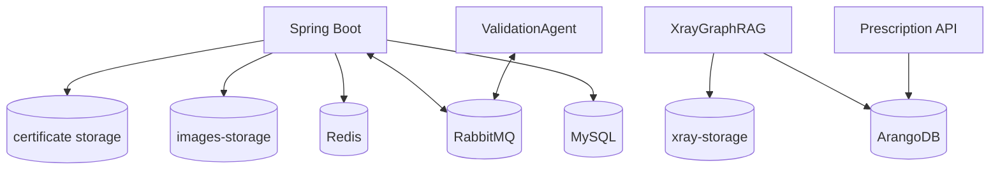
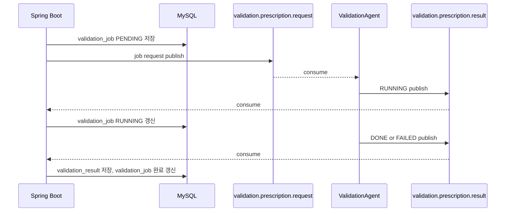
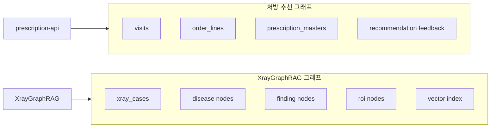
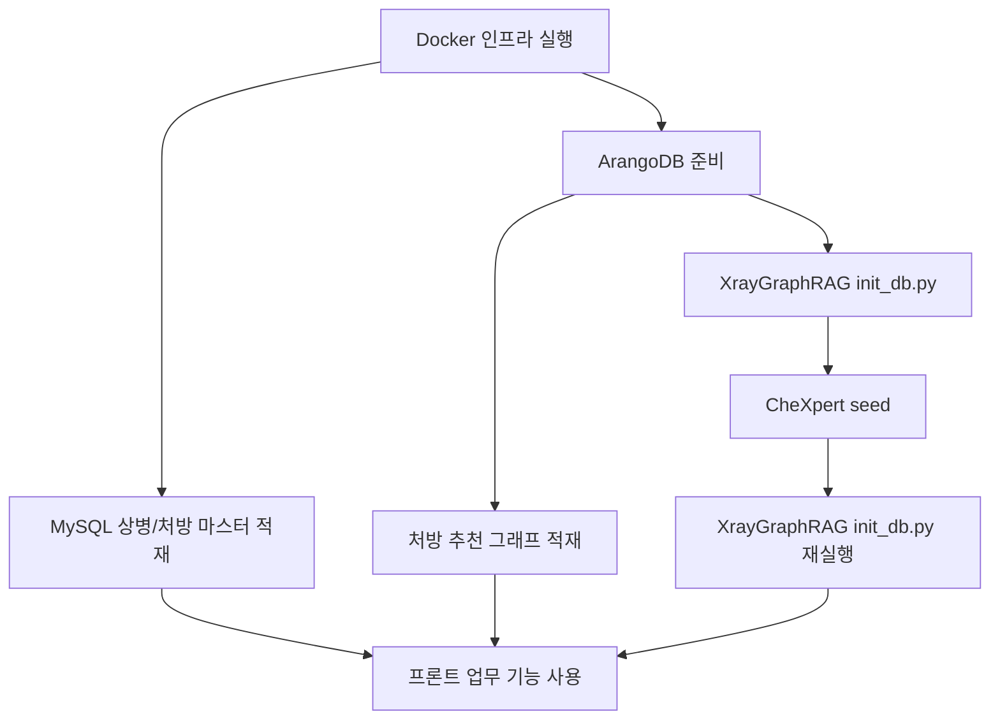

# 데이터, 메시징, 배포 구조

이 문서는 BitComputer의 저장소, 메시지 큐, Docker 실행 구조와 운영 시 자주 확인하는 명령을 정리한다.

## 1. 데이터 저장소 역할



| 저장소 | 역할 |
|---|---|
| MySQL | 환자, 직원, 진료 기록, 상병/처방 마스터, 진료별 상병/처방, 방사선 리포트, 검증 job/result, 진단서 저장 |
| Redis | 캐시 |
| RabbitMQ | 검증 에이전트 비동기 request/result queue |
| ArangoDB | 처방 그래프, 처방 피드백 그래프, XrayGraphRAG case/그래프/벡터 |
| `images-storage` | Spring/Flask 영상 파일 공유 |
| `xray-storage` | XrayGraphRAG heatmap, reconstruction, case 이미지 저장 |
| `rabbitmq-data` | RabbitMQ 내부 상태 유지 |
| `mysql-data` | MySQL 데이터 유지 |
| `arango-data`, `arango-apps` | ArangoDB 데이터 유지 |

## 2. 주요 MySQL 테이블

| 테이블 | 역할 |
|---|---|
| `patient` | 환자 기본 정보 |
| `employee` | 직원/사용자 정보 |
| `dept` | 진료과 |
| `waiting` | 대기/접수 상태 |
| `history` | 진료 기록 |
| `disease` | 상병 마스터 |
| `diagnose` | 처방 마스터 |
| `history_disease` | 진료별 저장 상병 스냅샷 |
| `history_diagnose` | 진료별 저장 처방 스냅샷 |
| `radiology_report` | X-ray 분석 요청과 결과 |
| `validation_job` | 비동기 검증 job 상태 |
| `validation_result` | 검증 에이전트 최종 JSON 결과 |
| `validation_event` | 이전 outbox 방식 검증 이벤트. 현재 RabbitMQ 흐름에서는 기본 비활성화 |
| `medical_certificate` | 진단서 PDF 경로, AI 원문, 저장 소견, 피드백 타입 |
| `prescription_feedback` | 추천 처방 피드백 |
| `phrase` | 직원별 상용구 |

## 3. RabbitMQ 설계



| Queue | Producer | Consumer | 메시지 |
|---|---|---|---|
| `validation.prescription.request` | Spring Boot | ValidationAgent | 검증 job 요청 |
| `validation.prescription.result` | ValidationAgent | Spring Boot | `RUNNING`, `DONE`, `FAILED` 결과 |

## 4. ArangoDB 데이터

ArangoDB는 두 종류의 그래프성 데이터를 담당한다.



주의:

- Docker build는 ArangoDB 데이터를 만들지 않는다.
- 처방 그래프 적재와 XrayGraphRAG seed는 실행 중인 ArangoDB volume에 대해 별도로 수행해야 한다.
- XrayGraphRAG는 seed 후 `init_db.py`를 다시 실행해 벡터 인덱스 상태를 갱신하는 것이 좋다.

## 5. 환경 변수

| 변수 | 사용 서비스 | 설명 |
|---|---|---|
| `MYSQL_ROOT_PASSWORD` | MySQL, Spring | MySQL root 비밀번호 |
| `MYSQL_DATABASE` | MySQL, Spring | 업무 DB 이름 |
| `ARANGO_PASSWORD` | ArangoDB, Spring, Python AI | ArangoDB root 비밀번호 |
| `ARANGO_DATABASE` | Spring, Prescription API | 처방 그래프 DB |
| `XRAY_ARANGO_DATABASE` | XrayGraphRAG | X-ray 그래프 DB |
| `GOOGLE_API_KEY` | Certificate API, Prescription API | Gemini 호출 |
| `GEMINI_MODEL` | Certificate API, Prescription API | Gemini 모델 |
| `OPENAI_API_KEY` | ValidationAgent | OpenAI tool decider/요약 |
| `OPENAI_MODEL` | ValidationAgent | 기본 `gpt-5-nano` |
| `NEXT_PUBLIC_API_BASE_URL` | Front-End | Spring API base URL |
| `XRAY_API_DEFAULT_VIEW` | Spring | 기본 X-ray 촬영 방향 |

## 6. 실행과 종료

루트 디렉터리:

```powershell
cd "C:\Users\kjbdd\OneDrive\바탕 화면\Project\BitComputer"
```

전체 빌드 후 실행:

```powershell
docker compose --env-file .env.docker up -d --build
```

기존 이미지로 실행:

```powershell
docker compose --env-file .env.docker up -d
```

특정 서비스만 재빌드:

```powershell
docker compose --env-file .env.docker up -d --build frontend
docker compose --env-file .env.docker up -d --build spring-boot
docker compose --env-file .env.docker up -d --build validation-agent
docker compose --env-file .env.docker up -d --build certificate-api
```

데이터 유지 종료:

```powershell
docker compose --env-file .env.docker down
```

데이터까지 삭제:

```powershell
docker compose --env-file .env.docker down -v
```

`-v`를 붙이면 MySQL, ArangoDB, RabbitMQ 등 Docker volume이 삭제된다.

## 7. 상태 확인

```powershell
docker compose --env-file .env.docker ps
curl http://localhost:8080/actuator/health
curl http://localhost:8000/health
curl http://localhost:5001/health
curl http://localhost:8001/health
curl http://localhost:8002/health
```

RabbitMQ 관리 UI:

```text
http://localhost:15672
user: guest
password: guest
```

ArangoDB 웹 UI:

```text
http://localhost:8529
user: root
password: .env.docker의 ARANGO_PASSWORD
```

## 8. 로그 확인

```powershell
docker logs -f bit-spring-boot
docker logs -f bit-frontend
docker logs -f bit-validation-agent
docker logs -f bit-prescription-api
docker logs -f bit-certificate-api
docker logs -f bit-xraygraph
docker logs -f bit-flask-radiology
```

## 9. 데이터 적재 순서



MySQL 마스터 적재:

```powershell
python .\Back-End\scripts\import_master_codes.py
```

처방 그래프 적재:

```powershell
cd "C:\Users\kjbdd\OneDrive\바탕 화면\Project\BitComputer\GraphDB\data_normalize"
python import_to_arango.py --database bitcomputer_graph --batch 1000
```

XrayGraphRAG 초기화/seed:

```powershell
cd "C:\Users\kjbdd\OneDrive\바탕 화면\Project\BitComputer\XrayGraphRAG"
python scripts\init_db.py
python scripts\seed_chexpert.py --archive "C:\Users\kjbdd\Downloads\archive" --split train --frontal-only --uncertainty ones --batch 100
python scripts\init_db.py
```

## 10. 운영상 주의점

- X-ray 분석에서 `view=PA`/`view=AP`는 DB에 적재된 view와 맞아야 한다.
- ValidationAgent는 DB를 직접 수정하지 않고 결과만 RabbitMQ로 보낸다.
- 진단서 PDF는 브라우저에서 생성한 뒤 Spring에 업로드해 저장한다.
- `docker compose down`은 데이터를 지우지 않는다. 디스크 용량 회수가 필요하면 volume 삭제 여부를 신중히 결정해야 한다.
- Gemini/OpenAI quota 문제가 발생하면 AI 생성/추천/요약 품질이 폴백 경로로 낮아질 수 있다.
