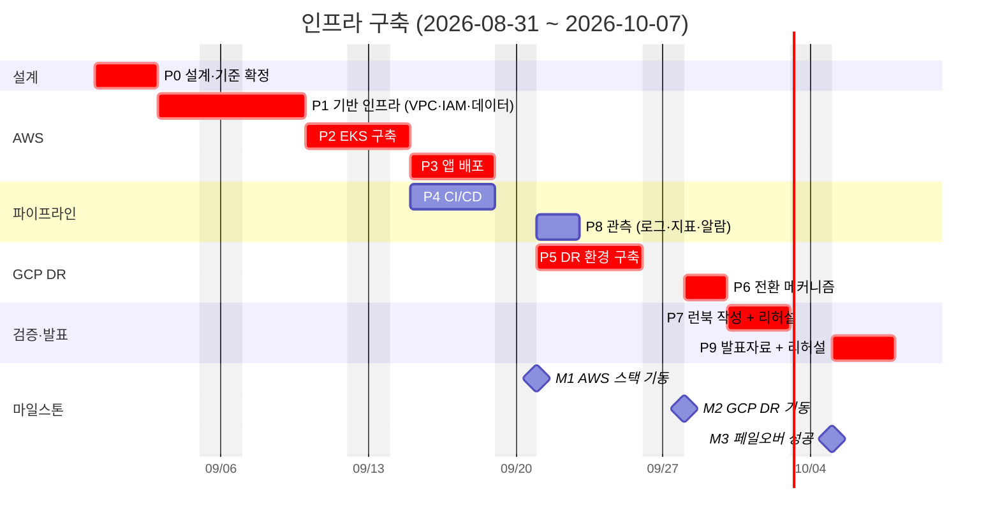

# 인프라 구축 일정 — AWS 주 / GCP DR

**기간:** 2026-08-31(월) ~ 2026-10-07(수) — 38일, **평일 28일**
**범위:** 인프라 전용. 애플리케이션 코드는 현재 상태로 고정한다.
**목표 시나리오:** AWS EKS 위에 전체 스택을 올리고, DR 발생 시 GCP 로 **AI 를 제외한 EMR 3-tier** 만 전환한다.

---

## 0. 이 문서를 읽는 법

1. §2 의 임계 경로가 가용 일수를 100% 소진한다. **버퍼가 없다.**
2. 지연이 발생하면 §7 의 축소 순서를 따른다. 무엇을 버릴지 미리 정해두지 않으면 발표 준비가 밀린다.
3. §6 의 미확정 항목은 W1 안에 답이 나와야 한다. 특히 **RPO 목표**가 정해지지 않으면 P6(데이터 복제)의 방식이 결정되지 않는다.

---

## 1. 워크로드 인벤토리

DR 시 무엇이 넘어가고 무엇이 안 넘어가는지가 이 프로젝트의 핵심 주장이다. 먼저 고정한다.

| 구성요소 | AWS(주) | GCP(DR) | 비고 |
|---|---|---|---|
| `apps/web` (Next.js) | ○ | ○ | 3-tier 의 web |
| `apps/api` (Spring Boot) | ○ | ○ | 3-tier 의 app |
| MySQL | ○ RDS | ○ Cloud SQL | 3-tier 의 data |
| Redis | ○ ElastiCache | ○ Memorystore | 세션·캐시 |
| `services/prescription` | ○ | **×** | AI. `prescription-api` 와 `certificate-api` 두 컨테이너가 이 한 컨텍스트에서 나온다(별도 `services/certificate` 디렉터리는 없다) |
| `services/llm-gateway` | ○ | **×** | AI. 단일 LLM 진입점 — 상류 자격증명이 여기에만 있다 |
| `services/validation-agent` | ○ | **×** | AI |
| `services/xray-rag` | ○ | **×** | AI |
| `services/radiology-legacy` | ○ | **×** | AI |
| ArangoDB | ○ (EKS StatefulSet) | **×** | AI 전용 그래프 |
| RabbitMQ | ○ | **×** | 검증 에이전트 메시징 |

**절단면이 깨끗하다는 점이 이 시나리오의 강점이다.** AI 서비스들이 곧 추가 데이터스토어(ArangoDB·RabbitMQ)를 쓰는 쪽이라, AI 를 빼면 DR 대상이 자연스럽게 3-tier + Redis 로 줄어든다. GCP 쪽에서 "무엇을 뺄지" 판단이 필요 없다.

> AWS 리전은 **us-west-2 고정**이다. Bedrock `bedrock-mantle` 이 us-east-1 / us-east-2 / us-west-2 에만 있기 때문이며, 근거는 `Docs/superpowers/specs/2026-08-28-llm-provider-tradeoffs.md` 에 있다. DR 대상에서 AI 가 빠지므로 GCP 리전은 이 제약과 무관하게 고를 수 있다.

---

## 2. 간트차트

**굵은(crit) 항목이 임계 경로다.** P4·P8 만 병행 여지가 있고 나머지는 순차다.

---

## 3. WBS

### P0 — 설계·기준 확정 (3일, 8/31~9/2)

이 단계의 산출물이 이후 전부의 기준이 된다. 여기서 흐리게 넘어가면 P5 에서 되돌아온다.

- [ ] 워크로드 인벤토리 확정 (§1 을 검토·확정)
- [ ] **RTO / RPO 목표 수치화** — P6 의 복제 방식을 결정하는 입력
- [ ] GCP 리전 선정
- [ ] Terraform 구성 요소 확정 — 모듈 경계, 무엇을 코드로 하고 무엇을 안 할지
- [ ] Terraform state 백엔드 설계 (S3 + DynamoDB 잠금)
- [ ] EKS 구축 기준 — 노드 타입·크기, 오토스케일링 방식, 애드온 목록, 네임스페이스·RBAC 전략
- [ ] 네트워크 설계 — VPC CIDR, 서브넷 계층, GCP 와의 CIDR 충돌 회피

**산출물:** 설계 문서 1개

### P1 — AWS 기반 인프라 (5일, 9/3~9/9)

- [ ] Terraform state 백엔드
- [ ] VPC / 서브넷(public·private·data) / NAT / 라우팅
- [ ] IAM — 역할, IRSA 준비
- [ ] Secrets Manager
- [ ] ECR 리포지터리 (이미지 7종)
- [ ] RDS MySQL
- [ ] ElastiCache Redis
- [ ] RabbitMQ (Amazon MQ 또는 EKS 내부 — P0 에서 결정)

### P2 — EKS 구축 (3일, 9/10~9/14)

- [ ] 클러스터 + 노드그룹
- [ ] AWS Load Balancer Controller
- [ ] ExternalDNS
- [ ] cert-manager (TLS)
- [ ] EBS CSI Driver
- [ ] 오토스케일러 (Cluster Autoscaler 또는 Karpenter — P0 결정)
- [ ] metrics-server
- [ ] 네임스페이스 · RBAC

### P3 — 앱 배포 (4일, 9/15~9/18)

- [ ] 이미지 7종 빌드·ECR 푸시
- [ ] Helm 차트 또는 매니페스트 작성
- [ ] ArangoDB StatefulSet + PVC
- [ ] Ingress / ALB / TLS / 도메인
- [ ] 데이터스토어 연결·시크릿 주입
- [ ] **스모크 검증** — 기존 `tests/e2e` 재활용

**M1: AWS 스택 기동**

### P4 — CI/CD (4일, P2 이후 병행)

- [ ] 빌드·테스트 (기존 CI 통합)
- [ ] ECR 푸시
- [ ] EKS 배포 (직접 배포 또는 GitOps — P0 결정)
- [ ] 배포 검증 게이트

### P5 — GCP DR 환경 (5일, 9/21~9/25)

- [ ] GCP 프로젝트 · IAM
- [ ] VPC (AWS 와 CIDR 비충돌)
- [ ] GKE 클러스터
- [ ] Cloud SQL (MySQL)
- [ ] Memorystore (Redis)
- [ ] Artifact Registry + 이미지 2종(web·api) 푸시
- [ ] **AI 제외 3-tier 배포**
- [ ] 단독 기동 검증

**M2: GCP DR 기동**

### P6 — 전환 메커니즘 (2일, 9/28~9/29)

**가장 얇게 배정된 구간이자 가장 어려운 구간이다.** §5 위험 참조.

- [ ] 데이터 복제 (RDS → Cloud SQL) — P0 의 RPO 목표에 따라 방식 결정
- [ ] DNS 페일오버 (Route53 헬스체크 → GCP 엔드포인트)
- [ ] 시크릿·설정의 클라우드별 분리
- [ ] AI 부재 시 애플리케이션 동작 확인 — **여기서 AI 호출이 실패해도 EMR 핵심 기능이 살아 있어야 한다**

### P7 — 런북 + 리허설 (3일, 9/30~10/2)

- [ ] DR 런북 작성 — 탐지 · 판단 · 전환 · 검증 · 복귀
- [ ] **실제 페일오버 리허설**
- [ ] RTO / RPO 실측
- [ ] 실측 결과를 런북에 반영 (목표와 실측이 다르면 그것도 결과다)

**M3: 페일오버 성공**

### P8 — 관측 (2일, P3 이후 병행)

- [ ] 로그 수집 (CloudWatch Logs)
- [ ] 지표 (Container Insights 또는 Managed Prometheus)
- [ ] 최소 대시보드
- [ ] 알람 — DR 판단 근거가 되는 것 위주

### P9 — 발표 (3일, 10/5~10/7)

- [ ] 아키텍처 다이어그램 (AWS / GCP / 전환 흐름)
- [ ] DR 시연 시나리오 구성
- [ ] 발표자료
- [ ] 발표 리허설

---

## 4. 마일스톤

| | 시점 | 판정 기준 |
|---|---|---|
| **M1** AWS 스택 기동 | 9/18 | 도메인으로 접속되고 기존 E2E 가 통과한다 |
| **M2** GCP DR 기동 | 9/25 | GCP 단독으로 EMR 3-tier 가 동작한다 (AI 없이) |
| **M3** 페일오버 성공 | 10/2 | 리허설로 전환이 확인되고 RTO/RPO 가 실측됐다 |

M1 이 9/18 을 넘기면 §7 의 축소를 즉시 발동한다. 뒤에서 흡수할 여유가 없다.

---

## 5. 위험

| 위험 | 영향 | 대응 |
|---|---|---|
| **버퍼 0** | 어느 단계든 지연이 그대로 발표 준비를 잠식 | §7 축소 순서를 미리 확정. M1 을 조기 경보로 사용 |
| **P6 데이터 복제** | 크로스 클라우드 MySQL 복제는 이 계획에서 가장 어렵고 2일만 배정됐다 | P0 에서 RPO 를 낮게 잡아 **주기적 백업·복원 기반 콜드 DR** 로 설계하면 난도가 크게 내려간다. 실시간 복제를 고집하면 P6 가 2일에 안 끝난다 |
| **쿠버네티스 클러스터 2개** | 28일에 EKS + GKE 를 처음부터 구축 | GKE 는 EKS 에서 만든 매니페스트를 최대한 재사용. 클라우드별 차이는 values 로 분리 |
| **추석 연휴** | W4(9/21~9/25)에 걸릴 가능성 — 이 주는 P5(GCP DR) 구간이다 | **확인 필요.** 걸리면 P5 를 앞당기거나 §7 을 발동한다 |
| **리허설 실패** | 런북이 검증되지 않은 채 발표 | P7 에 3일을 배정한 이유. 1일차 실패를 전제로 잡았다 |
| **비용** | 클러스터 2개 상시 가동 | 검증이 끝난 구간은 내려두고 필요할 때 올린다. Terraform 이므로 재현 가능하다 |

---

## 6. W1 안에 답이 나와야 하는 것

- [ ] **RTO / RPO 목표 수치** — P6 방식을 결정한다. 미정이면 P6 를 시작할 수 없다
- [ ] DR 을 **콜드**로 갈 것인가 **웜**으로 갈 것인가 — 비용과 난도가 갈린다
- [ ] GKE 를 쓸 것인가, Cloud Run 으로 갈 것인가 — 3-tier 만이면 Cloud Run 이 더 빠르지만 EKS 와 대칭성이 떨어진다
- [ ] CI/CD 를 직접 배포로 할 것인가 GitOps 로 할 것인가
- [ ] 추석 연휴가 W4 에 걸리는지

---

## 7. 축소 순서 — 지연 시 이 순서로 버린다

버퍼가 없으므로 무엇을 버릴지 미리 정한다. **위에서부터 버린다.**

1. **P8 관측을 최소화** — 로그 수집만 남기고 대시보드·알람은 발표 후
2. **CI/CD 를 빌드·푸시까지만** — 배포는 수동. 파이프라인 서사는 유지된다
3. **GCP DR 을 콜드로 강등** — 상시 가동 대신 Terraform 으로 필요할 때 생성. 리허설은 생성부터 포함해 측정
4. **AWS 오토스케일링·고가용성 축소** — 단일 AZ, 고정 노드 수
5. **관측·CI/CD 를 발표에서 "설계했으나 미구현"으로 명시** — 감추지 않는다

**절대 버리지 않는 것:** P7 리허설. 런북만 있고 검증하지 않은 DR 은 이 프로젝트의 주장을 무너뜨린다. 리허설이 실패했더라도 **실패했다는 사실과 원인**이 미검증보다 낫다.

---

## 8. 템플릿 사용법

이 문서는 재사용 템플릿이다. 다른 프로젝트에 쓸 때:

1. §1 인벤토리를 먼저 채운다 — 무엇이 어디서 도는지가 모든 결정의 입력이다
2. §3 WBS 를 쓰고, **순차로만 가능한 항목을 골라 임계 경로 일수를 더한다**
3. 그 합을 가용 평일과 비교한다 — 버퍼가 음수면 계획이 아니라 희망이다
4. §7 축소 순서를 **시작 전에** 정한다
5. §6 에 "언제까지 답이 나와야 하는 질문"을 모은다
6. mermaid 간트는 §3 을 옮긴 것이므로 WBS 를 먼저 쓰고 간트를 나중에 그린다
