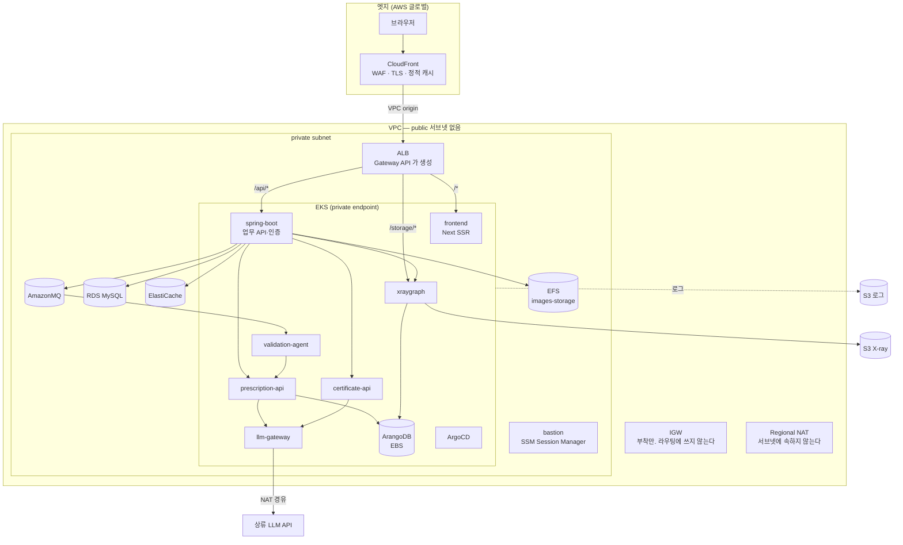
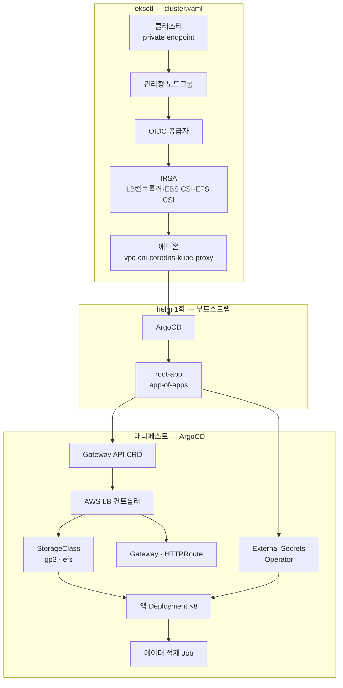
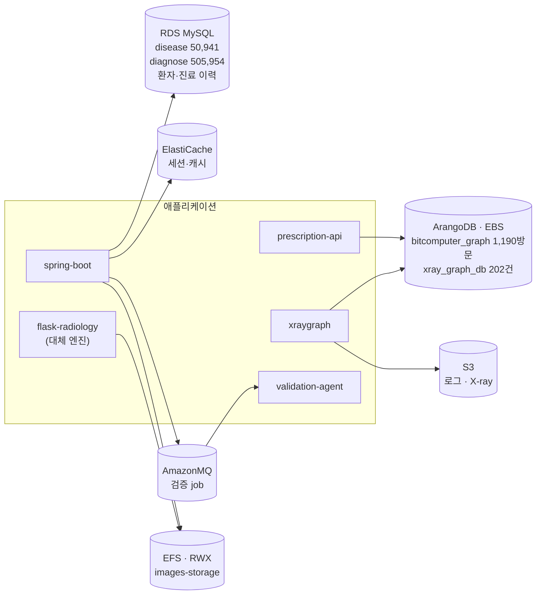
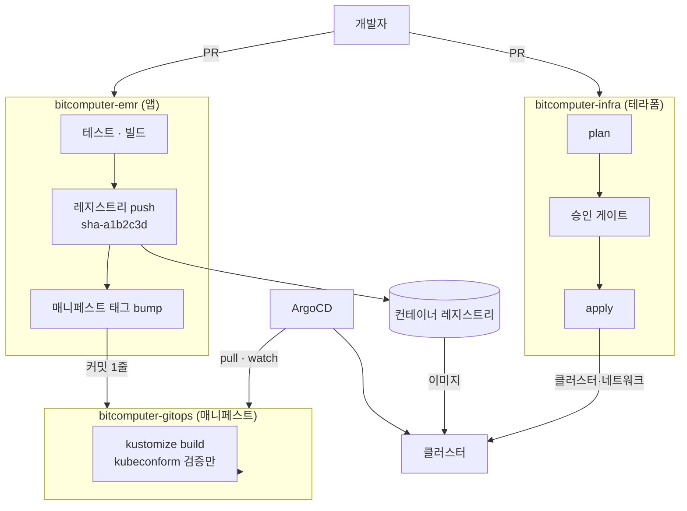
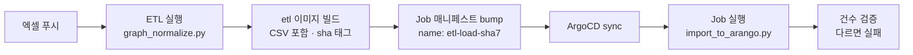
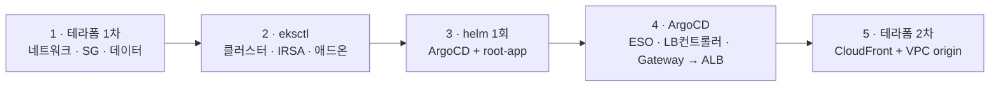

# 목표 아키텍처

BitComputer EMR 을 AWS 에 올렸을 때의 전체 그림. 결정 근거는
[10-aws-deployment-design.md](10-aws-deployment-design.md) 에, 현재 상태 실측은
[09-current-infrastructure.md](09-current-infrastructure.md) 에 있다.

이 문서는 **다섯 축을 한 장으로 잇는다** — 전체 구조 / 테라폼이 만드는 것 /
클러스터가 만드는 것 / 데이터 저장소 / CI·CD.

---

## 1. 전체 구조



**진입점은 CloudFront 하나다.** 프론트와 API 가 같은 오리진 아래 있어 CORS·SameSite
재설계가 필요 없다 — 인증이 쿠키 기반이라 이 이득이 크다.

**public 서브넷이 없다.** 공인 IP 를 가진 자원이 하나도 없다.

```
ALB       private   CloudFront VPC origin 이 직접 닿는다
bastion   private   SSM Session Manager — 인바운드도 공인 IP 도 불필요
NAT       서브넷 밖  Regional NAT 은 리전 단위 자원이다
IGW       VPC 에 부착만  라우팅에 쓰이지 않는다
```

**IGW 는 두 기능이 요구해서 붙인다** — Regional NAT 과 CloudFront VPC origin 이
각각 "이 VPC 가 인터넷과 통할 수 있다"는 표시로 IGW 를 요구한다. 라우팅 테이블에는
넣지 않는다.

### 1.1 CloudFront VPC origin 요구사항

**`ap-northeast-2` 는 지원된다.** AWS 지원 리전 표에 있고 **AZ 예외도 없다** —
도쿄·버지니아 등은 특정 AZ 가 제외돼 있는데 서울은 깨끗하다.

```
IGW      VPC 에 부착돼 있어야 한다        Regional NAT 도 요구하므로 어차피 있다
ALB SG   보안 그룹이 붙어 있어야 한다
NACL     인바운드는 평가되지 않는다        아웃바운드가 ephemeral(1024-65535)을 허용해야 한다
```

SG 인바운드는 둘 중 하나로 연다.

| | 방법 | 시점 |
|---|---|---|
| A | CloudFront 관리형 프리픽스 리스트 | 오리진 생성 **전에도** 가능 |
| B | 서비스 관리형 SG `CloudFront-VPCOrigins-Service-SG` | 오리진 생성 **후에만** |

**B 가 더 좁다** — 우리 배포에서 오는 트래픽으로만 제한된다. 다만 오리진을 만든
뒤에야 존재하므로 적용 순서가 한 단계 늘어난다.

> 이름이 `CloudFront-VPCOrigins-Service-SG` 로 시작하는 SG 를 직접 만들지 않는다.
> AWS 예약 패턴이다.

> gRPC 와 Lambda@Edge 오리진 트리거는 VPC origin 에서 지원되지 않는다. 둘 다
> 우리와 무관하다.

**클러스터 밖으로 나가는 트래픽은 둘뿐이다** — 상류 LLM 호출(NAT 경유)과 S3·ECR
같은 AWS 서비스(VPC 엔드포인트 경유).

### 1.1 `/storage/*` 가 따로 있는 이유

`xraygraph` 는 나머지 내부 서비스와 달리 **브라우저가 직접 읽는 경로를 갖는다.**

```python
app.mount("/storage", StaticFiles(directory=STORAGE_DIR), name="storage")
```

추론 응답의 `heatmapPath` 를 Spring 이 `XRAY_API_PUBLIC_BASE_URL` 로 절대 URL 로
만들어 브라우저에 준다. 브라우저는 그 주소로 히트맵 PNG 를 가져간다.

**`xraygraph` 를 ClusterIP 로만 두면 분석은 되는데 이미지가 안 뜬다.** 그래서
`/storage/*` HTTPRoute 가 필요하다. 2단계에서 히트맵을 S3 로 옮기면 이 경로는
CloudFront 가 대신하고 이 라우트는 사라진다(§4.3).

---

## 2. 테라폼이 만드는 것

### 2.0 확정 파라미터

레이어를 쓰기 전에 정해야 하는 값들이다. **바꾸는 비용이 특히 큰 것들이라**
먼저 못박는다 — 서브넷은 만든 뒤 크기를 못 바꾸고, 리전을 바꾸면 전부 재생성이다.

| 항목 | 값 |
|---|---|
| 리전 | `ap-northeast-2` (서울) |
| 보조 리전 | `us-east-1` — **CloudFront 용 WAF·ACM 전용.** 프로바이더 alias 로만 쓴다 |
| AZ | `a`, `b`, `c` — 3개 |
| 환경 | `dev`, `prod` — **VPC 부터 분리** |
| 서브넷 | `/24` |

```
prod  10.0.0.0/16
  private   10.0.10.0/24  (a)   10.0.11.0/24  (b)   10.0.12.0/24  (c)   ALB · EKS 노드 · 파드 · bastion
  data      10.0.20.0/24  (a)   10.0.21.0/24  (b)   10.0.22.0/24  (c)   RDS · ElastiCache · AmazonMQ · EFS

dev   10.1.0.0/16   (동일 배치)
```

**public 서브넷이 없다**(§1). `10.0.0.0/24`~`10.0.9.0/24` 를 비워 두어 나중에
필요하면 추가할 수 있다 — 서브넷은 **늘릴 수 있고 크기만 못 바꾼다.**

**데이터 계층을 별도 서브넷으로 뺀 이유가 `/24` 때문이다.** VPC CNI 는 **파드마다
VPC IP 를 할당**한다 — IP 를 먹는 것은 노드 수가 아니라 파드 수다. RDS·ElastiCache
가 같은 서브넷에 있으면 그만큼 파드가 쓸 IP 가 준다.

`/24` 는 AWS 예약 5개를 빼고 **251개**다. `m5.large` 기준 노드 하나가 ENI 3개 ×
10 IP = 약 29개를 잡으므로 **서브넷당 노드 8대**까지 들어간다. 지금 워크로드가
파드 25~40개라 충분하다.

> **VPC CNI prefix delegation 을 켜면 얘기가 달라진다.** ENI 마다 `/28`(16개)을
> 통째로 잡아 IP 소모가 급증한다. `/24` 에서는 켜지 않는다.

**AZ 를 3개로 둔 이유는 AmazonMQ 다.** RabbitMQ 클러스터 배포는 **노드 3개를 서로
다른 AZ 3곳에** 둔다. EKS 자체는 2개면 되지만 MQ 가 3개를 요구한다.

ArangoDB 가용성은 AZ 개수와 무관하다 — **EBS 는 몇 개를 두든 단일 AZ 에 묶인다.**

**NAT 는 Regional NAT 하나다.** 2025-11 에 나온 리전 단위 자원으로, **하나가 모든
AZ 를 덮고** 워크로드 분포에 따라 자동 확장한다. 서브넷에 속하지 않으므로
"AZ 마다 하나씩 둘까"라는 질문 자체가 없어진다.

```
자동 모드   스케일 다운·재확장 때 egress IP 가 바뀐다
고정 IP     외부가 우리 IP 를 허용목록에 넣어야 할 때만 필요
확장 시간   최대 60분. 그동안 교차 AZ 트래픽이 생길 수 있다
```

지금 밖으로 나가는 곳은 **상류 LLM 과 GHCR 뿐이고 둘 다 허용목록이 없으므로 자동
모드로 충분하다.**

**`c6i.xlarge` 는 `a`·`b`·`c` 전부에서 쓸 수 있다**(계정에서 확인). 노드그룹의
서브넷을 좁힐 필요가 없다.

> 다른 계정·리전으로 옮길 때는 다시 확인한다. 없는 AZ 가 있으면 노드그룹 생성이
> 실패한다.
>
> ```bash
> aws ec2 describe-instance-type-offerings --location-type availability-zone >   --filters Name=instance-type,Values=c6i.xlarge --region ap-northeast-2 >   --query 'InstanceTypeOfferings[].Location' --output text
> ```

> **환경 둘은 비용이 두 배다.** 클러스터·RDS·NAT 가 각각 하나씩 더 든다.
> `dev` 는 NAT 하나 공유·RDS 단일 AZ·작은 노드로 줄이는 것을 권한다.

### 2.1 사이징

| 대상 | 타입 | 근거 |
|---|---|---|
| 노드 `general` | `t3.medium` × **2~4** | frontend·spring·경량 API 4개·ArangoDB |
| 노드 `ai` | `c6i.xlarge` × **1~2** | xraygraph 파드 하나뿐이라 최소 1 |
| RDS | `db.t3.medium` | 질의가 산발적이라 버스터블이 맞다 |
| ElastiCache | `cache.t3.medium` | 세션·캐시 전용 |
| AmazonMQ | `mq.m7g.medium` × **3** | 클러스터 최소 사양. RabbitMQ **4.2** |
| 백업 | **7일** | RDS 자동 백업 · **AWS Backup**(EBS) — §4.5 |

**`ai` 노드그룹만 c 계열인 이유가 둘이다.**

**t3 는 버스터블이다.** CPU 크레딧이 마르면 **베이스라인 20%** 로 떨어진다. 추론은
짧고 굵게 CPU 를 전부 쓰는 작업이라 크레딧이 빠르게 마르고, 마른 뒤의 성능은
예측이 어렵다.

**코어 수가 성능을 직접 정한다.** 실측이 **14코어에서 3~4초**였다. torch 추론은
코어를 병렬로 쓰므로 코어가 줄면 그만큼 늘어난다.

```
14 vCPU (실측)      3~4초
 4 vCPU (c6i.xlarge) 10~12초 예상
 2 vCPU (t3.medium)  20~30초 예상 + 크레딧 소진 시 그 이상
```

웹 타임아웃이 60초라 실패하지는 않지만, 20초를 넘기면 사용자는 화면이 멈춘 것으로
느낀다.

### 2.2 범위에서 뺀 것

**모니터링·알람·옵저버빌리티는 이번 범위가 아니다.** 로그 수집용 S3 는 만들되
수집 파이프라인은 나중에 붙인다.

```mermaid
flowchart LR
  subgraph L0["00-bootstrap"]
    B1["state S3 버킷"]
    B2["GH Actions OIDC 역할"]
  end
  subgraph L1["10-network"]
    N1["VPC · subnet<br/>(EKS 태그 포함)"]
    N2["RT · IGW · NAT"]
    N3["VPC 엔드포인트 8종"]
  end
  subgraph L2["20-security"]
    S1["SG"]
    S2["IAM"]
  end
  subgraph L3["30-data"]
    D1["RDS<br/>인스턴스 + 부속"]
    D2["ElastiCache"]
    D3["AmazonMQ"]
    D4["S3 ×2 · EFS<br/>AWS Backup"]
  end
  subgraph L4["40-edge"]
    E1["CloudFront"]
    E2["WAF (us-east-1)"]
    E3["VPC origin"]
  end

  L0 --> L1 --> L2 --> L3
  L3 -.ALB 생성 이후.-> L4
```



| 레이어 | 자원 | 비고 |
|---|---|---|
| `00-bootstrap` | state 버킷, GH Actions OIDC 역할 | 로컬 state 로 만들고 마이그레이션 |
| `10-network` | VPC, subnet, RT, IGW, NAT, VPC 엔드포인트 | **서브넷 EKS 태그를 여기서 붙인다** |
| `20-security` | SG, IAM | 클러스터 SG ID 대신 CIDR 을 소스로 |
| `30-data` | **RDS**, ElastiCache, AmazonMQ, S3 ×2, EFS, **AWS Backup** | RDS 는 `deletion_protection` + `prevent_destroy` 로 잠근다 |
| `40-edge` | CloudFront, WAF, VPC origin | **ALB 생성 이후에만 적용 가능** |

### 테라폼이 만들지 않는 것

| 자원 | 누가 | 이유 |
|---|---|---|
| EKS 클러스터·노드그룹 | eksctl | IRSA·애드온을 훨씬 적은 코드로 처리 |
| ALB · 리스너 · TG | Gateway API 컨트롤러 | 컨트롤러가 만들고 소유한다 |
| ASG | EKS 관리형 노드그룹 | 노드그룹이 ASG 를 직접 만든다 |
| EBS 볼륨 | EBS CSI + PVC | 정적 생성은 파드를 AZ·노드에 못 박는다 |
| Route53 · VPN | 나중 단계 | |

### 상태 관리

```
키      s3://<bucket>/<env>/<layer>/terraform.tfstate
잠금     S3 네이티브 락 (use_lockfile) — DynamoDB 불필요
참조     레이어 간은 SSM Parameter Store (terraform_remote_state 아님)
환경     workspace 아님. 키 접두사로 분리
```

`terraform_remote_state` 는 하위 레이어의 state 구조에 상위를 결합시킨다. SSM 을
쓰면 결합이 **이름 하나**로 줄고 K8s 매니페스트와 CI 도 같은 값을 읽는다.

---

## 3. 클러스터에서 만드는 것



### eksctl 로 갈 때 주의사항

**서브넷 태그는 테라폼이 붙인다.** eksctl 에 기존 서브넷을 넘기면 **태그를 추가하지
않는다.** 없으면 LB 컨트롤러가 서브넷을 못 찾고, **클러스터를 다 만든 뒤 Gateway 가
안 뜨는 형태로** 드러난다.

```hcl
public   "kubernetes.io/role/elb"          = "1"
private  "kubernetes.io/role/internal-elb" = "1"
```

**프라이빗이면 VPC 엔드포인트도 테라폼 몫이다.**

```yaml
privateCluster:
  enabled: true
  skipEndpointCreation: true    # 테라폼이 이미 만들었다
```

```
ec2  ecr.api  ecr.dkr  s3(gateway)  logs  sts  elasticloadbalancing  autoscaling
```

빠뜨리면 노드는 조인되는데 **이미지 풀이나 로그 전송에서 걸린다.**

**삭제는 정확히 역순이다.**

```
매니페스트 삭제 (Gateway → ALB 회수)  →  eksctl delete cluster  →  terraform destroy
```

ALB 가 살아 있는 채로 서브넷을 지우면 테라폼이 오래 매달린 뒤 실패한다.

### Gateway API

- **AWS LB 컨트롤러 v2.13 이상**이라야 Gateway API 를 받는다
- **CRD 를 따로 설치**한다. 쿠버네티스에 내장돼 있지 않다
- 인증서·스킴 같은 ALB 고유 설정은 **`LoadBalancerConfiguration` CRD** 로 붙인다
- 네임스페이스를 넘는 라우팅은 **`ReferenceGrant`** 가 필요하다

### 노드 그룹

| 그룹 | 타입 | 워크로드 |
|---|---|---|
| `general` | `t3.medium` | frontend, spring-boot, 경량 API 4개, ArangoDB |
| `ai` | `c6i.xlarge` | xraygraph — **CPU 전부 + 1.4GB** |

`xraygraph` 가 CPU 를 다 쓰는 동안 프론트가 같은 노드에 있으면 화면 응답이 같이
느려진다. **taint/toleration 으로 가른다** — 사이징 근거는 §2.1.

---

## 4. 데이터 저장소



| 저장소 | 담는 것 | 갱신 | 왜 이 선택인가 |
|---|---|---|---|
| **RDS MySQL** | 마스터 코드 + 환자·진료 이력 | 엑셀 → Job | 관리형 |
| **ArangoDB** (인클러스터+EBS) | 처방 그래프, X-ray 그래프 | 엑셀·CheXpert → Job | **AWS 관리형 등가물 없음** |
| **ElastiCache** | 세션·캐시 | — | 관리형 |
| **AmazonMQ** | 검증 job 큐 | — | `mq.m7g.medium` ×3, RabbitMQ 4.2 |
| **EFS** | 진료 업로드 원본 + flask 오버레이 | 운영 중 상시 | **RWX 필요** (§4.2) |
| **S3 · X-ray** | CheXpert 사례 산출물 + 질의 히트맵 | 적재 시 / 추론마다 | 무한 증가분을 라이프사이클로 만료 (§4.3) |
| **S3 · 로그** | 컨테이너 로그 | 상시 | 가장 쌈 |

### 4.2 EFS — 진료 업로드 원본과 오버레이

**실제 진료에서 올린 X-ray 다.** 아래 규약으로 쌓인다.

```
images/<radiologyRequestId>/original/<파일명>              Spring 이 업로드를 저장
images/<radiologyRequestId>/overlay/<파일명>_overlay.jpg   flask 가 히트맵을 얹어 저장
```

`original` 은 `RadiologyReportController` 가 업로드를 받아 쓰고, `overlay` 는
`flask-radiology` 가 자기 추론 결과를 얹어 만든다.

**세 곳이 쓴다.**

```
쓰기   Spring ImageStorageUtil          original/
쓰기   flask-radiology                  overlay/
서빙   Spring WebMvcConfig /images/**   브라우저에 정적 서빙
```

**EBS 로는 안 된다** — Spring 과 flask 가 같은 디렉터리를 각자 쓰므로
ReadWriteMany 가 필요하다. `RADIOLOGY_ENGINE=xray` 인 지금은 flask 가 호출되지
않아 실제로는 Spring 혼자 쓰지만, **flask 를 켜는 순간 조용히 깨진다.**

**S3 로 가려면 세 곳을 동시에 고쳐야 하고** 그중 하나가 브라우저가 직접 보는 정적
서빙이다. 배포와 코드 변경을 한 번에 묶으면 문제가 났을 때 원인이 둘로 갈린다.

**용량이 근거를 완성한다** — X-ray 원본 1장 46KB, 로컬 `storage/` 전체가 471파일
109MB 다. 단가가 10배여도 이 규모에서는 절대 금액 차이가 무의미하다.

> 뒤집을 조건: 업로드가 수십 GB 를 넘거나 정적 서빙을 CloudFront 로 옮길 때.

### 4.3 S3 · X-ray — 적재 산출물과 질의 히트맵

**EFS 와 담는 것이 완전히 다르다.** 이쪽은 `xraygraph` 의 `storage/` 다.

| 종류 | 접두사 | 언제 생기나 | 실측 |
|---|---|---|---|
| 사례 원본 | `case_*` | 적재 시 1회 | 471개 · 26MB |
| 재구성 출력 | `case_*` | 적재 시 1회 | 471개 · 19MB |
| 히트맵 | `case_*` | 적재 시 1회 | 471개 · 65MB |
| **질의 히트맵** | `query_case_*` | **추론할 때마다 1개** | 누적 |

**질의 히트맵이 무한히 쌓인다.** 추론 한 번에 파일 하나다. 로컬에서 오늘 17번
돌려 17개가 생겼다. 운영에서는 정리 정책이 필요하고, **S3 라이프사이클로 자동
만료시킬 수 있다는 것이 EBS 대신 S3 를 쓸 실질 근거다.**

**브라우저가 이 파일을 직접 읽는다**(§1.1). 그래서 이관이 두 단계로 갈린다.

```
1단계   적재 산출물만 S3 에 백업 (재적재에 4.5분 걸리므로 보관 가치가 있다)
        질의 히트맵은 EBS 에 두고 /storage/* HTTPRoute 로 서빙

2단계   히트맵을 S3 에 직접 쓰고 CloudFront 가 서빙
        라이프사이클로 query_* 자동 만료
        xraygraph 의 StaticFiles 마운트와 /storage/* 라우트를 함께 제거
```

`images-storage` 때와 같은 이유로 나눈다 — **배포와 코드 변경을 한 번에 묶지
않는다.**

### 4.4 SQUID 가중치 — initContainer 로 넣는다

지금은 `xraygraph` 가 `radiology-legacy` 디렉터리를 바인드 마운트해 읽는다.
K8s 에는 그런 마운트가 없다.

```
S3 (X-ray 버킷)  models/squid_exp1_256_mask/model.pth
       │  initContainer — IRSA 로 인증, 체크섬 검증
       ▼
   emptyDir /weights
       │
       ▼
  xraygraph   SQUID_MODEL_DIR=/weights/squid_exp1_256_mask
```

**이미지에 굽지 않는 이유:** 가중치가 코드와 다른 주기로 바뀌고, 구우면 두
이미지(`xraygraph`·`flask-radiology`)에 같은 파일이 중복된다. S3 에 한 벌 두고
둘 다 받아 가는 편이 낫다.

**체크섬을 검증해야 한다.** 가중치가 바뀌었는데 이미지가 그대로면
`engineStatus` 는 여전히 `real` 인데 **모델이 다르다.** initContainer 가 받은
파일의 해시를 확인하고 다르면 기동을 실패시킨다 — 이 저장소가 반복해서 겪은
"조용히 어긋나는" 부류를 여기서 막는다.

**업로드는 CI 가 한다.** `services/radiology-legacy/squid_exp1_256_mask/**` 가
바뀌면 S3 에 올리고 매니페스트의 기대 해시를 갱신한다.

### 4.5 백업 — AWS Backup

```
RDS          자동 백업 7일        관리형
ArangoDB     AWS Backup 7일       EBS 볼륨 스냅샷
```

**ArangoDB 만 손이 간다.** 인클러스터 + EBS 라 관리형 자동 백업이 없다.

**볼륨 ID 를 테라폼이 모른다는 것이 설계를 정한다.** PVC 가 동적으로 만들기
때문이다. 그래서 **태그로 선택**한다.

```
StorageClass   tagSpecification 으로 볼륨에 backup=arangodb 를 붙인다
AWS Backup     그 태그를 selection 조건으로 쓴다
```

StorageClass 쪽 태그를 빠뜨리면 **백업 계획은 만들어지는데 대상이 0건**이 된다 —
콘솔에서 계획이 초록으로 보이므로 복원할 때까지 모른다.

> **EBS 스냅샷은 crash-consistent 다.** 애플리케이션 일관성은 보장되지 않는다.
> ArangoDB 는 WAL 이 있어 대부분 복구되지만, **복원을 한 번은 실제로 해 봐야
> 한다.** 재해 복구는 그날 처음 시험해 보는 절차가 되어서는 안 된다.
>
> 더 확실히 하려면 `arangodump` 를 주기적으로 S3 에 넣는다. 그건 논리 백업이라
> 애플리케이션 일관성이 있다.

**무엇이 복구되고 무엇이 안 되는지 구분해 둔다.**

| | 복구 경로 |
|---|---|
| 처방 그래프 원본 | 엑셀 → ETL 재적재 (4.5분) |
| 합성 케이스 | 스크립트 재실행 (결정론적) |
| X-ray 코퍼스 | CheXpert 재시드 (4.5분) |
| **운영 중 쌓인 피드백 이력** | **백업뿐이다** |

앞의 셋은 백업이 없어도 되살아난다. **마지막 하나 때문에 백업이 필요하다.**

### EBS 를 미리 만들지 않는다

정적 PV 로 미리 만든 볼륨을 물리면 파드가 그 AZ·그 노드에 못 박히고, 테라폼이 볼륨
생명주기를 K8s 가 바인딩을 각각 쥐어 서로 싸운다. **PVC 동적 프로비저닝**으로 간다.

ArangoDB 는 EBS 가 AZ 에 묶이므로 `topology.kubernetes.io/zone` 어피니티와
`WaitForFirstConsumer` 바인딩을 함께 쓴다.

### 갱신이 필요한 저장소 셋

| 대상 | 출처 | 트리거 |
|---|---|---|
| RDS `disease`/`diagnose` | 엑셀 2개 | 엑셀 푸시 |
| ArangoDB `bitcomputer_graph` | 엑셀 + 합성 케이스 | 엑셀 푸시 |
| ArangoDB `xray_graph_db` | CheXpert 202건 | 모델·마스크 변경 시 |

**`import_to_arango.py` 는 기본이 truncate 다.** 원본 적재 후 `--append` 로 합성
케이스를 다시 넣어야 한다. 순서가 뒤바뀌면 합성 120건이 사라진다.

**Job 은 끝나고 건수를 검증해야 한다.** 적재는 "성공"이라 말하면서 내용이 틀릴 수
있다.

---

## 5. CI / CD



### 분리의 실체는 크리덴셜이다

| | 앱 파이프라인 | 인프라 파이프라인 | 매니페스트 |
|---|---|---|---|
| 트리거 | `apps/**`, `services/**` push | `live/**`, `modules/**` PR·merge | PR |
| 하는 일 | 테스트·빌드·push·태그 커밋 | plan → 승인 → apply | 검증만 |
| 권한 | 레지스트리 write, 매니페스트 write | AWS OIDC | 없음 |
| **못 하는 것** | **클러스터 접근 불가** | **레지스트리 접근 불가** | **apply 불가** |
| 빈도 | 하루 수십 번 | 주 1~2회 | PR마다 |

**두 파이프라인은 서로를 호출하지 않는다.** 연결 고리는 둘뿐이다 — 앱 CI 가
매니페스트 레포에 남기는 **커밋 하나**, 그리고 ArgoCD 의 **pull**.

앱 CI 는 클러스터로 push 하지 않는다. **그래서 앱 CI 에 클러스터 크리덴셜이 아예
존재하지 않는다.**

### 경로 → 이미지 매핑이 1:1 이 아니다

일반적인 `services/<name>` = 이미지 하나 전제가 **우리에게는 맞지 않는다.**

| 경로 | 이미지 |
|---|---|
| `services/prescription` | **prescription-api, certificate-api** ← 둘 |
| `services/validation-agent` | validation-agent |
| `services/llm-gateway` | llm-gateway |
| `services/xray-rag` | xraygraph |
| `services/radiology-legacy` | flask-radiology |
| `apps/api` | spring-boot |
| `apps/web` | frontend |

**매핑을 명시적으로 두지 않으면 `certificate-api` 가 조용히 낡는다.** 실제로 커밋
11개 뒤진 채 healthy 로 돌던 적이 있다.

### 태그 전략

```
sha-a1b2c3d   배포용 불변 태그. 매니페스트가 참조하는 유일한 것
main          사람이 최신 확인용. 배포에 쓰지 않음
latest        만들지 않는다
```

`latest` 를 쓰면 ArgoCD 가 "동기화됨"이라 하는데 파드는 다른 이미지인 상황이 나온다.
**불변 태그를 쓰면 `Docs/08` 의 낡은 이미지 판별이 필요 없어진다** — 태그가 곧
커밋이다.

**태그 갱신은 CI 커밋으로 한다.** Argo Image Updater 가 아니라 앱 CI 가 매니페스트
레포에 `kustomize edit set image` 결과를 커밋한다.

```
장점   git 이력이 곧 배포 이력이다. 누가 언제 무엇을 올렸는지 남는다
대가   앱 CI 가 매니페스트 레포 write 권한을 갖는다 (fine-grained PAT, 그 레포 한정)
```

`dev` 오버레이만 자동 bump 하고 **`prod` 는 PR 로 프로모션**한다. 그러면 ArgoCD
자동 동기화를 켜 두어도 `prod` 가 멋대로 바뀌지 않는다.

### 데이터 적재도 GitOps 로 돈다

**CI 에 클러스터 크리덴셜을 주지 않으면서** 엑셀 변경을 반영하는 방법이다.



**Job 이름에 sha 를 넣는다.** 그래야 데이터가 바뀔 때만 새 Job 객체가 생기고
ArgoCD 가 한 번만 실행한다. `ttlSecondsAfterFinished` 로 오래된 Job 을 정리한다.

### 레지스트리 — GHCR (private)

**AWS 와 GCP 가 같은 이미지를 당겨간다.** ECR 을 쓰면 클라우드마다 레지스트리를
두고 미러링해야 하는데, DR 형상이 살아 있는 한 그 비용이 계속 든다.

대가를 적어 둔다.

```
NAT 필수          ghcr.io 는 VPC 엔드포인트가 없다. 노드가 NAT 를 탄다
imagePullSecret   private 이므로 이미지를 당기는 네임스페이스마다 필요
토큰 만료          PAT 를 쓰면 만료 관리가 따라온다
```

**뒤의 둘은 ESO 가 줄여 준다.** 토큰을 Secrets Manager 에 한 벌 두고 ESO 가
각 네임스페이스에 `kubernetes.io/dockerconfigjson` 타입 Secret 으로 뿌리면,
**회전할 자리가 한 곳**이 된다.

```
Secrets Manager  ghcr-token
      │  ExternalSecret (네임스페이스마다)
      ▼
 imagePullSecret
```

> 만료 없는 자격증명이 필요하면 PAT 대신 **GitHub App** 을 쓴다. 팀 프로젝트
> 기간에는 fine-grained PAT 로 충분하다.

### 5.1 CI 쪽 시크릿

| 레포 | 필요한 것 | 방식 |
|---|---|---|
| 앱 | 레지스트리 push | `GITHUB_TOKEN` (GHCR) 또는 OIDC (ECR) |
| 앱 | 매니페스트 write | fine-grained PAT, 그 레포 한정 |
| 인프라 | AWS | **OIDC — 시크릿 없음** |
| 매니페스트 | 없음 | ArgoCD read-only deploy key |

**장수명 클라우드 키가 한 곳도 없다.** 이것이 이 구성의 핵심이다.

### 5.2 런타임 시크릿 — External Secrets Operator

```
Secrets Manager
   │  ClusterSecretStore (IRSA — 정적 키 없음)
   ▼
ExternalSecret  →  K8s Secret  →  파드 envFrom
```

**이 선택의 근거는 하나다 — 이 앱들은 전부 환경변수로 설정을 읽는다.** `.env` 37개
키가 전부 그렇다.

| | 코드 수정 | 방식 |
|---|---|---|
| **ESO** | **없음** | Secret 을 만들어 `envFrom` 으로 주입 |
| Secrets Store CSI | 필요 | 파일 마운트. 환경변수로 쓰려면 결국 Secret 을 또 만든다 |
| IRSA + SDK 직접 | **8개 서비스 전부** | 앱이 기동 때 조회 |

CSI 드라이버도 `secretObjects` 로 K8s Secret 을 만들 수 있는데, **그러면 ESO 와
같은 일을 부품 하나 더 얹어서 하는 셈**이다.

> **회전에는 재시작이 필요하다.** ESO 가 K8s Secret 은 갱신하지만 **파드의
> 환경변수는 안 바뀐다** — 환경변수는 컨테이너 기동 시점에 고정된다. 자동화하려면
> `stakater/Reloader` 를 얹는다. 지금 규모에서는 수동 롤링 재시작으로 충분하다.

### 5.3 ArgoCD 부트스트랩 — helm 1회 후 자기 관리

**ArgoCD 가 매니페스트를 배포하는데, ArgoCD 자신은 누가 설치하나.**

```
1. eksctl create cluster
2. helm install argocd argo/argo-cd -n argocd -f bootstrap/argocd-values.yaml
3. kubectl apply -f bootstrap/root-app.yaml        app-of-apps
4. 이후 ArgoCD 가 자기 자신을 포함해 전부 관리
```

**테라폼에 helm/kubernetes 프로바이더를 넣지 않는 것이 요점이다.** 넣는 순간
"존재하지 않는 클러스터를 참조하는 plan" 순환이 돌아온다 — eksctl 로 빼면서 없앤
바로 그 문제다.

4단계에서 root-app 이 **argo-cd 차트 자체를 관리하는 Application 을 포함**한다.
그러면 2단계의 수동 설치가 이후 git 으로 대체된다.

> **자기 관리에는 위험이 하나 있다.** 잘못된 sync 로 ArgoCD 가 죽으면 스스로
> 복구하지 못한다. 그래서 `bootstrap/argocd-values.yaml` 을 레포에 남긴다 — 그
> 파일로 helm install 을 다시 돌리면 살아난다.

**프라이빗 클러스터라 둘이 더 필요하다.** ArgoCD 가 GitHub 에 닿아야 하므로 **NAT
egress** 가 필요하고, UI 는 외부에 노출하지 않고 **bastion 경유 SSM 포트포워드**로
본다.

---

## 6. 적용 순서



**5가 4에 의존한다.** CloudFront 오리진에 ALB 가 필요한데 그것은 Gateway 가 만든다.
한 번에 `terraform apply` 하면 실패한다.

3단계의 helm 설치는 **한 번뿐**이다. 그 뒤로는 ArgoCD 가 자기 자신을 포함해 전부
git 에서 가져간다(§5.3).

---

## 7. 확인 체크리스트

배포 전에 이것들이 참인지 본다.

- [ ] 앱 워크플로에 `kubectl` / `kubeconfig` / `configure-aws-credentials` 가 없다
- [ ] 인프라 워크플로에 `docker` / 레지스트리 로그인이 없다
- [ ] 인프라 apply 가 깨진 상태에서 앱 빌드가 정상적으로 돈다
- [ ] 두 워크플로가 dispatch 로 서로를 트리거하지 않는다
- [ ] GitHub Secrets 에 장수명 클라우드 액세스 키가 0개다
- [ ] 서브넷에 EKS 태그가 붙어 있다
- [ ] 적재 Job 과 런타임 파드가 **같은 ConfigMap** 을 본다
- [ ] `latest` 태그를 참조하는 매니페스트가 없다
- [ ] StorageClass 가 붙이는 태그와 AWS Backup selection 조건이 같다
- [ ] **복원을 한 번 해 봤다** — 백업 계획이 초록인 것과 복원되는 것은 다르다

마지막에서 두 번째가 우리 고유 항목이다. `USE_PSPNET_ROI` 가 코드와 compose 양쪽에
기본값을 갖는데 적재 스크립트는 호스트에서 돌아 compose 를 거치지 않았고, 그 결과
**저장 코퍼스와 질의가 서로 다른 기준 위에 놓였는데 양쪽 다 정상으로 보였다.**
K8s 에서 ConfigMap 과 코드 기본값 사이에 같은 함정이 재발한다.

---

## 8. 아직 열린 것

**설계 판단은 남지 않았다.**

**웹으로 확인해 닫은 것 넷.**

| 항목 | 결과 |
|---|---|
| CloudFront VPC origin 의 서울 지원 | **지원됨.** AZ 예외 없음 (§1.1) |
| AmazonMQ 클러스터 최소 사양 | `mq.m7g.medium` × 3 |
| AmazonMQ 엔진 버전 | **4.2** — `m7g` 에서만 지원. 3.13 은 t3/m5/m7g |
| NAT 개수 | **질문이 사라졌다.** Regional NAT 은 리전 단위라 하나면 된다 |

`mq.t3.micro` 는 이미 **신규 생성이 막혔고 지원 종료가 2026-10-01** 이다. 클러스터도
지원하지 않으므로 선택지에 없다.

`c6i.xlarge` 는 `a`·`b`·`c` 전부에서 쓸 수 있음을 계정에서 확인했다.

**전부 정해진 것:** 리전·CIDR·AZ·환경(§2.0), 사이징·노드 개수(§2.1), NAT(§2.0),
CloudFront VPC origin(§1.1), public 서브넷 제거(§1), RDS 소유권(§2),
SQUID 가중치 전달(§4.4), 백업(§4.5), 레지스트리·태그 갱신(§5), 시크릿 주입
기제(§5.2), ArgoCD 부트스트랩(§5.3).

**범위에서 뺀 것:** 모니터링·알람·옵저버빌리티(§2.2). 로그 수집용 S3 는 만들되
파이프라인은 나중이다.

설계에 남은 판단은 없다. 다음은 코드다.

### 이전 전에 고쳐야 할 코드

```
1. ImageStorageUtil / WebMvcConfig 경로 탐색 → image.storage.path 준수   ← 필수
2. http/client.ts 빈 baseURL → 상대 경로                              (한 줄)
3. SQUID 가중치를 S3 에 올리고 initContainer 로 받게 한다 (§4.4)
```

**1번이 위험하다.** `getProjectRoot()` 가 작업 디렉터리에서 `BitComputer` 폴더를
위로 훑어 찾고 못 찾으면 **현재 디렉터리에 만든다.** K8s 에서 다른 곳을 가리키면
예외가 아니라 **빈 디렉터리를 만들고 정상처럼 뜬다.**

---

## 9. 관련 문서

| 문서 | 내용 |
|---|---|
| [09-current-infrastructure.md](09-current-infrastructure.md) | 현재 구조 실측 |
| [10-aws-deployment-design.md](10-aws-deployment-design.md) | 이전 결정과 근거 |
| [07-runbook-data-loading.md](07-runbook-data-loading.md) | 적재 절차 |
| [08-runbook-container-images.md](08-runbook-container-images.md) | 이미지 빌드·배포 |
