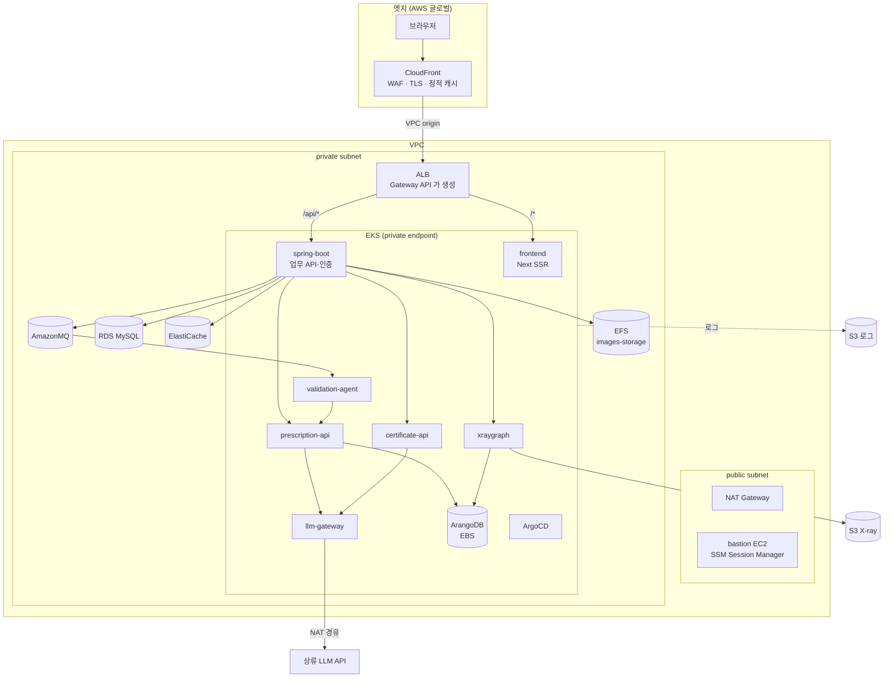
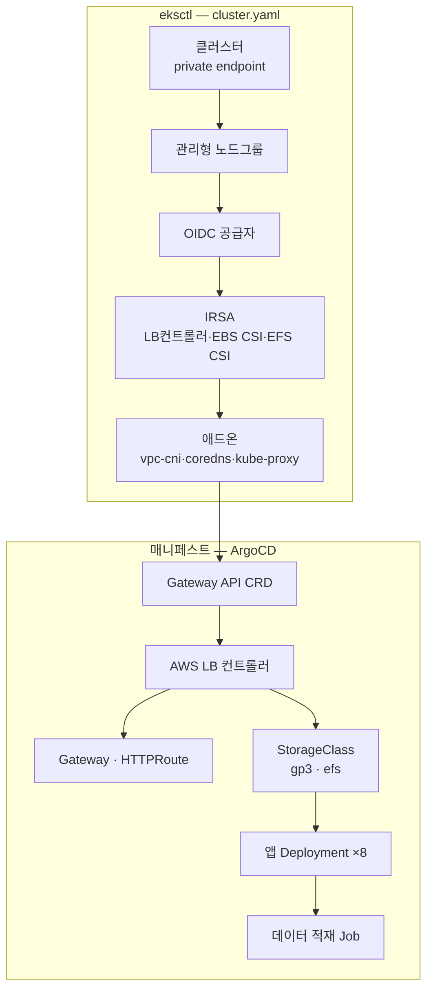
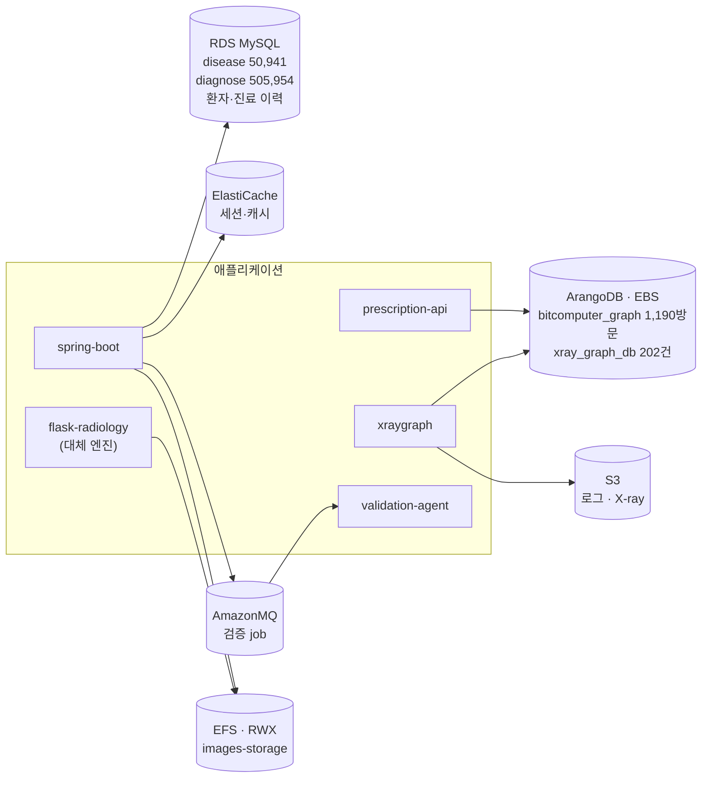
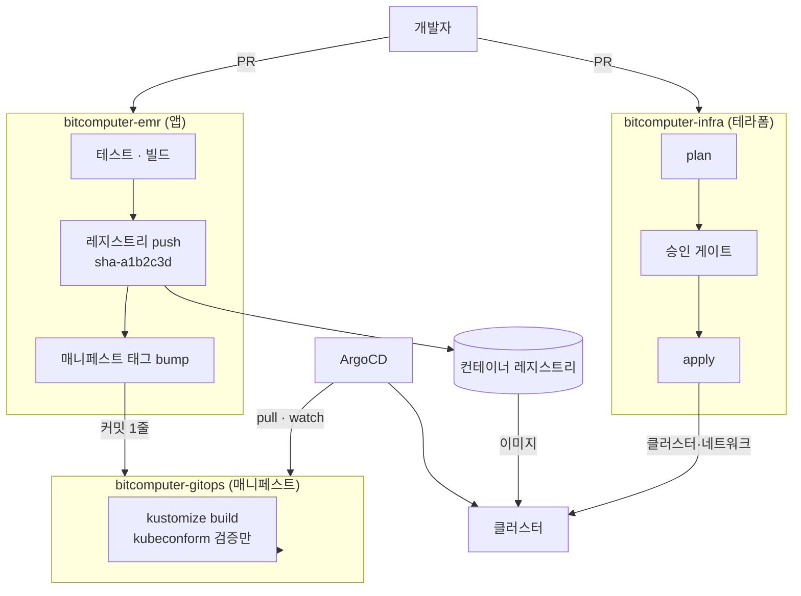
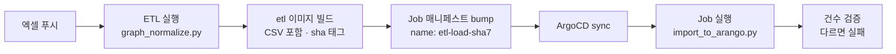
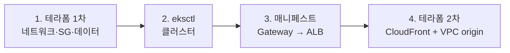

# 목표 아키텍처

BitComputer EMR 을 AWS 에 올렸을 때의 전체 그림. 결정 근거는
[10-aws-deployment-design.md](10-aws-deployment-design.md) 에, 현재 상태 실측은
[09-current-infrastructure.md](09-current-infrastructure.md) 에 있다.

이 문서는 **다섯 축을 한 장으로 잇는다** — 전체 구조 / 테라폼이 만드는 것 /
클러스터가 만드는 것 / 데이터 저장소 / CI·CD.

---

## 1. 전체 구조



**진입점은 CloudFront 하나다.** 프론트와 API 가 같은 오리진 아래 있어 CORS·SameSite
재설계가 필요 없다 — 인증이 쿠키 기반이라 이 이득이 크다.

**노드와 ALB 는 전부 private subnet 에 있다.** CloudFront VPC origin 이 사설 ALB 에
직접 닿는다. public subnet 에는 NAT 와 bastion 만 남는다.

**클러스터 밖으로 나가는 트래픽은 둘뿐이다** — 상류 LLM 호출(NAT 경유)과 S3·ECR
같은 AWS 서비스(VPC 엔드포인트 경유).

---

## 2. 테라폼이 만드는 것

```mermaid
flowchart LR
  subgraph L0["00-bootstrap"]
    B1["state S3 버킷"]
    B2["GH Actions OIDC 역할"]
  end
  subgraph L1["10-network"]
    N1["VPC · subnet<br/>(EKS 태그 포함)"]
    N2["RT · IGW · NAT"]
    N3["VPC 엔드포인트 8종"]
  end
  subgraph L2["20-security"]
    S1["SG"]
    S2["IAM"]
  end
  subgraph L3["30-data"]
    D1["RDS 부속<br/>subnet·param group"]
    D2["ElastiCache"]
    D3["AmazonMQ"]
    D4["S3 ×2 · EFS"]
  end
  subgraph L4["40-edge"]
    E1["CloudFront"]
    E2["WAF (us-east-1)"]
    E3["VPC origin"]
  end

  L0 --> L1 --> L2 --> L3
  L3 -.ALB 생성 이후.-> L4
```



| 레이어 | 자원 | 비고 |
|---|---|---|
| `00-bootstrap` | state 버킷, GH Actions OIDC 역할 | 로컬 state 로 만들고 마이그레이션 |
| `10-network` | VPC, subnet, RT, IGW, NAT, VPC 엔드포인트 | **서브넷 EKS 태그를 여기서 붙인다** |
| `20-security` | SG, IAM | 클러스터 SG ID 대신 CIDR 을 소스로 |
| `30-data` | RDS 부속, ElastiCache, AmazonMQ, S3 ×2, EFS | RDS 인스턴스 본체는 수동 |
| `40-edge` | CloudFront, WAF, VPC origin | **ALB 생성 이후에만 적용 가능** |

### 테라폼이 만들지 않는 것

| 자원 | 누가 | 이유 |
|---|---|---|
| EKS 클러스터·노드그룹 | eksctl | IRSA·애드온을 훨씬 적은 코드로 처리 |
| ALB · 리스너 · TG | Gateway API 컨트롤러 | 컨트롤러가 만들고 소유한다 |
| ASG | EKS 관리형 노드그룹 | 노드그룹이 ASG 를 직접 만든다 |
| EBS 볼륨 | EBS CSI + PVC | 정적 생성은 파드를 AZ·노드에 못 박는다 |
| RDS 인스턴스 | 수동 | 상태 자원. 부속만 테라폼 |
| Route53 · VPN | 나중 단계 | |

### 상태 관리

```
키      s3://<bucket>/<env>/<layer>/terraform.tfstate
잠금     S3 네이티브 락 (use_lockfile) — DynamoDB 불필요
참조     레이어 간은 SSM Parameter Store (terraform_remote_state 아님)
환경     workspace 아님. 키 접두사로 분리
```

`terraform_remote_state` 는 하위 레이어의 state 구조에 상위를 결합시킨다. SSM 을
쓰면 결합이 **이름 하나**로 줄고 K8s 매니페스트와 CI 도 같은 값을 읽는다.

---

## 3. 클러스터에서 만드는 것



### eksctl 로 갈 때 주의사항

**서브넷 태그는 테라폼이 붙인다.** eksctl 에 기존 서브넷을 넘기면 **태그를 추가하지
않는다.** 없으면 LB 컨트롤러가 서브넷을 못 찾고, **클러스터를 다 만든 뒤 Gateway 가
안 뜨는 형태로** 드러난다.

```hcl
public   "kubernetes.io/role/elb"          = "1"
private  "kubernetes.io/role/internal-elb" = "1"
```

**프라이빗이면 VPC 엔드포인트도 테라폼 몫이다.**

```yaml
privateCluster:
  enabled: true
  skipEndpointCreation: true    # 테라폼이 이미 만들었다
```

```
ec2  ecr.api  ecr.dkr  s3(gateway)  logs  sts  elasticloadbalancing  autoscaling
```

빠뜨리면 노드는 조인되는데 **이미지 풀이나 로그 전송에서 걸린다.**

**삭제는 정확히 역순이다.**

```
매니페스트 삭제 (Gateway → ALB 회수)  →  eksctl delete cluster  →  terraform destroy
```

ALB 가 살아 있는 채로 서브넷을 지우면 테라폼이 오래 매달린 뒤 실패한다.

### Gateway API

- **AWS LB 컨트롤러 v2.13 이상**이라야 Gateway API 를 받는다
- **CRD 를 따로 설치**한다. 쿠버네티스에 내장돼 있지 않다
- 인증서·스킴 같은 ALB 고유 설정은 **`LoadBalancerConfiguration` CRD** 로 붙인다
- 네임스페이스를 넘는 라우팅은 **`ReferenceGrant`** 가 필요하다

### 노드 그룹

| 그룹 | 워크로드 | 근거 |
|---|---|---|
| `general` | frontend, spring-boot, 경량 API 4개, ArangoDB | 각 60~650MB |
| `ai` | xraygraph | **CPU 전부 + 1.4GB.** 추론 3~4초가 그 전제 |

`xraygraph` 가 CPU 를 다 쓰는 동안 프론트가 같은 노드에 있으면 화면 응답이 같이
느려진다. taint/toleration 으로 가른다.

---

## 4. 데이터 저장소



| 저장소 | 담는 것 | 갱신 | 왜 이 선택인가 |
|---|---|---|---|
| **RDS MySQL** | 마스터 코드 + 환자·진료 이력 | 엑셀 → Job | 관리형 |
| **ArangoDB** (인클러스터+EBS) | 처방 그래프, X-ray 그래프 | 엑셀·CheXpert → Job | **AWS 관리형 등가물 없음** |
| **ElastiCache** | 세션·캐시 | — | 관리형 |
| **AmazonMQ** | 검증 job 큐 | — | 관리형 |
| **EFS** | 업로드 원본·오버레이 | 운영 중 | **RWX 필요** |
| **S3** | 로그, X-ray 파생물 | 배치 | 가장 쌈 |

### `images-storage` 가 EFS 인 이유

**세 곳이 쓴다.**

```
쓰기   Spring ImageStorageUtil       업로드 원본
읽기   flask-radiology               Spring 이 경로 문자열만 넘기고 flask 가 직접 읽는다
서빙   Spring WebMvcConfig /images/**  브라우저에 정적 서빙
```

**EBS 로는 안 된다** — flask 를 켜는 순간 ReadWriteMany 가 필요해진다.

**S3 로 가려면 세 곳을 동시에 고쳐야 하고** 그중 하나가 브라우저가 직접 보는 정적
서빙이다. 배포와 코드 변경을 한 번에 묶으면 문제가 났을 때 원인이 둘로 갈린다.

**용량이 근거를 완성한다** — X-ray 원본 1장 46KB, 로컬 `storage/` 전체가 471파일
109MB 다. 단가가 10배여도 이 규모에서는 절대 금액 차이가 무의미하다.

> 뒤집을 조건: 업로드가 수십 GB 를 넘거나 정적 서빙을 CloudFront 로 옮길 때.

### EBS 를 미리 만들지 않는다

정적 PV 로 미리 만든 볼륨을 물리면 파드가 그 AZ·그 노드에 못 박히고, 테라폼이 볼륨
생명주기를 K8s 가 바인딩을 각각 쥐어 서로 싸운다. **PVC 동적 프로비저닝**으로 간다.

ArangoDB 는 EBS 가 AZ 에 묶이므로 `topology.kubernetes.io/zone` 어피니티와
`WaitForFirstConsumer` 바인딩을 함께 쓴다.

### 갱신이 필요한 저장소 셋

| 대상 | 출처 | 트리거 |
|---|---|---|
| RDS `disease`/`diagnose` | 엑셀 2개 | 엑셀 푸시 |
| ArangoDB `bitcomputer_graph` | 엑셀 + 합성 케이스 | 엑셀 푸시 |
| ArangoDB `xray_graph_db` | CheXpert 202건 | 모델·마스크 변경 시 |

**`import_to_arango.py` 는 기본이 truncate 다.** 원본 적재 후 `--append` 로 합성
케이스를 다시 넣어야 한다. 순서가 뒤바뀌면 합성 120건이 사라진다.

**Job 은 끝나고 건수를 검증해야 한다.** 적재는 "성공"이라 말하면서 내용이 틀릴 수
있다.

---

## 5. CI / CD



### 분리의 실체는 크리덴셜이다

| | 앱 파이프라인 | 인프라 파이프라인 | 매니페스트 |
|---|---|---|---|
| 트리거 | `apps/**`, `services/**` push | `live/**`, `modules/**` PR·merge | PR |
| 하는 일 | 테스트·빌드·push·태그 커밋 | plan → 승인 → apply | 검증만 |
| 권한 | 레지스트리 write, 매니페스트 write | AWS OIDC | 없음 |
| **못 하는 것** | **클러스터 접근 불가** | **레지스트리 접근 불가** | **apply 불가** |
| 빈도 | 하루 수십 번 | 주 1~2회 | PR마다 |

**두 파이프라인은 서로를 호출하지 않는다.** 연결 고리는 둘뿐이다 — 앱 CI 가
매니페스트 레포에 남기는 **커밋 하나**, 그리고 ArgoCD 의 **pull**.

앱 CI 는 클러스터로 push 하지 않는다. **그래서 앱 CI 에 클러스터 크리덴셜이 아예
존재하지 않는다.**

### 경로 → 이미지 매핑이 1:1 이 아니다

일반적인 `services/<name>` = 이미지 하나 전제가 **우리에게는 맞지 않는다.**

| 경로 | 이미지 |
|---|---|
| `services/prescription` | **prescription-api, certificate-api** ← 둘 |
| `services/validation-agent` | validation-agent |
| `services/llm-gateway` | llm-gateway |
| `services/xray-rag` | xraygraph |
| `services/radiology-legacy` | flask-radiology |
| `apps/api` | spring-boot |
| `apps/web` | frontend |

**매핑을 명시적으로 두지 않으면 `certificate-api` 가 조용히 낡는다.** 실제로 커밋
11개 뒤진 채 healthy 로 돌던 적이 있다.

### 태그 전략

```
sha-a1b2c3d   배포용 불변 태그. 매니페스트가 참조하는 유일한 것
main          사람이 최신 확인용. 배포에 쓰지 않음
latest        만들지 않는다
```

`latest` 를 쓰면 ArgoCD 가 "동기화됨"이라 하는데 파드는 다른 이미지인 상황이 나온다.
**불변 태그를 쓰면 `Docs/08` 의 낡은 이미지 판별이 필요 없어진다** — 태그가 곧
커밋이다.

### 데이터 적재도 GitOps 로 돈다

**CI 에 클러스터 크리덴셜을 주지 않으면서** 엑셀 변경을 반영하는 방법이다.



**Job 이름에 sha 를 넣는다.** 그래야 데이터가 바뀔 때만 새 Job 객체가 생기고
ArgoCD 가 한 번만 실행한다. `ttlSecondsAfterFinished` 로 오래된 Job 을 정리한다.

### 레지스트리 — GHCR vs ECR

| | GHCR | ECR |
|---|---|---|
| 인증 | imagePullSecret + PAT 만료 관리 | **IRSA, 만료 없음** |
| 네트워크 | **NAT 를 반드시 탄다** | VPC 엔드포인트로 NAT 회피 |
| 멀티클라우드 | 하나로 양쪽 공급 | 클라우드별 분리 |

**GCP DR 이 프론트·Spring 둘뿐이라 "하나로 양쪽" 이득이 작다.** 반면 프라이빗
클러스터에서 NAT 비용과 PAT 만료는 매번 치른다. **DR 을 상시 띄울 거면 GHCR,
아니면 ECR** 이 유리하다. 아직 열린 항목이다.

### 시크릿

| 레포 | 필요한 것 | 방식 |
|---|---|---|
| 앱 | 레지스트리 push | `GITHUB_TOKEN` (GHCR) 또는 OIDC (ECR) |
| 앱 | 매니페스트 write | fine-grained PAT, 그 레포 한정 |
| 인프라 | AWS | **OIDC — 시크릿 없음** |
| 매니페스트 | 없음 | ArgoCD read-only deploy key |

**장수명 클라우드 키가 한 곳도 없다.** 이것이 이 구성의 핵심이다.

---

## 6. 적용 순서



**4가 3에 의존한다.** CloudFront 오리진에 ALB 가 필요한데 그것은 Gateway 가 만든다.
한 번에 `terraform apply` 하면 실패한다.

---

## 7. 확인 체크리스트

배포 전에 이것들이 참인지 본다.

- [ ] 앱 워크플로에 `kubectl` / `kubeconfig` / `configure-aws-credentials` 가 없다
- [ ] 인프라 워크플로에 `docker` / 레지스트리 로그인이 없다
- [ ] 인프라 apply 가 깨진 상태에서 앱 빌드가 정상적으로 돈다
- [ ] 두 워크플로가 dispatch 로 서로를 트리거하지 않는다
- [ ] GitHub Secrets 에 장수명 클라우드 액세스 키가 0개다
- [ ] 서브넷에 EKS 태그가 붙어 있다
- [ ] 적재 Job 과 런타임 파드가 **같은 ConfigMap** 을 본다
- [ ] `latest` 태그를 참조하는 매니페스트가 없다

마지막에서 두 번째가 우리 고유 항목이다. `USE_PSPNET_ROI` 가 코드와 compose 양쪽에
기본값을 갖는데 적재 스크립트는 호스트에서 돌아 compose 를 거치지 않았고, 그 결과
**저장 코퍼스와 질의가 서로 다른 기준 위에 놓였는데 양쪽 다 정상으로 보였다.**
K8s 에서 ConfigMap 과 코드 기본값 사이에 같은 함정이 재발한다.

---

## 8. 아직 열린 것

```
1. 레지스트리 GHCR vs ECR              DR 운용 빈도에 달림
2. ArgoCD 태그 갱신                    CI 커밋 vs Image Updater
3. AmazonMQ 엔진 버전 / 단일 vs 클러스터
4. 로그 수집 경로                       Fluent Bit → S3 직접 vs CloudWatch 경유
5. CloudFront VPC origin 리전 지원 확인
```

### 이전 전에 고쳐야 할 코드

```
1. ImageStorageUtil / WebMvcConfig 경로 탐색 → image.storage.path 준수   ← 필수
2. http/client.ts 빈 baseURL → 상대 경로                              (한 줄)
3. SQUID 가중치 전달 (이미지에 굽기 vs S3+initContainer)
```

**1번이 위험하다.** `getProjectRoot()` 가 작업 디렉터리에서 `BitComputer` 폴더를
위로 훑어 찾고 못 찾으면 **현재 디렉터리에 만든다.** K8s 에서 다른 곳을 가리키면
예외가 아니라 **빈 디렉터리를 만들고 정상처럼 뜬다.**

---

## 9. 관련 문서

| 문서 | 내용 |
|---|---|
| [09-current-infrastructure.md](09-current-infrastructure.md) | 현재 구조 실측 |
| [10-aws-deployment-design.md](10-aws-deployment-design.md) | 이전 결정과 근거 |
| [07-runbook-data-loading.md](07-runbook-data-loading.md) | 적재 절차 |
| [08-runbook-container-images.md](08-runbook-container-images.md) | 이미지 빌드·배포 |
