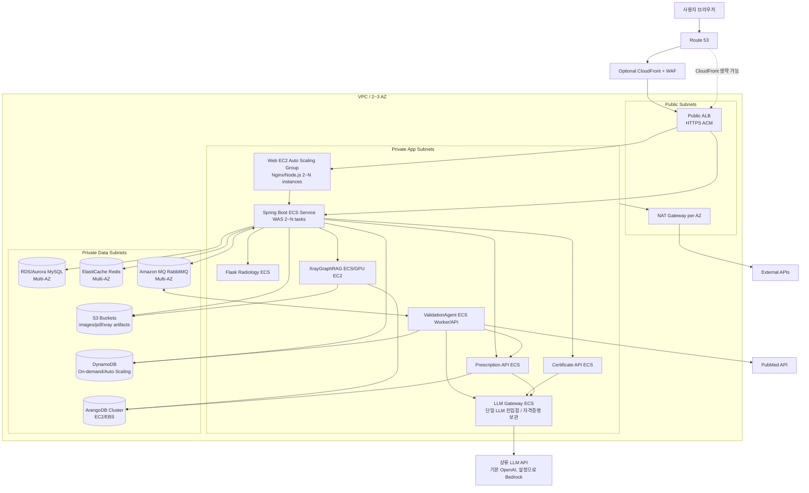
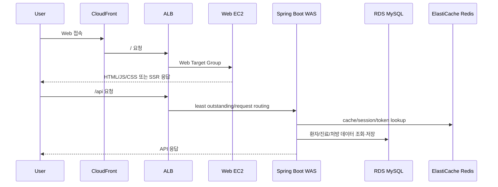
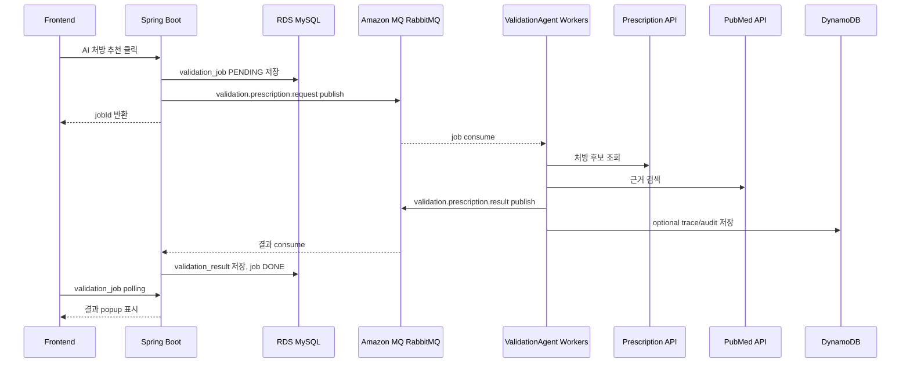
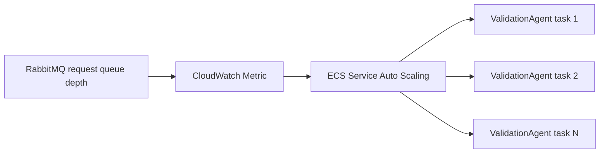
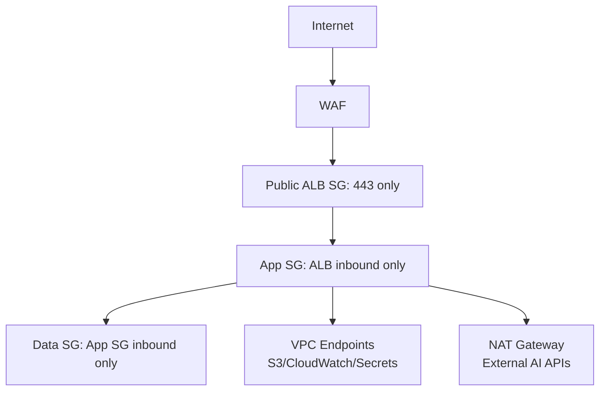
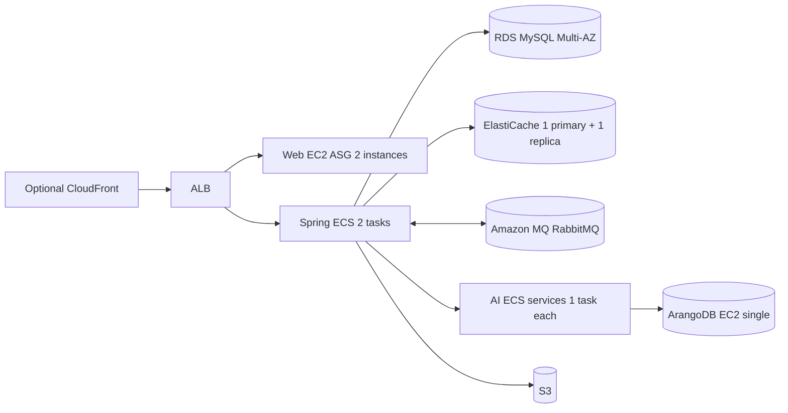
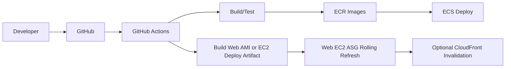

# AWS Architecture

> **이 문서는 ECS 기반 설계다.** 2026-08-31 에 시작한 실제 구축 계획
> ([06-infra-build-schedule.md](06-infra-build-schedule.md))은 **EKS** 를 목표로 하고
> 리전을 `us-west-2` 로 고정했다. 두 문서가 어긋나면 배포 대상 오케스트레이터와
> 리전은 06 이 최신이며, 이 문서의 부하 특성·데이터 계층·Auto Scaling 지표는
> 오케스트레이터와 무관하게 그대로 유효하다.

이 문서는 BitComputer를 AWS에 배포할 때 권장하는 Web, WAS, AI 서비스, Redis, DB, RabbitMQ 구조를 정리한다. 목표는 단일 서버 Docker Compose 구조를 운영용 고가용성 구조로 분리하고, Spring Boot WAS와 AI 서비스의 부하 특성에 맞게 독립적으로 확장하는 것이다.

## 1. 권장 요약

| 영역 | 권장 AWS 서비스 | 배포 방식 |
|---|---|---|
| Web | EC2 Auto Scaling Group + Nginx/Node.js, CloudFront 선택 | Next.js Web 서버를 EC2에 배포. 최소 2대 Multi-AZ, ALB Target Group으로 분산 |
| Public 진입점 | ALB + ACM + Route 53, 필요 시 CloudFront/WAF | `/`는 Web EC2 Target Group, `/api/*`는 Spring Boot Target Group으로 path routing |
| WAS | ECS Fargate 또는 ECS on EC2 + Auto Scaling | Spring Boot 최소 2 tasks, 운영 3 tasks 이상, Multi-AZ |
| AI API | ECS Fargate, X-ray 고부하 모델은 ECS GPU EC2 | 서비스별 Target Group 또는 Cloud Map 내부 서비스 디스커버리 |
| Redis | ElastiCache for Redis Replication Group | Multi-AZ, Auto Failover, private subnet |
| RDB | Amazon RDS MySQL/Aurora MySQL | Multi-AZ, read replica는 조회 증가 시 추가 |
| DynamoDB | Job state, idempotency, event/audit 일부 | RDS 보조 저장소. 핵심 진료 relational data는 RDS 유지 |
| RabbitMQ | Amazon MQ for RabbitMQ | Multi-AZ broker, private subnet |
| ArangoDB | EC2 3-node cluster 또는 ECS EC2 + EBS/EFS | AWS managed 대체가 없어 별도 운영 필요. MVP는 단일 EC2, 운영은 cluster 권장 |
| 파일/이미지 | S3, 필요 시 EFS | X-ray 원본, heatmap, PDF, 업로드 이미지 저장 |
| Secret | AWS Secrets Manager + SSM Parameter Store | DB/API key/JWT secret 관리 |
| Observability | CloudWatch, X-Ray, OpenTelemetry | 로그, metric, trace, alarm |

## 2. 전체 배포 구조



핵심 원칙:

- Public subnet에는 ALB/NAT만 둔다. Web EC2, Spring Boot, Python AI, Redis, RDS, RabbitMQ, ArangoDB는 private subnet에 둔다.
- Web은 EC2 Auto Scaling Group으로 배포하고 ALB에서 `/` 트래픽을 Web Target Group으로 보낸다. 정적 asset cache가 필요하면 앞단에 CloudFront를 둔다.
- Spring Boot WAS와 AI 서비스는 서로 다른 ECS Service로 배포해 병목이 전파되지 않게 한다.
- ValidationAgent는 HTTP API보다 RabbitMQ worker 성격이 강하므로 queue depth 기반 Auto Scaling을 둔다.
- **상류 LLM 자격증명은 `llm-gateway` 태스크에만 주입한다.** certificate/prescription/validation
  태스크는 게이트웨이 base URL 만 알면 되므로, Secrets Manager 접근 권한을 가진 태스크 역할이
  하나로 줄어든다. Bedrock 을 상류로 고르면 `LLM_BEDROCK_*` 도 이 태스크에만 붙는다.
- 이미지/PDF/분석 산출물은 컨테이너 volume 대신 S3에 저장한다.

## 3. 요청 흐름

### 3.1 일반 Web/API



### 3.2 AI 처방 추천과 ValidationAgent



## 4. 서비스별 배치와 부하 고려

### 4.1 Front-End

웹 서버는 EC2 Auto Scaling Group으로 배포한다. 각 EC2에는 Nginx를 reverse proxy로 두고, Next.js 서버 또는 정적 build 산출물을 서비스한다. ALB는 `/`와 정적 리소스 요청을 Web Target Group으로 보내고, `/api/*` 요청은 Spring Boot Target Group으로 path routing한다.

| 항목 | 권장값 |
|---|---|
| 배포 | EC2 Auto Scaling Group, 최소 2대 Multi-AZ |
| 인스턴스 | 시작은 `t3.small`~`t3.medium`, SSR/빌드 포함 시 `t3.medium` 이상 |
| 웹 서버 | Nginx + Next.js Node server 또는 Nginx static serving |
| 캐시 | Nginx static cache, 필요 시 앞단 CloudFront |
| 보안 | EC2는 private subnet, inbound는 ALB SG만 허용 |
| 부하 기준 | CPU, memory, ALB RequestCountPerTarget, p95 latency |

Web EC2 부하 고려:

- 정적 파일 중심이면 CPU 부하는 낮고 network egress와 cache hit가 중요하다.
- SSR을 사용하면 Node.js CPU/메모리 부하가 증가하므로 Web ASG를 WAS와 별도로 확장한다.
- 이미지/PDF/X-ray 결과 파일은 Web EC2 디스크에 두지 않고 S3에서 presigned URL 또는 CloudFront signed URL로 제공한다.

### 4.2 Spring Boot WAS

Spring Boot는 사용자 API, 인증, 환자/진료/처방 저장, AI 서비스 orchestration, RabbitMQ result consumer를 담당한다. 사용자가 직접 대기하는 동기 API가 많으므로 최소 2개 이상을 Multi-AZ에 둔다.

| 환경 | 권장 시작 크기 | Auto Scaling |
|---|---|---|
| 개발/시연 | 2 tasks, 1 vCPU, 2GB | CPU 60%, ALB RequestCountPerTarget |
| 소규모 운영 | 3 tasks, 1~2 vCPU, 2~4GB | CPU 55~65%, p95 latency, RPS |
| 중간 운영 | 4~8 tasks, 2 vCPU, 4GB | CPU + memory + ALB latency |

WAS 부하 분리 기준:

- 환자 접수/조회 같은 CRUD는 RDS와 Redis가 병목이 될 수 있다.
- X-ray 분석, 진단서 생성, 처방 추천은 Spring이 직접 계산하지 않고 AI 서비스로 위임해야 한다.
- RabbitMQ result consumer가 WAS 내부에 있으면 API task와 consumer task를 분리하는 것도 좋다. 예: `spring-api`와 `spring-worker`.

### 4.3 Python AI 서비스

AI 서비스는 부하 특성이 서로 다르므로 하나의 큰 인스턴스에 묶지 않는다.

| 서비스 | 특성 | 권장 배치 | Scale 기준 |
|---|---|---|---|
| `flask-radiology` | 이미지 처리, CPU/메모리 사용 가능 | ECS Fargate 또는 GPU 필요 시 ECS EC2 | CPU, 처리 시간, 동시 요청 |
| `xraygraph` | X-ray RAG/벡터/파일 산출물 | ECS EC2 또는 Fargate, 무거운 모델이면 GPU node | CPU/GPU, p95 latency |
| `certificate-api` | LLM 외부 API 호출 중심 | Fargate 1~2 vCPU | RPS, 외부 API latency |
| `prescription-api` | ArangoDB 조회 + LLM 호출 | Fargate 1~2 vCPU | RPS, Arango query latency |
| `validation-agent` | RabbitMQ consumer, LLM/PubMed I/O 중심 | Fargate worker service | RabbitMQ queue depth |
| `llm-gateway` | 상류 LLM 프록시. I/O 대기 중심, 상태 없음 | Fargate 0.5~1 vCPU, 최소 2 tasks | 동시 인플라이트 요청, 상류 p95 latency |

ValidationAgent scaling 예시:



권장 정책:

- `validation.prescription.request` queue depth가 task당 5~10개 이상이면 scale out.
- queue depth가 0으로 10~15분 유지되면 scale in.
- 외부 LLM rate limit 때문에 무작정 task 수를 늘리지 않는다. 상류 quota에 맞춰 max task를 제한한다. 실제 소비량은 게이트웨이의 계측 레코드 한 곳에서 볼 수 있다.

## 5. 데이터 계층

### 5.1 RDS/Aurora MySQL

현재 MySQL에는 환자, 직원, 진료 기록, 상병/처방, 진단서, validation job/result 등 relational consistency가 중요한 데이터가 있다. 운영에서는 RDS MySQL 또는 Aurora MySQL을 권장한다.

| 항목 | 권장 |
|---|---|
| 배포 | Multi-AZ DB cluster |
| 백업 | PITR 7~35일 |
| 연결 | RDS Proxy 권장 |
| 읽기 확장 | 조회가 많아지면 read replica |
| 보안 | private subnet, SG는 WAS만 허용 |

DynamoDB로 바로 대체하지 말아야 하는 데이터:

- `patient`, `employee`, `history`, `waiting`
- `history_disease`, `history_diagnose`
- `medical_certificate`
- 강한 relational join과 transaction이 필요한 업무 데이터

### 5.2 DynamoDB

DynamoDB는 RDS를 대체하기보다 고속 key-value/event성 데이터를 보조하는 위치가 적합하다.

추천 사용처:

- ValidationAgent `reasoningTrace` 원본 저장. RDS에는 summary/result만 저장.
- idempotency key 저장. 예: `jobId`, `eventId` 중복 처리 방지.
- 비정형 audit/event log. TTL을 걸어 비용 관리.
- 프론트 polling 최적화를 위한 job status projection. 단, source of truth는 RDS로 유지 가능.

```mermaid
erDiagram
  ValidationJobTrace {
    string pk "JOB#jobId"
    string sk "TRACE#timestamp"
    string status
    string model
    string traceJson
    number ttl
  }

  IdempotencyKey {
    string pk "IDEMPOTENCY#eventId"
    string jobId
    string status
    number ttl
  }
```

### 5.3 Redis

Redis는 ElastiCache Replication Group으로 운영한다.

권장 사용:

- 짧은 TTL 캐시
- 인증/refresh token blacklist 또는 session cache
- 자주 조회되는 마스터 데이터 캐시
- AI 결과 polling cache

주의:

- Redis를 영구 업무 데이터 저장소로 사용하지 않는다.
- cluster mode는 키 설계가 필요하다. 단순 운영은 cluster mode disabled + replica부터 시작한다.

### 5.4 RabbitMQ

RabbitMQ는 Amazon MQ for RabbitMQ를 권장한다. 직접 EC2에 RabbitMQ cluster를 구성할 수도 있지만 운영 부담이 커진다.

권장:

- Multi-AZ broker
- durable queue
- publisher confirm
- consumer ack
- DLQ 구성
- 메시지 payload에는 큰 JSON 전체보다 `jobId`, `historyId`, 핵심 snapshot만 포함

Queue:

| Queue | Producer | Consumer | Scale 기준 |
|---|---|---|---|
| `validation.prescription.request` | Spring Boot | ValidationAgent | queue depth, oldest message age |
| `validation.prescription.result` | ValidationAgent | Spring Boot worker | queue depth |
| `validation.prescription.dlq` | RabbitMQ DLX | 운영자/재처리 worker | DLQ count alarm |

### 5.5 ArangoDB

ArangoDB는 처방 그래프와 XrayGraphRAG 그래프/벡터를 담당하지만 AWS managed service가 없다. 운영 난이도를 고려하면 아래 단계로 접근한다.

| 단계 | 구조 | 설명 |
|---|---|---|
| MVP | EC2 1대 + EBS snapshot | 가장 단순하지만 HA 없음 |
| 운영 기본 | EC2 3대 ArangoDB cluster + EBS | Coordinator/DBServer/Agent 분산 |
| 대안 검토 | Neptune/OpenSearch Serverless Vector | 코드와 쿼리 변경 비용 큼 |

ArangoDB가 장애 나도 Spring 핵심 업무가 모두 멈추지 않도록, 처방 추천/X-ray RAG 실패는 graceful degradation 처리하는 것이 좋다.

## 6. 네트워크와 보안



보안 권장:

- DB, Redis, MQ, ArangoDB는 public IP 없음.
- Secrets Manager에서 DB password, API key, JWT secret을 주입.
- 파일 저장용 S3 bucket은 block public access를 켜고, CloudFront로 파일을 제공할 경우 Origin Access Control을 사용한다.
- ALB access log, WAF log를 S3/CloudWatch에 저장.
- 의료 데이터 성격상 S3, RDS, EBS, DynamoDB, MQ 모두 encryption at rest 활성화.

## 7. Auto Scaling 설계

| 컴포넌트 | Scale Out 지표 | Scale In 지표 | 상한 고려 |
|---|---|---|---|
| Spring Boot WAS | CPU > 60%, p95 latency > 800ms, RequestCountPerTarget 증가 | CPU < 30%, latency 안정 | RDS connection 수 |
| Web EC2 | CPU > 50~60%, RequestCountPerTarget 증가, p95 latency 증가 | CPU < 25~30%, latency 안정 | SSR 사용 여부, static cache hit |
| ValidationAgent | request queue depth/task > 5~10, oldest message age 증가 | queue depth 0 지속 | 상류 LLM / PubMed rate limit |
| Prescription API | RPS, p95 latency, CPU | latency 안정 | ArangoDB query capacity, 상류 LLM quota |
| Certificate API | RPS, p95 latency | latency 안정 | 상류 LLM quota |
| LLM Gateway | 인플라이트 요청 수, 상류 p95 latency | 사용률 안정 | 상류 rate limit — 여기가 전체 LLM 트래픽의 병목 지점이다 |
| XrayGraphRAG | CPU/GPU, p95 latency | 사용률 안정 | 모델 로딩 시간, GPU 비용 |
| Flask Radiology | CPU, memory, 처리 시간 | 사용률 안정 | 이미지 크기와 동시 처리량 |

RDS connection 보호:

- RDS Proxy 또는 HikariCP max pool 조정.
- WAS task 수가 늘어날수록 총 DB connection이 늘어나므로 `task count * max pool size`를 RDS max connection 이하로 제한한다.
- 조회가 많은 API는 Redis cache 또는 read replica로 분산한다.

## 8. 비용과 단계별 도입

### 8.1 MVP 배포



MVP는 Web EC2와 Spring Boot를 각각 2개 이상으로 시작하고, AI 서비스는 1 task씩 두되 병목이 확인되는 서비스부터 scale out한다.

### 8.2 운영 권장

- Web EC2: 2~4 instances, 2~3 AZ, ALB Target Group health check.
- Spring Boot: 3 tasks 이상, 2~3 AZ.
- ValidationAgent: queue depth 기반 1~5 tasks.
- Prescription/Certificate API: 최소 2 tasks.
- XrayGraphRAG/Flask Radiology: CPU/GPU 사용률을 보고 별도 node group.
- RDS/Aurora: Multi-AZ + read replica.
- RabbitMQ: Multi-AZ Amazon MQ.
- ArangoDB: 3-node cluster 또는 managed 대안 검토.

## 9. 배포 파이프라인



권장:

- 서비스별 Docker image를 ECR에 push.
- Web은 EC2 Launch Template/AMI 기반으로 배포하거나, CodeDeploy로 EC2에 artifact를 배포한다.
- ECS rolling deployment 또는 blue/green deployment.
- DB migration은 Spring 배포 전후 순서를 명확히 관리.
- AI 서비스는 모델/프롬프트 버전을 env 또는 image tag로 기록.

## 10. 장애 대응 포인트

| 장애 | 영향 | 대응 |
|---|---|---|
| Web EC2 장애 | 화면 접속 일부 실패 | ALB health check로 제외, ASG가 새 인스턴스 기동 |
| WAS task 장애 | 일부 API 요청 실패 | ALB health check로 자동 제외, ECS 재시작 |
| RDS primary 장애 | 쓰기 중단 가능 | Multi-AZ failover |
| Redis 장애 | cache miss 증가 | replica failover, cache fallback |
| RabbitMQ 장애 | validation job 지연 | Amazon MQ Multi-AZ, DLQ, 재시도 |
| ValidationAgent 장애 | 검증 결과 지연 | queue에 메시지 유지, worker scale out |
| ArangoDB 장애 | 처방 추천/X-ray RAG 실패 | 핵심 진료 저장은 유지, AI 기능 degradation |
| 외부 LLM quota | AI 응답 지연/실패 | rate limit, fallback message, max task 제한 |

## 11. 추천 최종 구조

최종적으로는 다음 구조를 목표로 한다.

- Web은 EC2 Auto Scaling Group으로 배포하고 ALB 뒤에서 최소 2대 Multi-AZ로 운영.
- API는 ALB 뒤 Spring Boot ECS Service 3개 이상으로 운영.
- Spring Boot와 RabbitMQ consumer를 분리해 API latency와 비동기 처리를 독립 확장.
- ValidationAgent는 RabbitMQ queue depth 기반으로 Auto Scaling.
- RDS/Aurora MySQL을 업무 데이터의 source of truth로 유지.
- DynamoDB는 trace/audit/idempotency/projection 용도로 보조 사용.
- Redis는 ElastiCache Multi-AZ로 cache/session성 데이터만 담당.
- RabbitMQ는 Amazon MQ for RabbitMQ Multi-AZ로 운영.
- 이미지, PDF, X-ray 결과 파일은 S3에 저장하고 presigned URL 또는 CloudFront signed URL로 접근.
- ArangoDB는 운영 난이도가 높으므로 초기에는 EC2 단일 노드 + snapshot, 운영 전환 시 3-node cluster 또는 Neptune/OpenSearch 대안을 검토한다.
