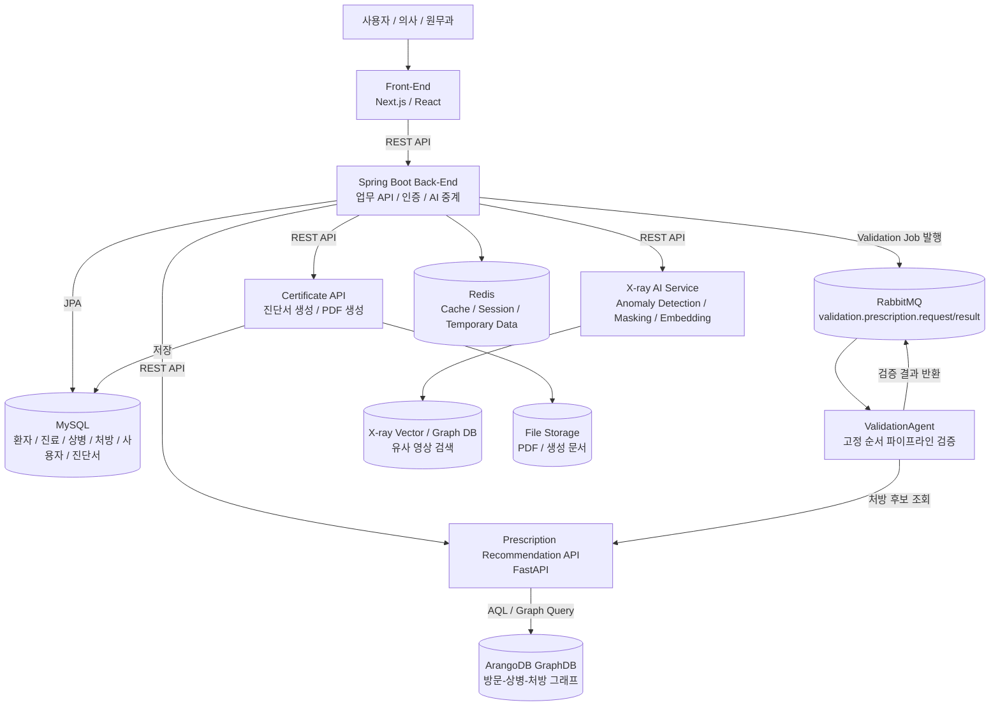

## 5. Project Contents (과제 내용)

본 프로젝트는 병원 진료 업무를 지원하기 위한 AI 기반 의료 보조 시스템이다. 시스템은 환자 접수, 진료실 대시보드, 상병 및 처방 관리, X-ray 영상 기반 상병 추론, 처방 추천 에이전트, 처방 검증 에이전트, 진단서 생성 및 저장 기능을 통합적으로 제공한다. 사용자는 웹 기반 인터페이스를 통해 환자 접수와 진료 정보를 관리할 수 있으며, 의사는 진료실 화면에서 상병 선택, 처방 추천, 영상 판독 결과 확인, 진단서 생성 등을 수행할 수 있다.

시스템은 Front-End, Spring Boot Back-End, MySQL, ArangoDB GraphDB, Python 기반 AI 서비스, RabbitMQ, Redis로 구성된다. 각 구성 요소는 REST API, 메시지 큐, 데이터베이스 연결을 통해 상호 연동되며, 의료진의 최종 판단을 보조하는 형태로 AI 기능을 제공한다.

### 5.1 Design in Detail (상세 설계)

#### 5.1.1 System Structure (시스템 구조)

본 시스템은 병원 업무 데이터 처리와 AI 추론 기능을 분리한 다중 서비스 구조로 설계되었다. Front-End는 사용자와 직접 상호작용하는 웹 UI를 담당하고, Spring Boot Back-End는 병원 업무 데이터와 AI 서비스 호출을 중계한다. 처방 추천, X-ray 분석, 진단서 생성, 검증 에이전트는 Python 기반 독립 서비스로 분리되어 있으며, RabbitMQ를 통해 비동기 검증 작업을 수행한다.

위 구조에서 논리적 중심은 Spring Boot Back-End이다. Front-End에서 환자 접수, 진료실 조회, 처방 추천, 진단서 생성 등의 사용자 요청이 발생하면 Spring Boot는 요청의 성격에 따라 MySQL, AI 서비스, RabbitMQ로 처리를 위임한다. 병원 업무 데이터는 MySQL에 저장되며, 처방 추천에 필요한 방문-상병-처방 관계는 ArangoDB에 그래프 형태로 저장된다.

물리적 연결 관계는 REST API와 메시지 큐로 구분된다. Front-End와 Spring Boot, Spring Boot와 Python AI 서비스 간 통신은 HTTP REST API를 기반으로 한다. 반면 처방 추천 이후 검증 과정은 RabbitMQ를 이용한 비동기 메시징 구조로 처리된다. 이를 통해 사용자의 요청 처리와 검증 에이전트 실행을 분리하고, 검증 작업이 오래 걸리더라도 전체 UI 응답성이 저하되지 않도록 설계하였다.

X-ray 이미지 기반 상병 추론은 별도의 AI 서비스에서 수행된다. X-ray 이미지가 입력되면 anomaly detection, masking, image embedding, similarity search 과정을 거쳐 유사 영상 기반 상병 후보를 도출한다. 이 결과는 Spring Boot를 통해 저장되고, 이후 ValidationAgent가 상병 및 처방 검증 시 참고 정보로 사용한다.

진단서 생성 기능은 Certificate API가 담당한다. 환자 정보, 상병, 처방, 의사 소견을 기반으로 진단서 문안을 생성하고, PDF 저장 및 DB 저장 기능과 연동된다. 이 구조는 진료 데이터 관리, AI 추론, 문서 생성을 각각 독립된 모듈로 분리하여 유지보수성과 확장성을 확보하기 위한 설계이다.

#### 5.1.2 Module Specification (모듈 설계)

##### 1. 사용자 인터페이스 모듈

| 항목 | 내용 |
|---|---|
| 모듈명 | 사용자 인터페이스 모듈 |
| 역할 | 병원 사용자가 환자 접수, 진료, 상병/처방 조회, AI 추천, 진단서 생성 기능을 사용할 수 있는 웹 화면 제공 |
| 주요 파일 | `Front-End/src/app/(dashboard)/dashboard/page.tsx`, `Front-End/src/components/Diagnosis.tsx`, `Front-End/src/components/ViewDataBase.tsx`, `Front-End/src/components/MedicalInfo.tsx`, `Front-End/src/components/MedicalCertificate.tsx` |
| 주요 데이터 구조 | 환자 정보, 진료 이력, 상병 선택 목록, 처방 선택 목록, AI 추천 처방 목록, 진단서 입력 폼 |
| 입력값 | 사용자 클릭, 검색어, 환자 접수 정보, 상병/처방 선택, 진단서 작성 입력 |
| 출력값 | 화면 렌더링 결과, API 요청, 선택된 상병/처방 데이터, PDF 저장 요청 |
| 의존 모듈 | Spring Boot Back-End, 인증 서비스, 상병/처방 API, 처방 추천 API, 진단서 API |

사용자 인터페이스 모듈은 Next.js와 React를 기반으로 구현되었다. 환자 접수 탭에서는 환자 기본 정보와 진료 정보를 입력하고, 진료실 탭에서는 선택된 환자의 내원 정보, 상병, 처방, X-ray 결과, 진단서 기능을 통합적으로 사용할 수 있다. `Diagnosis.tsx`는 AI 처방 추천 결과를 표시하고, 추천 처방 중 DB에 매칭되지 않은 항목을 사용자가 직접 검색하여 선택할 수 있는 “처방 상세 선택” 팝업을 제공한다.

##### 2. 환자 접수 및 진료 이력 관리 모듈

| 항목 | 내용 |
|---|---|
| 모듈명 | 환자 접수 및 진료 이력 관리 모듈 |
| 역할 | 환자 접수, 대기 상태, 진료 이력, 내원 정보 저장 및 조회 |
| 주요 파일 | `PatientController`, `HistoryController`, `WaitingController`, `HistoryDiseaseController`, `HistoryDiagnoseController` |
| 주요 데이터 구조 | Patient, Waiting, History, HistoryDisease, HistoryDiagnose |
| 알고리즘 / 절차 | 환자 접수 → 대기열 등록 → 진료 이력 생성 → 상병/처방 저장 → 타임라인 조회 |
| 입력값 | 환자 ID, 직원 ID, 진료과, 진료일, 증상, 상병/처방 선택 정보 |
| 출력값 | 접수 결과, 진료 이력 ID, 저장된 상병/처방 목록 |
| 의존 모듈 | MySQL, Front-End, 상병/처방 DB 조회 모듈 |

이 모듈은 병원 업무의 기본 흐름을 관리한다. 환자가 접수되면 대기 상태가 생성되고, 의사가 진료실 화면에서 해당 환자를 선택하면 진료 이력과 연결된 상병 및 처방 정보를 관리할 수 있다. 저장된 진료 이력은 이후 X-ray 분석, 처방 추천, 진단서 생성의 입력 데이터로 활용된다.

##### 3. 상병 및 처방 DB 조회 모듈

| 항목 | 내용 |
|---|---|
| 모듈명 | 상병 및 처방 DB 조회 모듈 |
| 역할 | 상병 코드와 처방 코드를 검색하고 진료 화면에 추가할 수 있도록 지원 |
| 주요 파일 | `DiseaseController`, `DiagnoseController`, `DiseaseRepository`, `DiagnoseRepository` |
| 주요 API | `/api/diseases`, `/api/diagnoses` |
| 주요 데이터 구조 | DiseaseDTO, DiagnoseDTO, PaginatedResponse |
| 알고리즘 / 절차 | 검색어 입력 → 코드/명칭 기반 LIKE 검색 → 페이지 단위 결과 반환 |
| 입력값 | query, code, name, page, size |
| 출력값 | 상병 또는 처방 검색 결과 목록 |
| 의존 모듈 | MySQL, Front-End |

상병 및 처방 DB 조회 모듈은 코드와 명칭 기반 검색을 제공한다. 처방 검색은 `DiagnoseRepository`의 `findByCodeContainingIgnoreCaseOrNameContainingIgnoreCase`를 통해 수행되며, Front-End의 데이터베이스 조회 패널과 처방 상세 선택 팝업에서 동일한 검색 API를 재사용한다.

##### 4. 처방 추천 모듈

| 항목 | 내용 |
|---|---|
| 모듈명 | 처방 추천 모듈 |
| 역할 | 환자, 상병, 기존 처방, 그래프 데이터를 기반으로 Top-3 처방 후보 추천 |
| 주요 파일 | `GraphDB/langchain_graph_qa/prescription_api.py`, `run_prescription_agent.py`, `PrescriptionAgentClient.java`, `AgentServiceImpl.java` |
| 주요 데이터 구조 | PrescriptionRecommendRequest, PrescriptionRecommendResponse, RecommendedPrescriptionItemDTO |
| 알고리즘 / 절차 | 환자 컨텍스트 수집 → ArangoDB top_rx 조회 → cohort_rx 조회 → LLM 프롬프트 생성 → Top-3 JSON 파싱 |
| 입력값 | patient_id, symptoms, history, top_rx, disease_codes, similar_outcomes |
| 출력값 | 추천 처방명, 처방코드, 추천 사유, confidence_score |
| 의존 모듈 | Spring Boot, ArangoDB, LLM API, ValidationAgent |

처방 추천 모듈은 Spring Boot에서 전달한 환자 및 진료 컨텍스트를 기반으로 동작한다. 처방 후보가 부족한 경우 ArangoDB에서 환자 방문 기반 top_rx를 조회하고, 상병 코드가 존재하면 해당 상병과 연결된 코호트 처방 빈도를 조회한다. 이후 LLM을 호출하여 Top-3 처방 추천 JSON을 생성하고, 결과에 confidence_score를 주입한다.

##### 5. XAI 처방 신뢰도 계산 모듈

| 항목 | 내용 |
|---|---|
| 모듈명 | XAI 처방 신뢰도 계산 모듈 |
| 역할 | 추천 처방이 기존 진료 데이터와 얼마나 연결되어 있는지 수치화 |
| 주요 파일 | `run_prescription_agent.py`, `prescription_api.py` |
| 주요 데이터 구조 | s_freq, s_similarity, feedback_adjustment, confidence_score |
| 알고리즘 / 절차 | 상병-처방 빈도 계산 → 유사도 점수 계산 → 의사 피드백 보정 → 최종 점수 산출 |
| 입력값 | disease_codes, prescription_code, accepted/rejected/missed feedback |
| 출력값 | 처방별 confidence_score |
| 의존 모듈 | ArangoDB, PrescriptionFeedback, 처방 추천 모듈 |

XAI 처방 신뢰도 계산은 빈도 점수와 유사도 점수를 결합하여 수행된다. 기본적으로 `confidence_score = 0.7 × s_freq + 0.3 × s_similarity + feedback_adjustment` 구조를 사용한다. 의사가 AI 추천을 수용한 처방은 accepted 피드백으로 가산되고, 거부한 처방은 rejected 피드백으로 감점된다. AI가 추천하지 않았지만 의사가 직접 추가한 처방은 missed 피드백으로 기록되어 이후 추천 보정에 활용된다.

##### 6. 처방 검증 에이전트 모듈

| 항목 | 내용 |
|---|---|
| 모듈명 | 처방 검증 에이전트 모듈 |
| 역할 | AI 추천 및 저장 처방이 환자 정보, 상병, 증상, X-ray 추론 결과와 일관되는지 검증 |
| 주요 파일 | `ValidationAgent/app/agent.py`, `ValidationAgent/app/tools.py`, RabbitMQ consumer |
| 주요 데이터 구조 | ValidationAgentRequest, ValidationAgentResponse, reasoningTrace |
| 알고리즘 / 절차 | RabbitMQ 메시지 수신 → 고정 순서 도구 호출 → rule-based finalize → verification 대조 → JSON 결과 반환 |
| 입력값 | 환자 요약, 증상, 저장 상병, 저장 처방, X-ray 추론 결과 |
| 출력값 | overallStatus, summary, reason, checks, recommendedPrescriptions, reasoningTrace |
| 의존 모듈 | RabbitMQ, Prescription API, Spring Boot |

ValidationAgent는 처방 추천 결과를 그대로 신뢰하지 않고, 별도의 검증 계층을 통해 안전성을 확인한다. 도구는 X-ray Result Loader, Disease Validator, Prescription Validator, Prescription Finder 로 구성되며, **도메인이 정한 고정 순서로 호출된다.** 검증 결과와 각 단계의 관측값을 reasoningTrace 형태로 반환한다.

초기 구현은 ReAct 방식이었다. 에이전트가 상태를 보고 도구를 고르게 했으나, **실행 로그를 계측한 결과 그 결정이 값을 하지 않았다.** 모델이 고른 순서는 매번 하드코딩된 순서를 재생산했고, 관측값이 다음 행동을 바꾼 사례가 없었으며, 루프 종료는 FINALIZE 가 아니라 `max_iterations` 소진이었다. 게이트웨이 호출 4회를 써서 `for` 루프가 만들었을 시퀀스를 재생산한 셈이다. 고정 순서로 바꾸면서 결정 호출 4회가 0회가 됐고, 실행 경로가 결정론적이 되어 테스트 가능해졌다.

##### 7. X-ray 이미지 기반 상병 추론 모듈

| 항목 | 내용 |
|---|---|
| 모듈명 | X-ray 이미지 기반 상병 추론 모듈 |
| 역할 | X-ray 이미지에서 이상 영역을 탐지하고 유사 영상 기반 상병 후보를 도출 |
| 주요 처리 | X-ray 입력, anomaly detection, masking, image embedding, similarity search |
| 주요 데이터 구조 | X-ray image, masked ROI, image embedding, predictedDiseases |
| 알고리즘 / 절차 | 이미지 입력 → 이상 탐지 → ROI 마스킹 → 임베딩 생성 → 유사도 검색 → 상병 후보 생성 |
| 입력값 | 환자 X-ray 이미지 |
| 출력값 | 예측 상병 후보, 유사도 점수, heatmap 또는 결과 이미지 |
| 의존 모듈 | X-ray AI Service, X-ray Vector/Graph DB, Spring Boot |

X-ray 이미지 기반 상병 추론 모듈은 영상 분석 결과를 진료 데이터와 연결하기 위한 기능이다. 분석 결과는 Spring Boot에 저장되고, ValidationAgent가 저장 상병과 X-ray 추론 결과의 일관성을 검증할 때 사용된다. 이 모듈은 진단을 확정하는 것이 아니라 의사의 판단을 보조하는 영상 기반 근거를 제공한다.

##### 8. 진단서 생성 모듈

| 항목 | 내용 |
|---|---|
| 모듈명 | 진단서 생성 모듈 |
| 역할 | 진료 데이터 기반 진단서 문안 생성, PDF 저장, DB 저장 |
| 주요 파일 | `GraphDB/langchain_graph_qa/certificate_api.py`, `certificate_agent.py`, `MedicalCertificate.tsx`, `AgentDocumentServiceImpl.java` |
| 주요 데이터 구조 | CertificateAgentRequest, CertificateFormDTO, GenerateCertificateResponseDTO |
| 알고리즘 / 절차 | 환자/상병/처방/소견 입력 → 진단서 문안 생성 → 사용자 수정 → PDF 및 DB 저장 |
| 입력값 | 환자 정보, 진단명, 처방, 치료 내용 및 향후 치료 소견 |
| 출력값 | 진단서 문안, PDF 파일, DB 저장 기록 |
| 의존 모듈 | Spring Boot, Certificate API, MySQL, Front-End |

진단서 생성 모듈은 의사가 입력한 진료 정보를 바탕으로 진단서 문안을 생성한다. 생성된 문안은 화면에서 수정 가능하며, PDF로 저장하거나 DB에 저장할 수 있다. PDF 저장 시 긴 텍스트가 영역 밖으로 잘리지 않도록 줄바꿈과 글자 크기 조정 로직을 적용하였다.

##### 9. 메시징 및 비동기 처리 모듈

| 항목 | 내용 |
|---|---|
| 모듈명 | 메시징 및 비동기 처리 모듈 |
| 역할 | 처방 추천 및 검증 이벤트를 비동기로 처리 |
| 주요 파일 | `ValidationRabbitConfig.java`, `ValidationJobResultConsumer.java`, RabbitMQ 설정 |
| 주요 데이터 구조 | ValidationJob, validation request queue, validation result queue |
| 알고리즘 / 절차 | ValidationJob 생성 → RabbitMQ 발행 → ValidationAgent 처리 → 결과 큐 수신 → DB 저장 |
| 입력값 | 검증 job payload |
| 출력값 | 검증 결과, job 상태 변경 |
| 의존 모듈 | Spring Boot, RabbitMQ, ValidationAgent |

비동기 처리 모듈은 사용자의 처방 추천 요청과 검증 에이전트 실행을 분리한다. Spring Boot는 검증 작업을 RabbitMQ에 발행하고 즉시 jobId를 반환한다. Front-End는 jobId를 이용해 상태를 polling하며, 검증 결과가 완료되면 모달 형태로 사용자에게 표시한다.

##### 10. 평가 모듈

| 항목 | 내용 |
|---|---|
| 모듈명 | 평가 모듈 |
| 역할 | 처방 추천 에이전트의 tool path, 답변 품질, hallucination을 정량 평가 |
| 주요 파일 | `GraphDB/langchain_graph_qa/evals`, `run_eval.py`, `metrics.py`, judge prompt, scenario JSONL |
| 주요 데이터 구조 | evaluation scenario, toolTrace, answerQuality, hallucinationJudgment |
| 알고리즘 / 절차 | 시나리오 실행 → API 호출 → judge 평가 → metric 집계 → report 생성 |
| 입력값 | LLM/template 기반 평가 시나리오 |
| 출력값 | results JSONL, summary JSON, report MD |
| 의존 모듈 | Prescription API, OpenAI judge, 평가 데이터 |

평가 모듈은 처방 추천 기능을 안전성과 품질 관점에서 검증하기 위해 구현되었다. 최종 평가에서는 tool path F1 0.924171, answer quality 평균 0.386, hallucination rate 0.9가 측정되었다. 이를 통해 API 파이프라인은 비교적 안정적이지만, 답변 근거성과 환각 방지는 추가 개선이 필요함을 확인하였다.

### 5.2 Implementation (구현)

#### 5.2.1 Implementation Result (구현 결과)

본 프로젝트의 구현 결과는 병원 진료 업무 흐름을 기준으로 확인할 수 있다. 사용자는 로그인 후 권한에 따라 접근 가능한 화면이 제한되며, 관리자 계정은 직원 계정 관리 기능을 사용할 수 있다. 의사는 진료실 화면에서 환자 정보와 내원 정보를 확인하고, 상병 및 처방을 검색하거나 AI 추천 결과를 반영할 수 있다.

[그림 1 삽입: 로그인 화면 및 권한별 접근 화면]

환자 접수 화면에서는 진료과목, 진료의사, 진료일, 증상 등 환자 접수에 필요한 정보를 입력할 수 있다. 접수된 환자는 진료실 대시보드에서 확인할 수 있으며, 내원 정보는 타임라인 형태로 표시된다.

[그림 2 삽입: 환자 접수 화면]

진료실 대시보드는 환자 선택, 내원 정보, 상병/처방 입력, 데이터베이스 조회, AI 추천 결과 확인을 하나의 화면에서 수행할 수 있도록 구성하였다. 상병 및 처방 DB 조회 기능은 `/api/diseases`, `/api/diagnoses`와 연결되어 있으며, 사용자는 코드 또는 명칭으로 검색한 뒤 더블클릭하여 진료 목록에 추가할 수 있다.

[그림 3 삽입: 진료실 대시보드 화면]

[그림 4 삽입: 상병/처방 DB 조회 화면]

AI 처방 추천 기능은 현재 환자, 상병 코드, 진료 이력을 기반으로 처방 후보를 생성한다. 추천 결과는 Top-3 형태로 표시되며, 각 항목에는 처방명, 처방코드, 추천 사유, confidence_score가 포함된다. 추천 처방이 DB에 직접 매칭되지 않는 경우에는 사용자가 “처방 상세 선택” 팝업을 통해 `/api/diagnoses` 검색 결과 중 적절한 처방을 직접 선택할 수 있도록 구현하였다.

[그림 5 삽입: AI 처방 추천 결과 표시 화면]

[그림 6 삽입: 처방 상세 선택 팝업 화면]

선택된 처방은 진료 화면의 처방 목록에 반영되며, 저장 시 MySQL의 진료 처방 이력에 저장된다. 또한 AI 추천에 대한 accepted, rejected, missed 피드백은 이후 confidence_score 계산에 활용될 수 있도록 기록된다.

[그림 7 삽입: 추천 처방 선택 반영 및 저장 결과 화면]

X-ray 이미지 분석 결과는 환자의 최신 영상 판독 결과로 저장되며, predictedDiseases와 heatmap 또는 결과 이미지 형태로 활용된다. 이 정보는 ValidationAgent가 저장 상병과 영상 기반 추론 결과의 일치 여부를 검증하는 입력으로 사용된다.

[그림 8 삽입: X-ray 이미지 분석 결과 화면]

ValidationAgent 검증 결과는 모달 형태로 표시된다. 모달에는 전체 검증 상태, 요약, 검증 이유, 그래프 조회 결과, 추천 처방 후보가 포함된다. 이를 통해 의사는 AI 추천 처방이 환자 상태 및 기존 상병과 일관되는지 확인할 수 있다.

[그림 9 삽입: ValidationAgent 검증 결과 모달]

진단서 생성 기능은 환자 정보, 상병, 처방, 의사 소견을 기반으로 문안을 생성한다. 사용자는 생성된 문안을 수정할 수 있으며, 최종 결과는 PDF 및 DB에 저장된다. PDF 저장 시 긴 텍스트가 잘리지 않도록 줄바꿈과 글자 크기 자동 조정 로직을 적용하였다.

[그림 10 삽입: 진단서 생성 및 PDF/DB 저장 화면]

처방 추천 에이전트 평가 결과는 별도의 평가 모듈에서 생성되었다. 평가 항목은 tool path accuracy, answer quality, hallucination evaluation으로 구성된다. 최종 평가에서는 tool path F1이 0.924171로 측정되어 조건부 파이프라인 호출은 안정적인 편임을 확인하였다. 그러나 answer quality 평균은 0.386, hallucination rate는 0.9로 측정되어, 처방명과 코드가 근거 데이터에 충분히 연결되지 않거나 근거 밖 처방을 생성하는 문제가 남아 있음을 확인하였다.

[그림 11 삽입: 처방 추천 에이전트 평가 결과 리포트]

#### 5.2.2 Implementation Tools (구현 도구)

| 도구 | 사용 목적 | 선택 이유 |
|---|---|---|
| Next.js / React | 웹 기반 사용자 인터페이스 구현 | 컴포넌트 기반 구조로 진료실, 환자 접수, 진단서 등 복합 화면을 모듈화하기 적합하며, Next.js의 라우팅과 빌드 기능을 활용할 수 있다. |
| TypeScript | 프론트엔드 타입 안정성 확보 | API 응답 구조와 컴포넌트 props를 명확히 정의하여 런타임 오류를 줄이고 유지보수성을 높일 수 있다. |
| Spring Boot | 병원 업무 API 서버 구현 | REST API, JPA, RabbitMQ 연동을 안정적으로 제공하며, 환자/진료/상병/처방 등 업무 데이터를 구조적으로 관리하기 적합하다. |
| MySQL | 관계형 병원 업무 데이터 저장 | 환자, 진료 이력, 사용자 권한, 진단서 등 정형 데이터 저장에 적합하며, 트랜잭션 기반 데이터 일관성을 제공한다. |
| ArangoDB | 그래프 기반 처방 추천 근거 저장 | 방문-상병-처방 관계를 그래프 형태로 표현할 수 있어 co-occurrence 조회와 유사 환자군 처방 패턴 분석에 적합하다. |
| Python FastAPI | AI 서비스 API 구현 | 처방 추천, 검증, 진단서 생성, X-ray 분석과 같은 Python AI 로직을 REST API로 빠르게 서비스화할 수 있다. |
| LangChain | ValidationAgent 의 도구 정의와 게이트웨이 클라이언트 | 초기에는 LangGraph 로 ReAct 루프를 구성했으나, 계측 결과 도구 선택이 값을 하지 않아 고정 순서로 대체했다. 도구 추상화와 클라이언트만 남겼다. |
| OpenAI / Gemini | LLM 기반 추천, 검증, 문서 생성 | 자연어 기반 진료 컨텍스트를 해석하고 JSON 형태의 추천 및 검증 결과를 생성하는 데 활용하였다. |
| RabbitMQ | 비동기 검증 job 처리 | 처방 추천 요청과 검증 에이전트 실행을 분리하여 응답성을 확보하고, 검증 작업을 안정적으로 큐잉할 수 있다. |
| Redis | 캐시 및 확장 가능한 인프라 구성 | 향후 세션, 임시 데이터, 캐시 처리 등 성능 개선을 위한 인프라 요소로 구성하였다. |
| Docker / Docker Compose | 전체 서비스 컨테이너화 | Front-End, Spring Boot, Python AI 서비스, MySQL, ArangoDB, RabbitMQ, Redis를 동일한 환경에서 통합 실행할 수 있다. |
| Mermaid | 시스템 구조 시각화 | 보고서와 개발 문서에서 시스템 구조, API 흐름, 평가 파이프라인을 텍스트 기반 다이어그램으로 표현할 수 있다. |
| LLM-as-Judge Evaluation | 처방 추천 에이전트 품질 평가 | tool path accuracy, answer quality, hallucination을 시나리오 기반으로 정량 평가하여 기능 개선 방향을 도출할 수 있다. |

이와 같이 본 프로젝트는 웹 프론트엔드, 업무 백엔드, AI 서비스, 그래프 데이터베이스, 메시징 시스템을 결합하여 병원 진료 보조 시스템을 구현하였다. 각 도구는 기능적 요구사항에 따라 선택되었으며, 특히 AI 서비스는 독립적인 Python API로 분리하여 모델 및 알고리즘 변경에 유연하게 대응할 수 있도록 설계하였다.
