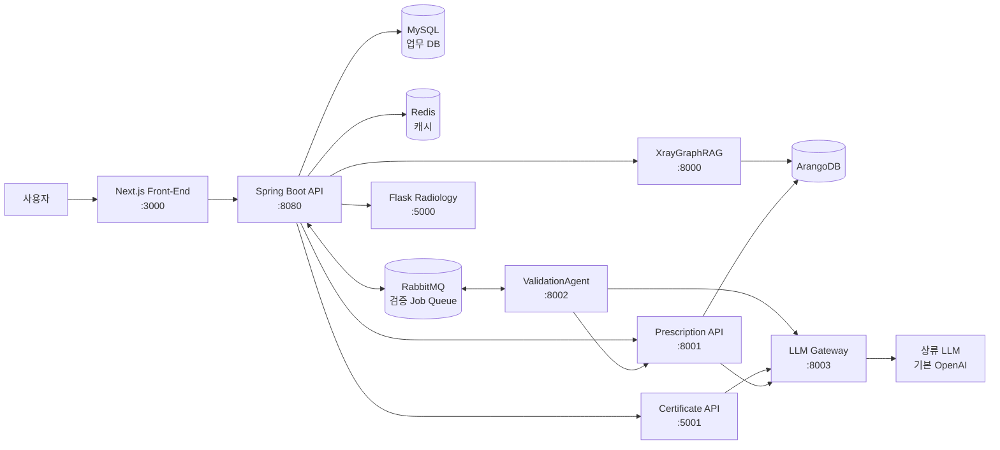

# BitComputer 프로젝트 문서

이 폴더는 BitComputer의 전체 구조, 주요 업무 흐름, API 엔드포인트, AI 서비스/에이전트 설계, 데이터·배포 구조를 설명한다.

## 문서 목록

1. [전체 시스템 구조](./01-system-architecture.md)
   - Docker Compose 기준 서비스 구성
   - 프론트엔드, Spring Boot, Python AI 서비스, DB/메시징 관계
   - 주요 저장소 디렉터리 역할

2. [주요 사용자 흐름](./02-user-flows.md)
   - 환자 접수
   - 진료실 상병/처방 저장
   - X-ray 분석
   - AI 처방 추천 및 검증
   - 진단서 생성, PDF 다운로드, DB 저장

3. [엔드포인트와 프로세스](./03-api-endpoints.md)
   - Spring Boot API
   - Python AI API
   - 각 엔드포인트의 주요 입력, 처리, 저장소, 외부 호출

4. [AI 서비스와 에이전트 설계](./04-ai-services-and-agents.md)
   - XrayGraphRAG
   - 처방 추천 API
   - 진단서 소견 생성 API
   - ValidationAgent 고정 파이프라인과 도구 구성

5. [데이터, 메시징, 배포 구조](./05-data-and-deployment.md)
   - MySQL/ArangoDB/RabbitMQ/Redis/볼륨 역할
   - 주요 테이블과 큐
   - 실행, 종료, 재빌드, 로그 확인

6. [인프라 구축 일정 — AWS 주 / GCP DR](./06-infra-build-schedule.md)
   - 워크로드 인벤토리(DR 시 무엇이 넘어가고 무엇이 안 넘어가는가)
   - EKS/GKE 구축 WBS 와 임계 경로, 마일스톤
   - 지연 시 축소 순서

7. [런북: 데이터 적재와 검증](./07-runbook-data-loading.md)
   - 빈 볼륨에서 화면이 동작하는 상태까지의 절차
   - MySQL 마스터 코드, 처방 추천 그래프, X-ray(CheXpert) 적재
   - 적재 후 검증 명령과 결과 읽는 법

8. [런북: 컨테이너 이미지 빌드와 배포](./08-runbook-container-images.md)
   - 이미지 8종과 각각을 언제 다시 빌드해야 하는지
   - 기동·확인, .env 가 빌드가 아니라 기동에 쓰인다는 점
   - CI 가 전부 빌드하지 않는다는 사실, ECR push, 디스크 회수

9. [AWS Architecture](./AWS%20Architecture.md)
   - CloudFront/S3, ALB, ECS, Auto Scaling 기반 운영 배포 구조
   - RDS, DynamoDB, ElastiCache Redis, Amazon MQ RabbitMQ 배치
   - WAS/AI 서비스별 부하 특성과 고가용성 설계
   - 현재 구축 계획(06)은 ECS 가 아니라 EKS 를 목표로 한다 — 그 문서 머리말 참조

10. [Prescription Agent Evaluation](./Prescription%20Agent%20Evaluation.md) / [Methodology](./Prescription%20Agent%20Evaluation%20Methodology.md)
    - 처방 추천 에이전트 평가 방법론과 워크플로우
    - tool path, 답변 품질, hallucination 평가 구조
    - 평가 데이터, judge 프롬프트, 결과 해석 기준
    - 2026-06-06 실행 기록이다. 그 이후 파이프라인이 바뀌었다는 주석이 두 문서 머리에 있다

발표용 문서(`Capston-Design-Report.md`, `Script.md`, `QnA.md`,
`프로젝트_개요_PPT_동훈.md`)는 서술이 소유자의 것이라 이 목록에서 따로 관리하지 않는다.

## 전체 한눈에 보기

XrayGraphRAG 만 LLM 을 쓰지 않는다. 나머지 세 AI 서비스는 상류를 직접 부르지 않고
게이트웨이만 안다 — 자격증명은 `bit-llm-gateway` 컨테이너에만 있다.

## 읽는 순서

처음 보는 사람은 `01-system-architecture.md` → `02-user-flows.md` → `04-ai-services-and-agents.md` 순서로 읽는 것을 권장한다. API 연동이나 디버깅이 목적이면 `03-api-endpoints.md`와 `05-data-and-deployment.md`를 먼저 보면 된다. 처음 실행하거나 DB 가 비어 보이면 `07-runbook-data-loading.md` 를, 코드를 고쳤는데 화면이 그대로면 `08-runbook-container-images.md` 를 본다.
