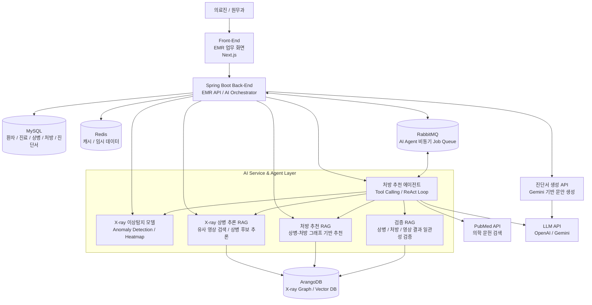

# 프로젝트 개요 - 동훈

## 1. 프로젝트 소개

**BitComputer는 EMR 시스템과 의료 AI Agent를 결합한 지능형 진료 보조 플랫폼이다.**

본 프로젝트는 환자 접수, 진료 이력 관리, 상병 및 처방 관리, 진단서 생성 등 기본적인 EMR 기능을 제공할 뿐만 아니라, X-ray 이미지 기반 이상탐지 모델, 상병 추론 RAG, 처방 추천 RAG, 검증 RAG를 결합하여 의료진의 의사결정을 보조한다.

특히 처방 추천 에이전트는 단일 LLM 응답에 의존하지 않고, 환자 진료 데이터, X-ray 분석 결과, 상병 후보, 처방 그래프, 의학 문헌 검색 결과 등 여러 도구를 호출하며 단계적으로 판단한다.

즉, 본 시스템은 병원 업무 데이터를 관리하는 EMR 시스템이면서 동시에 AI가 근거 기반으로 진료 보조 결과를 생성하고 검증하는 의료 AI Agent 시스템이다.

## 2. 프로젝트 달성 목표

본 프로젝트의 목표는 병원 진료 업무의 디지털 관리와 AI 기반 의사결정 보조를 통합하는 것이다.

주요 목표는 다음과 같다.

- 환자 접수, 진료 이력, 상병, 처방, 진단서 관리 기능을 포함한 EMR 시스템 구현
- X-ray 이미지 기반 이상탐지 모델을 통해 영상 내 이상 영역 탐지
- X-ray 분석 결과와 유사 사례 검색을 활용한 상병 추론 RAG 구현
- 환자 증상, 상병, 진료 이력, 처방 그래프 데이터를 활용한 처방 추천 RAG 구현
- 추천 처방이 환자 상태, 상병, X-ray 결과와 일치하는지 검증하는 검증 RAG 구현
- 여러 AI 도구를 사용하는 처방 추천 에이전트 구조 구현
- AI 추천 결과를 의료진이 검토하고 최종 판단할 수 있는 보조 시스템 구현

## 3. 추진배경 및 필요성

기존 EMR 시스템은 환자 정보와 진료 기록을 저장하고 조회하는 데 초점이 맞춰져 있다. 그러나 실제 진료 환경에서는 단순한 기록 관리뿐만 아니라, 환자의 증상과 검사 결과를 바탕으로 상병을 추론하고 적절한 처방을 선택하는 과정이 중요하다.

특히 X-ray 영상 판독, 상병 후보 검토, 처방 선택, 처방 적합성 검증은 의료진의 경험과 많은 참고 자료를 필요로 한다. 이 과정에서 AI 기반 이상탐지 모델과 RAG 기반 검색·추론 구조를 활용하면 의료진이 더 다양한 근거를 빠르게 확인할 수 있다.

따라서 본 프로젝트는 EMR 기능 위에 AI Agent 구조를 결합하여, 진료 데이터를 단순 저장하는 수준을 넘어 분석, 추천, 검증까지 수행하는 지능형 의료 보조 시스템을 구현하고자 한다.

## 4. 결과물 - 구성도

구성 설명:

- EMR Layer는 환자 접수, 진료 기록, 상병, 처방, 진단서 데이터를 관리한다.
- AI Service Layer는 X-ray 이상탐지, 상병 추론, 처방 추천, 검증 기능을 담당한다.
- 처방 추천 에이전트는 여러 RAG와 외부 도구를 호출하며 추천 결과를 생성한다.
- RabbitMQ를 통해 AI Agent 작업을 비동기로 처리하여 사용자 화면의 응답성을 유지한다.
- ArangoDB는 X-ray 유사 사례 검색과 상병-처방 그래프 탐색을 위한 그래프/벡터 저장소로 사용된다.
- LLM은 단독 판단자가 아니라 검색 결과와 도구 호출 결과를 종합하는 추론 보조 역할을 한다.

## 5. 결과물 - 특징

본 시스템은 EMR 기능과 AI Agent 기능이 결합된 구조를 가진다.

- 기본 EMR 기능 제공: 환자 접수, 진료 이력, 상병/처방 관리, 진단서 생성
- X-ray 이미지 기반 이상탐지 모델 적용
- X-ray 분석 결과를 바탕으로 유사 영상과 상병 후보를 검색하는 상병 추론 RAG 적용
- 상병-처방 그래프 데이터를 활용한 처방 추천 RAG 적용
- 추천 처방과 환자 상태의 일관성을 확인하는 검증 RAG 적용
- 처방 추천 에이전트가 여러 도구를 호출하며 단계적으로 판단
- ReAct 방식의 Tool Calling 구조로 검색, 추천, 검증 과정을 분리
- AI 결과를 자동 확정하지 않고 의료진 검토용 보조 정보로 제공

## 6. 결과물 - 장점

본 프로젝트는 단순 EMR 시스템보다 확장된 의료 AI 보조 기능을 제공한다.

- 진료 기록을 저장하는 데 그치지 않고 AI가 분석, 추천, 검증까지 수행
- X-ray 영상 정보와 EMR 데이터를 함께 활용하여 판단 근거 확장
- RAG 기반 구조로 기존 데이터와 유사 사례를 참고한 추천 가능
- 처방 추천 후 검증 RAG를 통해 부적절한 추천 가능성을 한 번 더 점검
- Tool Calling 기반 에이전트 구조로 기능 확장성이 높음
- 의료진은 AI 결과를 참고하되 최종 판단권을 유지할 수 있음
- EMR, 영상 AI, 그래프 RAG, LLM Agent를 결합한 통합 의료 AI 플랫폼으로 발전 가능

## 발표용 한 줄 요약

**BitComputer는 EMR 시스템을 기반으로 X-ray 이상탐지, 상병 추론 RAG, 처방 추천 RAG, 검증 RAG를 결합한 의료 AI Agent 기반 진료 보조 플랫폼이다.**
