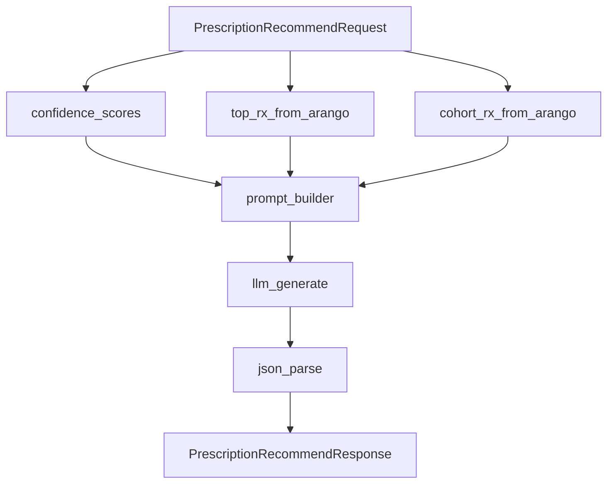

# Prescription Agent 평가 도구

이 폴더는 `prescription-api`의 처방 추천 결과를 평가하기 위한 LLM-as-judge 기반 평가 도구를 담는다.

## 평가 대상

`prescription-api`는 ReAct agent가 아니라 조건부 도구 호출 파이프라인이다.



## 평가 축

- Tool path 정확도: 입력 조건상 필요한 Arango/LLM/parse 단계가 호출됐는지 평가.
- 답변 품질: Top-3 JSON 구조, rank, 처방명 anchoring, 처방코드 매칭, dosage 안전성, reason 근거성을 평가.
- Hallucination: 입력과 tool observation에 없는 처방명, 코드, 용량, 병력, 수행하지 않은 action을 주장하는지 평가.
- 대조군 비교: 정상 근거 충분 케이스와 adversarial/sparse 케이스를 함께 생성해 비교한다.

## 파일 구성

- `schemas/scenario.schema.json`: 평가 scenario JSONL 스키마.
- `prompts/*.md`: scenario 생성 및 judge 프롬프트.
- `generate_scenarios.py`: LLM 또는 template 기반 평가 데이터 생성.
- `run_eval.py`: 처방 API 실행, judge 호출, metric/report 생성.
- `metrics.py`: tool path, 답변 품질, hallucination metric 계산.
- `scenarios/*.jsonl`: 생성된 평가 데이터.
- `results/*.jsonl|*.json|*.md`: 평가 실행 결과.

## 데이터 생성

ValidationAgent와 같은 모델로 데이터를 만들지 않기 위해 기본은 `--provider openai --model gpt-4o-mini` 또는 `--provider gemini`처럼 처방 API의 기본 Gemini 모델과 다른 모델을 사용한다.

```powershell
cd "C:\Users\kjbdd\OneDrive\바탕 화면\Project\BitComputer\GraphDB\langchain_graph_qa"
python .\evals\generate_scenarios.py --strategy llm --provider openai --model gpt-4o-mini --count 60 --output .\evals\scenarios\llm_prescription_eval_scenarios.jsonl
```

API quota가 없을 때는 template 데이터로 smoke test를 할 수 있다.

```powershell
python .\evals\generate_scenarios.py --strategy template --count 20 --output .\evals\scenarios\template_prescription_eval_scenarios.jsonl
```

## 평가 실행

외부 judge 없이 rule/heuristic만 실행:

```powershell
python .\evals\run_eval.py --scenarios .\evals\scenarios\template_prescription_eval_scenarios.jsonl --output-dir .\evals\results --skip-judges --mock-agent
```

실제 `prescription-api` direct import 실행 + OpenAI judge:

```powershell
python .\evals\run_eval.py --scenarios .\evals\scenarios\llm_prescription_eval_scenarios.jsonl --output-dir .\evals\results --judge-provider openai --openai-judge-model gpt-4o-mini --agent-model gpt-4o-mini --agent-temperature 0
```

실행 중에는 `PRESCRIPTION_EVAL_TRACE_ENABLED=true`가 자동 설정되어 `toolTrace`가 수집된다.

실행 중인 Docker API를 HTTP로 평가:

```powershell
python .\evals\run_eval.py --scenarios .\evals\scenarios\llm_prescription_eval_scenarios.jsonl --api-url http://localhost:8001 --output-dir .\evals\results --judge-provider openai --openai-judge-model gpt-4o-mini --agent-model gpt-4o-mini --agent-temperature 0
```

`--agent-model`은 평가 대상 agent의 생성 모델을 요청 단위로 덮어쓴다. Gemini free-tier quota가 소진된 경우에도 OpenAI judge 평가를 계속할 수 있도록 `gpt-4o-mini`를 사용할 수 있다.

## 최신 전체 평가 결과

최종 실행 산출물:

- Raw results: `results/prescription_eval_results_20260606T034823Z.jsonl`
- Summary: `results/prescription_eval_summary_20260606T034823Z.json`
- Report: `results/prescription_eval_report_20260606T034823Z.md`

요약 지표:

- Case count: 50
- Successful cases: 50
- Error cases: 0
- Tool path precision: 0.874439
- Tool path recall: 0.979899
- Tool path F1: 0.924171
- Answer quality average overall score: 0.386
- Hallucination rate: 0.9

해석:

- HTTP API 실행과 `toolTrace` 수집은 정상 동작했다.
- Tool path F1은 기준선 0.90을 넘었지만, `confidence_scores`는 expected path와 구현 정책 불일치로 FP가 많다.
- 답변 품질과 hallucination 안전성은 낮다. sparse/adversarial/hallucination trap 케이스에서 근거 밖 처방명·코드·용량 생성이 반복됐다.
- 다음 개선은 agent 모델 교체보다 `prescription_agent.py` 프롬프트 제약, `prescription_api.py` 후처리 guard, sparse data 응답 정책 보강을 우선한다.

## 기존 평가와의 관계

기존 `evaluate_prescription_scores.py`는 실제 처방 데이터의 co-occurrence 기반 적절성 점수를 계산하는 하위 정량 평가다. 이 폴더의 평가는 LLM 답변 품질, hallucination, tool path를 보는 상위 agent 평가이므로 둘을 함께 사용한다.
